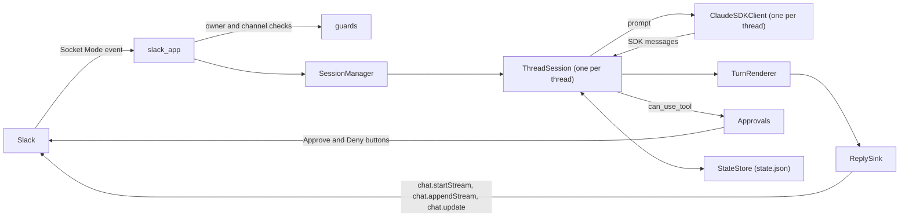

# Architecture

code-with-slack is one Python process. It holds a Slack Socket Mode connection and one Claude
Agent SDK client per live thread session, across every bound channel, all on one asyncio event
loop.

## Overview

One Slack thread is one Claude Code session, which is one `ClaudeSDKClient` in the daemon. A
message in a thread goes to that thread's client, and what the client sends back is written into
the same thread. Threads of different channels run side by side on the one event loop, and each
thread keeps the folder it was opened in.

| Part | Owns |
|---|---|
| `__main__` | the startup order, the Socket Mode connection, signals and the shutdown drain |
| `slack_app` | one listener per inbound path (message, button, modal, Home control): acknowledges, checks, routes |
| `guards` | the owner, workspace and channel checks that each inbound path runs on its own |
| `commands` | the `!word` parser and the daemon's own words |
| `sessions.SessionManager` | the live `ThreadSession` objects, one per open thread, and what spans them: `!bind`, `!resume`, the drain |
| `sessions.ThreadSession` | one thread: its client, prompt queue, turns, approvals, status reaction and idle close |
| `render.renderer.TurnRenderer` | turns the SDK's messages into a model of one reply |
| `render.sinks.ReplySink` | writes that model to Slack as a native stream, then by `chat.update`, and ends it with the footer |
| `approvals`, `hold`, `setup` | questions the daemon puts to the owner in Slack: tool permission, a same-folder hold, a session's setup |
| `state.StateStore` | `state.json`: the channels, their threads and what crash repair needs |
| `home.Home` | the app's Home tab, the session index; `delete.ThreadDeleter` serves its edit mode |

One message's way from Slack to Claude Code and back:

1. Slack delivers the event over the Socket Mode connection, which `slack_bolt`'s
   `AsyncSocketModeHandler` holds. `slack_app.build_app` registered the listener for it.
2. The listener acknowledges Slack, then checks the owner and the workspace (`guards.is_owner`)
   and the channel (`guards.ChannelGuard.refusal`). A message that starts with `!` is read by
   `commands.parse_bang` as one of the daemon's words or as a passthrough to a Claude Code command.
3. A prompt reaches `slack_app.submit_to_session`. A top-level message opens a session
   (`SessionManager.open`); a reply in a thread gets that thread's session (`SessionManager.get`),
   rebuilt when a restart or an idle close dropped it. Before the prompt is sent, it can wait for
   the owner: a first prompt for the session's setup, and a prompt that would wake an idle session
   for the same-folder hold, when another session is working in that folder.
4. `ThreadSession.submit` queues the prompt. The session sends one at a time to its
   `ClaudeSDKClient`, and one reader task follows the client's message stream.
5. The reader gives each SDK message to a `TurnRenderer`, which keeps the model of the reply.
   The `ReplySink` writes that model into the thread and ends the reply with the footer.
6. When Claude Code needs permission, the SDK calls `can_use_tool`. The session posts a message
   with Approve and Deny buttons, and the click comes back through steps 1 and 2.

Terms used throughout:

| Term | Meaning |
|---|---|
| thread | A Slack thread. Its root is the owner's top-level message, or the owner's `!resume` message |
| session | A Claude Code conversation, named by a session id. `ThreadSession` is its live side in the daemon |
| turn | One prompt sent to Claude Code, and what it does until its result arrives |
| reply | What the daemon writes in the thread for a turn, ending with the footer |
| report turn | A turn Claude Code starts by itself to report a finished background task |
| bypass | Claude Code's `bypassPermissions` mode, kept per thread and set with `!bypass` |
| root reaction | The reaction on the thread's root message that shows the session's state: ⏳ working, ✋ waiting for the owner, ✅ ended, ❌ error |
| drain | The wait at shutdown for the turns already sent to finish |

To learn what the daemon does and what it refuses, read this overview, then "Who may talk to
it", "Approvals", "Rendering" and the opening of "Sessions". The other sections are internals for
someone changing the code: "Startup", "State and the single-instance lock", "Writing to Slack",
"Footer", "Opening a file", the rest of "Sessions", "The session index" and "Slack handlers". The
limits those sections quote from Slack and the SDK are gathered, with their dates and versions,
in "Measured platform behaviour" at the end.

## Startup

`code-with-slack` (`code_with_slack.__main__.main`) starts in this order:

1. It loads the configuration (`config.load_config`), so a bad `.env` fails before anything else.
2. It takes the single-instance lock (`lock.single_instance`), so a second daemon fails before it
   opens a Socket Mode connection.
3. It reads `state.json` and prepares the attachments folder (see "Attached files").
4. It builds a plain `AsyncWebClient` and calls `auth.test` for the workspace id and the bot user
   id.
5. It installs the `SIGTERM` and `SIGINT` handlers, so a signal that arrives during a long repair
   is caught and not left to Python's default, which would end the process at once.
6. With that client, Socket Mode not opened yet, it repairs what a crashed daemon left open
   (`code_with_slack.repair.repair_crash`, see "State and the single-instance lock") and then
   cleans `state.json` (`code_with_slack.cleanup.clean`, see "Cleaning `state.json`"). Cleaning
   runs only after repair, so a pruned thread's leftovers are still repaired first, and it runs
   again every `cleanup.CLEAN_EVERY_SECONDS` until a stop begins.
7. It asks for the first session index (`Home.request`, see "The session index").
8. It opens the Socket Mode connection and, once connected, posts the version 1 to version 2
   upgrade notice to each channel that still owes one (`__main__._post_upgrade_notices`), as a
   message of its own, not a reply.

Logs go to standard error, which the LaunchAgent writes to
`~/Library/Logs/code-with-slack/code-with-slack.log`.

### Shutdown

`SIGTERM`, which `launchctl kill TERM` and `launchctl bootout` send, starts a drain
(`SessionManager.drain`):

- It lets the turns already sent finish, each up to its reply's end (the stream's stop, footer
  included), and the background tasks with the turns that report them. A task whose end came
  without its notification is waited for `sessions.INJECTED_TURN_WAIT`, since the CLI can
  suppress the notification. No other turn is sent.
- A new prompt gets `texts.RESTARTING` and, under it, the threads the stop still waits for
  (`refuse_restarting`, from `SessionManager.restart_holds`).
- A queued turn is dropped without a reply of its own (`ThreadSession.drop_queued`). One note
  (`sessions.not_sent`, `N messages were not sent because code-with-slack restarted: send them
  again.`, with the start of each) is added to the end of the thread's running reply, or posted as
  a message of its own when nothing runs.
- Approvals and questions stay open: the Socket Mode connection closes only after the drain.
- A thread left with only background tasks says `texts.RESTART_WAITS` in its status line
  (`ThreadSession._thread_line`, brought up to date by `ThreadSession.show_restart_wait` at every
  poll of the drain), naming them by the footer's counts, since the daemon cannot tell whether a
  task (a dev server, a watcher) ever ends. A status line does not notify and goes with the
  restart, where a message would do both. Where Slack refuses the app a thread status
  (`ThreadStatus.refused`), one message says it (`texts.RESTART_WAITS_MESSAGE`). `!stop` ends
  such tasks with `ClaudeSDKClient.stop_task`. Claude Code starts no turn to report a task
  stopped this way (measured: "Stopped task, no report turn"), so neither the drain nor the thread's
  next prompt waits `sessions.INJECTED_TURN_WAIT` for one.
- The signal names no sender, and the session that sent it has a turn running when it arrives.
  Every session with a turn running then gets `ThreadSession.may_have_ordered_restart`. A
  background task it starts after the signal, most likely its own wait for the new process, which
  could only end once this one has exited, is left out of `ThreadSession.restart_ready` (the idle
  test the drain uses) and of `texts.RESTART_WAITS`. The drain still waits for that session's
  turn and for every other task.

When no session is working, after `__main__.DRAIN_LIMIT_SECONDS`, or on a second signal, the
daemon closes the connection, then every session. After `bootout` launchd kills the daemon once
the LaunchAgent's `ExitTimeOut` passes (60 seconds at most), whatever the drain is doing. `SIGINT`
skips the drain: from a terminal it also reaches the Claude Code processes, which
claude-agent-sdk starts in the daemon's process group.

## Configuration

`code_with_slack.config.load_config` reads `~/.config/code-with-slack/.env` with
`python-dotenv`, without copying anything into the process environment. It refuses a file that
is not a regular file, belongs to another user, or is readable by group or others, and it
refuses tokens of the wrong kind. [setup.md](setup.md) lists the variables.

## State and the single-instance lock

`code_with_slack.state.StateStore` keeps, for each bound channel, its directory and, for each of
its threads, the folder it was opened in, its Claude Code session id, its bypass choice (on, off, or
never chosen), the effort level set with `/effort` and `ended`, the reaction name of its root once
✅ or ❌ is requested (cleared when the root turns ⏳ or ✋ again; read only by the session index),
in `~/.config/code-with-slack/state.json` (version 2). `bypass` is `true` for on and `false` for
not on; an explicit off also writes `bypass_off: true`, and a thread with `bypass` false and no
`bypass_off` has never chosen. A reader that does not know `bypass_off` takes an off as not on.
Every change is written to a temporary file beside it, synced, and renamed over it, so a crash
leaves either the old file or the new one. A file that cannot be read, or has an unknown version,
stops the daemon instead of being replaced. A version 1 file (one session id and bypass switch
per channel, no threads) is converted on load and written back as version 2: each channel keeps
its directory and gets an empty thread map and a pending upgrade notice; the session id and
bypass switch, which belonged to the channel itself, are dropped.

Each thread also carries three fields for crash repair, ids only, never message content:

- `open_replies`: the ts of every open reply's last message, a stream or a stopped message. More
  than one can be open at once, since a background task's own reply can outlive the turn that
  started it. Each `ReplySink` owns exactly one entry, added when its stream starts, replaced on
  a continuation, removed once the reply's end is known to have landed or it has given up
  retrying for good.
- `requests`: the ts of every approval, question and same-folder hold message still carrying
  buttons (added on post, removed on delete or answer).
- `status`: the root's reaction name while it is ⏳ or ✋ (cleared once ✅ or ❌ is requested).

All three are optional: a version 2 file without them reads as "nothing open", and a reader that
does not know them ignores them, so the version stays 2.
A graceful close (`ThreadSession.close`) clears all three for its thread once it is done, whatever
the fields looked like partway through (`StateStore.clear_repair`), so only a crash ever leaves
them set.

On start, before the Socket Mode connection opens, `code_with_slack.repair.repair_crash` repairs
every thread `state.json` still shows as left open. For each open reply it stops the message's
stream (`chat.stopStream`; `message_not_in_streaming_state` means Slack closed it already, at 5
minutes, and is fine), reads the message back by its own ts (`conversations.replies` with `ts`
and `limit=1`) and edits it with `chat.update`: its blocks as Slack keeps them, every card left
`in_progress` closed as an error (a stopped stream stores it as one anyway), and
`texts.STOPPED_BEFORE_ANSWER` appended as a context block, or, at Slack's 50-block cap, added to
the last context block. The stream's own stop is the one notification the reply owes, and the
edit never notifies; nothing is posted. It deletes each stale request (`message_not_found` counts
as done) and sets ❌ on a root left ⏳ or ✋, through the same `StatusReaction` a live session
uses. Each field is cleared once its own repair has been
attempted, successfully or not (a failed `state.json` write here is logged and swallowed, never
left to break startup), so a second start never retries what an earlier one gave up on; one
thread's failure is logged and does not stop the others.

`code_with_slack.lock.single_instance` holds an exclusive `flock` on the configuration directory
itself. A second process fails to start. The kernel releases the lock when the holder exits, so
a crash leaves no stale lock and no lock file.

### Cleaning `state.json`

`code_with_slack.cleanup.clean` runs on start and then every `cleanup.CLEAN_EVERY_SECONDS`
(`__main__._clean_every`), and removes only what an answer makes certain:

- `cleanup.forget_gone_channels` asks `conversations.info` about each bound channel and removes,
  with `StateStore.remove_channel`, each one Slack answers `channel_not_found` about, threads
  included. Any other failure is no answer and removes nothing. A private channel the bot was
  removed from gives the same answer as a deleted one, so it is forgotten too. When Slack finds
  none of the bound channels (a channel it gave no answer about is not one it found), nothing is
  removed and a warning says so: that is what the token of another workspace looks like.
- `StateStore.prune` then drops a thread whose session id is no longer among its folder's
  sessions (`__main__._alive_sessions`, read off the event loop) and a no-session thread whose
  root message is more than a day old. A folder `_alive_sessions` cannot tell about keeps its
  threads: one whose transcripts cannot be listed, and one too long-named to be found.

A pass leaves alone every thread and channel with a live session object
(`SessionManager.live_threads`), whose session id may not be on disk yet; the next pass takes
them once the session has closed. `clean` never raises: a pass that fails is logged and the next
one tries again.

## Who may talk to it

Every inbound path that acts (a message, including a `!word`, and a button) runs two checks of its
own before anything reaches Claude Code:

1. `code_with_slack.guards.is_owner`: the Slack user is the configured owner AND the workspace is
   the one `auth.test` reported at startup. A click from a user whose home workspace differs is
   refused.
2. `code_with_slack.guards.ChannelGuard.refusal`: the channel is private, not shared with another
   workspace, and its members are exactly the owner and the bot. It is read from Slack every
   time, so inviting a third person stops the bot in that channel at once.

Messages with a subtype (edits, deletions, joins) and messages from bots are ignored, except
`file_share`, a message carrying files. A `file_share` event has no `team` field (measured: "File
share event has no team"): `guards.message_actor` takes the workspace from the files' `user_team`,
which must be the same for every file, or the message is refused. A refusal reaches the owner as an
ephemeral message; everyone else gets nothing.

A control of the session index (the Home tab) runs the first check alone. Its payload names no
channel, and all it does is choose what the owner's own page shows: nothing reaches Claude Code.

Where the daemon's own answers go is decided in `slack_app.handle_word`. A word typed at the top
level, or in a thread that holds no session, acts as a top-level word: its answer is a normal post
in the channel (`in_channel`, or `say` with no thread), which is neither ephemeral nor a thread
reply, so it stays after a reload and never notifies. A word typed inside a session's thread is
answered by `tell_owner` or an ephemeral `say` under the owner's message (`chat.postEphemeral` with
`thread_ts`), which Slack drops on reload; `!bypass` adds `acknowledge`, a ✅ reaction on the word,
which stays; `!stop` there is answered by a post in the thread, which stays: `texts.STOPPED_THREAD`
when it stopped something, `texts.NOTHING_TO_STOP_THREAD` when nothing runs. `word_report` chooses
the same place for a word's failure, and `reply_on_failure` logs a report that itself fails instead
of letting it raise, since a raise would reach the message handler's own failure path, which posts
`ERROR_REPLY` threaded under the word. The old-folder notice (`texts.OLD_THREAD_FOLDER`, shown on a
prompt sent in a thread whose folder differs from the channel's current one) and `Not sent.` are
ephemeral as well. A Resume button carries `<session id>@<thread ts>`, the thread of the owner's
`!resume` message (`resume.parse_resume_value`); the click is checked like any other inbound path,
and a value in any other shape answers `texts.RESUME_STALE`.

## Attached files

`code_with_slack.attachments` handles the files of a `file_share` message before anything reaches
Claude Code. Every file is checked first (`attachments.refusal`): its download URL must be
`https://files.slack.com/...`, the only host that receives the bot token, and an image must be JPEG,
PNG, GIF or WebP, at most 7.5 MB (10 MB once base64-encoded) and 8000x8000 px, the limits of
Claude's vision API; any other image type is refused. A file that is not an image must be a `text/*`
type (which covers source code) or one of `attachments.FILE_TYPES` (PDF, JSON, XML, YAML,
JavaScript, shell, SQL, TOML, Jupyter notebook), at most 100 MB; any other type is refused. One
message takes at most 5 images and 15 MB of images in all: images stay in the conversation and are
sent again at every turn, and a request is capped at 32 MB. Then the files are downloaded together,
with the bot token and no redirect followed; `attachments.download` checks the host again beside the
header. Slack answers 302 when the app lacks `files:read` (measured: "Download without files:read").
An image becomes an image block, and the turn's prompt one user message of content blocks, sent
through the SDK's streaming input; any other file is saved to `$TMPDIR/code-with-slack/` and its
path is appended to the prompt, but only once every file arrived, so a failed message leaves no
copy. The folder must be a directory of this user with mode 700, or nothing is written there; at
each start the files older than 3 days are removed, so a conversation resumed after a restart still
finds its files. A refused file or a failed download sends nothing and tells the owner which file
and why. Prompts, messages with files and Claude Code commands enter the queue in the order they
were sent, although downloads take a while. A message that waited on its files is submitted to the
thread's session as it is then; if that session closed meanwhile (an idle close, most likely), the
submit is retried once against a freshly looked-up session for the same thread.

## Rendering

`code_with_slack.render.renderer.TurnRenderer` reads SDK message types only, never tool names, so
a tool Claude Code adds later shows in the reply with no code change. The table says "line" for
what the model holds per tool (`renderer.TaskUpdate`); the sink draws the lines on task cards, two
for a run of calls and one for a line with a view of its own (see below).

| SDK input | What the owner sees |
|---|---|
| `StreamEvent` with no parent, a `text_delta` | the text, as it is written |
| a top-level `TextBlock` in an `AssistantMessage` whose `message_id` a `message_start` event announced | nothing more: the same text already arrived as deltas |
| the same in an `AssistantMessage` whose `message_id` no `message_start` event announced | the text, where it arrives, a paragraph apart from text before it (note 1) |
| `ToolUseBlock` or `ServerToolUseBlock` with no parent | a new tool line, in progress, titled `Name: first string argument` |
| the same with `parent_tool_use_id` set (a subagent, or a skill run in a forked context) | the parent's line counts the subagent's calls and holds its latest ones (note 2) |
| `ToolResultBlock` or `ServerToolResultBlock` for a line | the line completes, or shows an error with the output's first line when `is_error`; a line whose task already ended as stopped keeps `Stopped` |
| `TaskStartedMessage` | for a tool call, nothing yet; a task's line once the call's result arrives with the task still running (note 3) |
| `TaskProgressMessage` | the line shows the task's description |
| `TaskNotificationMessage`, a terminal `TaskUpdatedMessage` | the line completes, shows an error when the task failed, or completes with `Stopped` |
| `AssistantMessage.error` with `parent_tool_use_id` set | nothing in the reply's text; its words become a nested line of the call's card (note 4) |
| `AssistantMessage.error` `authentication_failed` | a note asking to run `claude` and `/login` on the host. Claude Code sends this category for a 401 and for a 403 alike |
| any other `AssistantMessage.error` | the text of the message, as a notice (note 5) |
| `SystemMessage` `compact_boundary` | `Compacted the conversation: 15.0k → 2.0k tokens.`, from its `compact_metadata`, whether the owner asked (`!compact`) or Claude Code compacted on its own (note 6) |
| `ResultMessage` | its text, when nothing else was written (note 7) |

Notes on the table:

1. Claude Code writes its own output for a command this way: `Goal set: <condition>` before the
   first inner turn of a `/goal`, the output of `/usage` and of a skill run in a forked context
   (recorded: `goal.jsonl`, `usage.jsonl`, `skill-fork-command.jsonl`). A message with no
   `message_id` is left to the row above, and so is every such message while a streamed one has
   had no `message_stop`, or once a `message_start` named no id.
2. The count reads `Agent: review · 12 calls`. While the subagent runs, its line holds its latest
   calls (`renderer.CHILD_LINES`) as the card's `details`; a streamed card is sent each of them
   once and keeps them all, since a stream only adds to a card's text. The line becomes a task's
   line: it keeps a card of its own once it ends, in the foreground or in the background.
3. Claude Code starts a task for a long command in the foreground too, which ends before the
   call's result. When the call's result arrives with its task still running, the line becomes a
   task's line, notes "Running in background" on its nested line and stays in progress. A task
   started by a call inside another call (a long command a subagent runs) is held aside while
   that call is open: it gets no line and the session does not track it. If it ends before the
   call's result, it was the subagent's foreground work and stays off the reply; if it is still
   running at the call's result, it outlives the call and becomes a task with its own line, like
   a top-level one (`TurnRenderer.nests`, `take_promoted`). A task with no call in the reply gets
   a new line; one started by a call the reply never saw, while such a task (a command's) runs,
   is an agent inside that command and shows on the command's line, counted as a call with its
   description, as a subagent's calls show on its line.
4. A background subagent's own failed request stays out of the reply's text, as a subagent's
   other text does. The task's `TaskNotificationMessage`, with status `failed`, then sets the
   card of the call that started the subagent to an error with the notification's summary as its
   output (`Agent terminated early due to an API error: ...`). For a subagent run in the
   foreground Claude Code forwards no such message: the card gets the error from the task's
   notification and the call's own result. The session logs `Claude Code reported a subagent's
   error` with the channel, the thread and the category.
5. The text is the one Claude Code wrote itself (for a 529, `API Error: 529 Overloaded.` and what
   to do next). With no text block the turn's result speaks, and `Claude Code reported an error`
   with the error code shows only when the result has no text either. The category is never
   matched against a list: one the SDK's `AssistantMessageError` does not name, such as
   `model_not_found`, shows its text the same way. The session logs a warning with the channel,
   the thread and the code.
6. It can be the first frame of its turn that shows anything (`/compact`, a compaction as a turn
   begins): the turn then starts with it.
7. In the recordings a local command's text (`/usage`) arrives first in an `AssistantMessage` no
   stream event announced, so the result is the fallback for a turn whose only text is its
   result.

A turn that ends with no text and no tool line says `Done. Claude Code returned no text.`, or
`Stopped the current turn.` when it was interrupted, so no reply is left empty. When the turn
ends, every line still in progress is closed first (with `Stopped` when the turn
was interrupted), then the reply ends. A task that started and has not ended is the exception:
its line stays open with "Running in background". `TurnRenderer.running_tasks` lists them. Only
the task lifecycle messages decide this, because a subagent can move to the background with no
second `TaskStartedMessage`.

## Writing to Slack

`code_with_slack.render.sinks.ReplySink` writes each reply as a native Slack stream inside the
session's own thread, below the message that asked for it (`chat.startStream` in chunks mode,
addressed to the owner's user and team). The stream starts with Claude's first content, its first
text or the card of the first tool when a turn opens with one, and never with a placeholder. It
grows with `chat.appendStream` at most once a second per reply, and each append draws from one
shared `UpdateLimiter` (`sinks.UpdateLimiter`, injected through `SessionDeps`), as does every
`chat.update`: a token bucket that paces writes evenly at 40 per 60 seconds plus a burst of 5,
worst case 45 in one window, under the documented floor of `chat.update` (Tier 3, 50 or more a
minute, per app), so several busy threads together stay under the app's own budget instead of
racing through it and then freezing until it resets. The retry of a call that failed on the
connection is switched off for the calls that create or grow a message, `chat.postMessage` and the
three stream calls (`sinks.ConnectionRetryUnlessCreating`, on the client replies are written
with): they are not idempotent, and a reset can come after Slack applied the call. The sink reads
the thread back and adopts what landed.

Within a reply, writes happen in the order things happen. Claude's text goes as `markdown_text`
chunks. Tools go as `task_update` chunks, each a card Slack updates in place by its id.

A run of calls, the calls between two pieces of text, shares two cards (`render.fold.Fold`, fed by
`ReplySink.task`). One call of the run is shown whole, titled with the tool's name and its first
argument: the last call started that still runs, else the last one shown, which joins the counts
when another call takes its place. Until there is a call to count, the first card shows that call,
and a run of one call stays one card. From then on the first card holds the counts of what ended, in
the terminal's words where the terminal has words (`render.previews.folded`: `Ran 2 shell commands ·
Read 1 file`), the failed calls after `✗`, and the second card shows the call. Calls that run at the
same time show one at a time. A failed call says why in its title (`Bash: pytest -q · Exit code 1`).
Neither card carries `details` or `output`: Slack appends both to what a card already holds
(measured: "Card text is appended"), so a card that is reused keeps its text in its title.

A call with a view of its own has a card of its own, keyed by its `tool_use_id`, and ends the
run: a subagent, whose title counts its calls and whose `details` say what it is doing now, a
background task, which keeps its card `in_progress` for as long as it runs, and a stopped call. A
call that turns into one of these while a card of a run shows it keeps that card. An `Edit` or a
`Write` that ended well also ends the run, and has no card: its preview is all that shows it.

Once the reply's body has ended, each run reads as one line of counts in a `context` block
(`✓ Ran 2 shell commands · Read 1 file · ✗ Ran 1 shell command`), as the terminal folds a run
that ended (`TaskUpdate.folded`, `ReplySink._card_blocks`). A stream cannot replace what it
showed, so the line is written by the `chat.update` that follows the stream's stop
(`ReplySink._end`), which never notifies. The reply has ended with the stop: an update that fails
is tried once more with the next write, and the cards stay if that fails too.

The renderer keeps an `Edit` or a `Write` (`previews.PREVIEWED`) from the sink until its result
arrives (`TurnRenderer._block`), since a stream cannot take back the card a running call would
get. While the call runs the reply shows nothing for it; a call that waits for approval has the
approval's message. One that ended well is a `blocks` chunk with no card
(`render.previews.preview`): a collapsible, full-width `container` block
(`sinks.preview_containers`), closed until the owner opens it, whose title is the call's line
(`Update(notes.txt)`), in code style through `rich_text_title` with the plain `title` as the
fallback, and whose subtitle is the sentence (`Added 1 line, removed 1 line`). Inside a
diff's container is the whole numbered diff in a rich text preformatted element with the language
`diff`, which Slack desktop colours; each changed line also carries a red or green square after
its sign, since Slack mobile colours nothing. A new file's container holds its first 10 lines and
`… +N lines`. A body longer than `sinks.MESSAGE_LIMIT` continues in a second container with the
same title; both sit in one message when it is written by update, and in the next message
when it is streamed or posted. One that failed joins its run as a call that ended, with the
reason in its title; one that was stopped has a card of its own; one whose preview has no lines
(an empty new file) has a card that says the sentence. A card the sink already drew for the call
stays (`_Tool.cardless`), and the diff under it is then titled with the sentence alone.
An answered `AskUserQuestion` shows its answers the same way, as a `context` block of words
(`Preview.plain`). Its lines come from the questions and answers the daemon sent back, so they
depend on no undocumented field.
The preview reads `UserMessage.tool_use_result`, which the SDK does not document; any shape other
than the one measured falls back to the generic card, and the release probe's claim P13 checks the
shape on each new SDK.

The stream stays open until the reply ends, or until `sinks.STREAM_SECONDS` (280 seconds) after
it started, whichever comes first. Slack closes a stream 5 minutes after `chat.startStream`
(measured: "Stream lifetime"), and the daemon stops it a
little earlier itself.

- **The reply ends first.** `ReplySink.close_out` stops the stream with `chat.stopStream`,
  passing the footer, a divider and a context block, as `blocks` at the message's bottom (Slack
  renders them below the stream, buttons included). The stop is the one notification.
- **280 seconds pass first.** `ReplySink._expire` stops the stream (Slack pushes on the stop, the
  first notification) and the same message keeps growing with `chat.update`, which never
  notifies (measured: "Update after stop is silent"). Each update
  writes the whole message from the renderer's model as `markdown` blocks and `task_card` blocks
  (a run of calls keeps its two cards until the body ends), with a short `text`, since a
  `chat.update` whose `text` is long fails `msg_too_long`. The end
  posts the reply's ending as a new message, the second notification (`ReplySink._end`): the
  text Claude wrote after its last call, whole, with whatever follows it, and the footer under
  it. Its `text`, the banner, is the first paragraph of that text as plain text
  (`sinks.banner_text`), so the notification says how the work ended, the stream's own stop
  having said how it began. The ending is a whole part of the renderer's model, never a cut
  inside one (`ReplySink._ending_cursor`), so no list or heading is split. It is posted first,
  then a silent update takes it out of the message it grew in: a failed or cancelled post
  leaves the reply as it was, a failed update leaves the text twice, and in both cases the end
  has not landed and the one retry follows. When the message holds no such text, or nothing of
  the answer would stay before it (an answer that is text alone), nothing is moved and the new
  message is the footer alone (`ReplySink._write_closing`), its banner the start of Claude's
  answer, never a line of the daemon's. A turn cut short gets no footer (the Claude Code process
  was lost, another error ended it, or the daemon restarted or closed the session), and
  `ThreadSession._abandon` writes a line on how the reply ended
  (`Claude Code reported an error: …`, `This reply ended before an answer: …`). When Claude
  wrote text after its last call, that line follows the text into the new message, whose
  banner is still the start of the text. When there is no such text to move, the line itself
  is the ending that moves, with whatever follows it, and is the banner. The sink keeps it as
  a part of its own (`ReplySink.text` with `ending`, fed by `TurnRenderer.feed_ending`), so a
  notice written just before it stays in the reply, and a card that closes after it moves
  under it. No other line of the daemon's moves. A footer goes under the line: a report turn
  cut short renders into a reply that already has the footer of its first turn, and the
  running list (`⏳ 1 agent`) shows there until the session empties it. When a full message
  pushed the line, or the note under it, into a continuation, that message rang when it was
  posted and is the ending as it stands (`ReplySink._opens_on_ending`): no closing message
  follows. A line that does not fit the room left in a message is cut there, as any text is,
  and the continuation then rings with the rest of it. The new message shows empty in one
  known case: a turn that ended well with an answer of text alone, whose footer could not be
  built.

A message holds 12,000 characters and 50 blocks or task cards (measured: "Message limits"). Slack
translates Claude's text into a `header` per heading, a `table` per table, a `divider` per rule and
`rich_text` for each run between them, and holds a post and an update to 50 of those; a stream is
not held to it, the update after its stop is (measured: "Block cap after a stream stops").
`sinks.markdown_starts` counts a text that way for a stream's plan, a post and an update alike, and
`sinks.markdown_cut` cuts it at a block's start, before a heading that would end the message. While
the reply is being written, a write of its last message that Slack still refuses with `no more than
50 items allowed` halves the message's room and is tried again (`ReplySink._tighten`), so the rest
goes on in a new message; the writes of the reply's end are not split. A reply past
`sinks.MESSAGE_LIMIT` or `sinks.BLOCKS_LIMIT` continues in a new message, a new stream while the
first one still streams, else a post. Every message a reply adds notifies once. A stream and a post
count the text of a collapsed container toward those 12,000 characters; `chat.update` does not
(measured: "Container text on update"). A message written by update therefore counts a container as
one block and no characters (`ReplySink._weight`), so a stopped message holds several large diffs
where a stream would have continued. A continuation is posted with the characters a post takes, then
brought to what an update takes by a `chat.update` of the same message (`ReplySink._post_step`). An
update refused for content that held a container is tried once more with the containers counted, as
a post counts them (`_Message.containers_counted`, kept for the message): what fits is written, and
the rest goes on in a new message, or is cut with the preview note when the span is fixed.

The reply ends once its turn has ended and none of its tasks still runs or still waits on a turn
Claude Code starts to report it (the held-open reply): a task the turn started keeps its card open
and updating in place, `ReplySink.finish` ends only the body, and `ThreadSession._still_owed`
decides when `ReplySink.close_out` runs (the CLI can suppress the report's notification, so past
`sessions.INJECTED_TURN_WAIT` `ThreadSession._expire_unreported` gives up on it). A report turn can
name only the reply of the first task it covers when several end together;
`ThreadSession._sweep_closed_out`, run after every turn and after
`ThreadSession._expire_injected_turn`, ends every other reply left eligible. A turn Claude Code
starts on its own to report a background task renders into the reply that started the task
(`ThreadSession._opening_target`); when that reply has already ended, the report gets a reply of its
own.

A prompt taken into a report turn: every prompt a session sends is one user message under a uuid of
the daemon's own (`Turn.uuid`, `prompt.user_message`), and the session passes
`--replay-user-messages`, so Claude Code re-emits it as a `user` frame with that uuid
(`ThreadSession._acknowledge`; measured: "Prompt replay"). A prompt that gets a turn of its own is
replayed after that turn's `init` and before its first stream event, so no turn runs when its replay
arrives; one the CLI takes into a running turn is replayed inside that turn, and that turn ends with
one result, with the origin `task-notification`, for both. The session never waits for a replay: a
frame that names no prompt in `_sent` (or the active turn's own) is an ordinary frame, and a stream
with no replay frames is read as an ordinary stream. A replay that arrives while a turn runs lands
on `ActiveTurn.taken`; when that turn's result has an injected origin, `ThreadSession._finish`
releases those prompts (`_settle`: out of `_sent`, `Turn.done` set) and adds the note
`texts.TAKEN_INTO_REPLY_ONE` to the reply, through the same end notes as a restart's `N messages
were not sent`. A prompt whose replay did not come during the turn waits for its own turn. The
worker sends one prompt at a time, so a turn takes in at most one. An `interrupt()` with such a
prompt queued ends the report turn with `error_during_execution`, and the prompt then runs as a turn
of its own. A prompt already taken in when `!stop` ends the turn with an injected result is released
with the note like any other (not measured: what Claude Code does with it on an interrupt). If the
session is abandoned first (`ThreadSession._abandon`: a client error, a close, a restart), the
prompt is listed among the messages not sent, whether or not Claude Code had taken it in; its replay
is not kept.

`!stop`, a restart, an error that cuts a turn, an idle close and `SessionGone` end the reply through
the same path, at once: the stream stops with the footer and, for `!stop`, the stopped command's
card, and that stop is the notification (`ThreadSession._stop_task_replies` for the tasks' replies).
A stream whose last append has an unknown outcome (a reset, a timeout) is told nothing more: it is
stopped and the message goes on by `chat.update` from the model. An append Slack refuses as too long
(`msg_too_long`) would be refused again, so `ReplySink._stream_step` stops the stream at once,
without the footer, and writes the message by `chat.update`; the end then posts the reply's ending,
as for a reply past `STREAM_SECONDS`. The text of a message's cards counts toward the cap of a
streamed message, by a formula Slack does not document (measured: "Card text cap"). Slack adds the
`details` and the `output` of every `task_update` to what the card holds, so a stream is sent only
the lines a card lacks (`sinks.card_addition`), and `ReplySink._plan_card` counts each card toward
`MESSAGE_LIMIT`: its title, the text it was sent, and a fixed cost per card, per text and per line,
set from that measurement. A new card that does not fit opens the next message; a card already in a
full message gains no more lines of `details`, and still gets its `output`. The count is an estimate
of what Slack stores, so a refusal remains possible; it is logged with the sizes the plan knew and
no content. When Slack refuses an update of any message for its content, the change is dropped and
the message shows less than the model: unless a later update of it passes, the reply's end counts as
not landed and the root shows ❌. The update that only folds the cards of a stream sent all of its
span is the exception, since nothing of the reply is missing. Every reply that has ended keeps its
footer, the record of how its last turn ended; only the thread's latest reply adds the counts of
what still runs to it (`ReplySink.set_latest`). A card left `in_progress` in a stopped message is
stored as an error until it is updated (measured: "Open card stored as error"), so every end closes
its cards first.

Slack's push behaviour is what makes this shape: a stream in a thread the owner started notifies
once, when it stops, with its first text as the banner, and never when it starts (measured: "Push on
stream stop"; Slack's reference says nothing on it). Every write while Claude works is silent. An
open stream cannot be deleted (measured: "Open stream cannot be deleted"), which is why a reply
never starts as a placeholder that a later write replaces.

`chat.startStream` works only inside a thread and answers `invalid_thread_ts` without `thread_ts`
(measured: "Stream needs a thread"), which the thread model satisfies. A write Slack refuses, or
cannot receive because the network is down, is sent again with the whole reply at the next write; it
never stops the Claude Code session. Every message the daemon posts turns link and media previews
off (`unfurl_links`, `unfurl_media`), so a link in Claude's text is never fetched by Slack on its
own. The end has no next write to fix it: when Slack refuses the content of an edited message
(`invalid_blocks`, `msg_too_long` and the like, not a rate limit), that message is written once more
as plain text, and the reply goes on to the next messages. An end that fails for any other reason
(the network, or a rate limit slack-sdk has already retried) is tried once more after
`FINAL_RETRY_SECONDS`; until it lands, `ThreadSession` shows no ✅ (`_track_landing`), shows ❌ if the
retry fails too, and keeps the persisted status so the next start's repair still finds the reply.

## Approvals

When Claude Code asks for permission, the SDK calls `can_use_tool`. The session posts the request as
a message of its own, below the reply, with **Approve** and **Deny** buttons, and waits, for as long
as it takes. The request shows the tool's whole input, since Approve hands Claude Code the whole
input: it runs over as many code blocks as it needs, and past one message it keeps the start and the
end with a line saying how many characters are not shown. Everything the model wrote (the title, the
description, the input, a question's header) goes to Slack with `&`, `<` and `>` escaped and a
zero-width space after each backtick, so no `<url|label>` can hide what it links and no text can
close its code block. A clarifying question (Claude Code's `AskUserQuestion` tool, 1 to 4 questions)
arrives the same way and is posted as one line naming the questions, with **Answer** and **Skip**.
Answer opens a modal (`approvals.question_view`) that shows one question at a time, since Slack has
no tabs: radio buttons, or checkboxes when several may be picked, each option with its description,
and an **Other** field, as the terminal offers. Slack caps an option object's text and description
at 75 characters each and gives it no place for the option's `preview`. When an option says more
than that (`approvals._says_more`), the page shows the question in bold, then every option whole in
a `rich_text` block: its label in bold, its full description, and its preview in a preformatted
element, which keeps its line breaks. Rich text shows its text as written, so nothing Claude wrote
is read as markup. The choice under them keeps the labels alone, titled with the question's header.
The modal's own button reads `Next (1/3)` and moves on (`response_action: update`) only once the
question has an answer, otherwise the question gets an error (`response_action: errors`); it reads
`Submit` on the last. What was filled travels in the view's `private_metadata` (`approvals.Draft`,
under Slack's 3,000 characters) from one question to the next. The picked labels, with the text
typed under Other as the answer itself, go back as the tool's answers. The modal carries no channel
or thread: each click in it is checked against the owner, the workspace, and the channel and thread
its request was posted in (`approvals.Draft.thread_ts`, alongside its `private_metadata`). Each
request has a random id that only its buttons carry; a click resolves it once, only from the channel
and thread it was posted in, and only after the identity and channel guards. Once decided, the
request message is deleted: the tool's line in the reply records the call. For an answered question
that line is the record of the answers, as the terminal keeps it: the call's card reads `User
answered Claude's questions:` and a `context` block under it holds `⎿ · question → answer` for each
question, cut at Slack's 3,000 characters (`render.previews.answered`, drawn by
`sinks.piece_blocks`). It sits in the reply where the question was asked, so what Claude does next
shows below it. The session hands the answers to the reply itself (`ThreadSession._keep_answers`,
`TurnRenderer.answered`), keyed by the call id the permission request carries, and then deletes the
request. When the reply has no line of its own for that call (a question asked inside a subagent
shows on the subagent's line), the request is rewritten instead, with no buttons, into the same
record (`approvals.answered_blocks`); if Slack refuses that rewrite, the request is deleted, so no
button is left that no longer works. `!stop` denies every request still pending in the session's own
thread and deletes its message. A request Slack does not accept is denied at once, with a message
telling Claude Code that it could not be shown, and the tool's line records the denial.

## Footer

Every reply ends with one context line (`footer.format_footer`): `⚡ bypass` when bypass is on, the
model from the SDK's `get_context_usage()`, the effort level, the name of the folder this thread was
opened in, the git branch and the uncommitted changes of the folder the session works in, the
session's tokens from the turn's `ResultMessage.model_usage`, the context percentage from
`get_context_usage()`, and the 5-hour and weekly limits with the time to each reset. The folder the
session works in is the `cwd` of the latest hook input, which follows a `cd` and a worktree
(`ThreadSession.working_directory`): the same `Stop` hook, and a `PostToolUse` hook after every
tool, so a turn stopped or failed before its `Stop` still moves it. Until a hook reports it, and
again after the client restarts, it is the thread's own folder. The changes are the lines inserted
and deleted since the last commit, staged and unstaged, untracked files not counted, as
ccstatusline's git-changes counts them. They come from plumbing commands (`git diff-files
--shortstat` and `git diff-index --cached --shortstat HEAD`, the empty tree before a first commit),
which never write the index: `git diff` refreshes it under `index.lock`, and a diff killed at
`GIT_TIMEOUT` would leave the lock behind and stop every commit. The branch and the changes show
only where that folder is in a repository the daemon's git may run in (`trust.trusted_repository`:
one the owner trusted in Claude Code, or one inside the folder the session started in,
`ThreadSession.directory`, when that folder passes `workspace_trusted`); anywhere else no git runs
and the footer leaves both out, since a diff runs the `clean` filters a repository's config names.
git is given the repository with `--git-dir` and started at the repository's root, so it searches
for nothing from the folder: a planted `.git` file, a bare layout or a `core.worktree` there is
never read. `core.fsmonitor` is off, and `--ignore-submodules=dirty` keeps git out of every nested
repository the index names, so a submodule counts by its checked-out commit alone, also one set to
`ignore = all`. Inside the repository's own `.git` directory the branch alone shows. All the git
calls of one footer share `GIT_TIMEOUT` (`footer.git_state`). The effort level is the one Claude
Code reports in the input of a `Stop` hook the daemon registers on each client (`effort.level`);
`/effort` and `/model` run no hook, so after one of them the footer follows its output (`Set effort
level to ...`). Until Claude Code reports a level on the running client the footer leaves it out,
and when the model takes no effort parameter it shows `default`. The limits come from Claude Code's
`/usage`, sent on a separate long-lived client and cached for five minutes; a rate-limit event from
the SDK invalidates the cache. The limit fields exist only with a claude.ai subscription. A field
that cannot be read is left out.

`!status`, sent inside a session's thread, lists the same values one per line (`Model: ...`,
`Context: ...`), read by the same `ThreadSession._footer_data` and written from the same list,
`footer.footer_fields`, as the footer writes them, then the running tasks; bypass and the folder
are left out, since its Mode and Directory lines show them. When the session works in another
folder than the one it was opened in, a `Working in:` line names it before the values. Once the
thread has a session id, a `Terminal:` line under `Session:` gives
`cd <folder> && claude --resume <id> --fork-session` (`sessions.terminal_line`): a session
created through the SDK stays out of the terminal's picker, and a fork made in the terminal is
listed (`docs/setup.md`, "Continuing a session in the terminal"). The folder is the thread's
own, quoted for the shell, so the fork is listed where `!resume` in the channel looks; the id
is stored from the first turn's `init` message, so the line shows during that turn too. A
command holding a backtick is written as escaped text, since a code span cannot hold one, and
the line is left out when the folder cannot be used (`DirectoryUnavailable`). It starts
the thread's client when none is running, since the model and the
context come from it (`get_context_usage()` answers before a session's first turn and during a
turn; measured: "Usage before first turn"). The session tokens
are those of the client's last result, left out until its first turn and after a result that
reports none (`/usage`, `/clear`). Claude Code's version comes with a turn's `init` message and not
with the connect (measured: "Version on init"), so a client started by `!status` shows
`started, version shown after the first turn`. When the directory is missing, unreadable or not
trusted, the status ends with the message a prompt would get there; when the client fails to start
for another reason, it ends with the error line a prompt would get.

## Opening a file

`!open` shares a file of a session's folder into its thread, where Slack shows it in its own file
viewer. `code_with_slack.openfile` holds the logic and `slack_app` the handlers (`open_word`,
`open_file`, `open_modal`, `update_modal`, `on_open_choose`, `on_open_query`, `on_open_submit`).
The file goes up with
`AsyncWebClient.files_upload_v2` (`files:write`): the file itself, its basename as the name and its
path from the folder as the title, and nothing posted on success.

The search reads the folder from disk, and the changed files come from git. Which repositories the
folder has is `openfile.repositories_of`: the one holding the folder when
`SessionManager.repository` (the footer's own `trusted_repository` lookup, given the session's
folder) finds it usable, otherwise the usable ones found at most two levels below it, by
`folders.folders_within`, the walk `!bind` uses, which never enters a repository; the lookups of
those candidates run together. `Listings.repositories` keeps the answer for a folder for
`REPOSITORIES_TTL` seconds, so the listing and the changed files of one modal ask once. Where git
runs in several repositories (the listing, `changed_in`), at most `GIT_CHAINS` run at once. Inside
one the files come from git, through the footer's `run_git`: `ls-files --cached --others
--exclude-standard`, which leaves out what `.gitignore` excludes, as the terminal's `@` file picker
does under `respectGitignore`. Everywhere else `openfile.walk_files` reads the disk: regular files,
no symlinked folder entered, no `.git` entered, none of the usable repositories' roots (git lists
those). `openfile.Listings` joins the two for a folder, within `LISTING_BUDGET` seconds (what is
found by then is the answer), and keeps the result for `LISTING_TTL` seconds (`LISTING_PARTIAL_TTL`
when it ran out of time or a repository's git list failed or timed out, so an incomplete listing is
not taken for a complete one) so the keystrokes of one search do not walk the folder again; `!open
<words>` reads the same listing. A request for a folder being listed waits for that listing (a
shielded task, so a request that gives up does not stop it), and at most `LISTING_KEPT` folders are
kept, the expired ones removed on the next request. Paths are relative to the session's folder.

A kept listing is never the reason for "no match": `Listings.search` lists the folder again
first when a kept listing finds none, so a file made since is found. The listing it answers from
says whether it is complete (`Listing.complete`); a search over one that is not carries that into
its answer (`Found.complete`): `!open <words>` says `texts.OPEN_NO_MATCH_PARTIAL` instead of "no
match", posts the matches with `texts.OPEN_PARTIAL` instead of opening a single match on its own,
and the modal adds the same line under its rows. The files that match are checked on disk
(`regular_files`) only until the rows are full when a modal asks (`limit` of `ROW_LIMIT`), so
typing costs ten checks and not one for each match; past ten the count in the heading is the
matches by name, and below ten it is exact. `!open <words>` checks all of them.

The changed files are the union over the same repositories (`openfile.changed_in`): `status`
under `--no-optional-locks` with `diff-tree` from the repository's start commit to `HEAD`. No
command writes the index, and `status` does not report a file that was only touched
(the measurements are in the `openfile` docstring and repeated by `tests/test_openfile.py`). The
start commit is `openfile.start_commit`: where the repository's `HEAD` was when the thread
started, from HEAD's reflog at the thread's `thread_ts` (`git rev-parse --verify --quiet
HEAD@{<seconds> +0000}`, through `--git-dir`, so a linked worktree reads its own log). It is
computed when `!open` builds the list and kept nowhere: no handler touches it when a prompt
arrives, and a daemon restarted any number of times gives the same answer. A reflog that does not
go back that far gives its oldest entry (git's own answer), unless that entry's old value is
null, which means the repository was made or cloned since the thread began: then the start is the
empty tree and every file counts (`rev-list -g --until` says whether the log begins after the
thread, `rev-list -g --count` and `rev-parse HEAD@{<count>}` whether the oldest entry has an old
value, `hash-object -t tree /dev/null` is the empty tree of the repository's hash algorithm). With
no reflog, or no commit yet, there is no start and the list is the uncommitted and untracked
files.

`!open` alone posts a message with one button (`openfile.picker_blocks`, action
`OPEN_BUTTON_ACTION`); `!open <words>` with several matches posts the count and the same button,
carrying the words (at most `QUERY_LIMIT` characters) as its value. The click is handled by
`on_open_choose`: it acknowledges, checks the owner, the workspace and the channel (`admitted`),
resolves the thread to the folder of its own entry in `state.json` (`slack_app.thread_folder`),
never the channel's, and opens the modal with `views.open`. The click's `trigger_id` lives 3
seconds, which the channel check, the wait for the rows and `views.open` share: the owner check
and the thread's folder are local, so the listing starts before the channel check's two calls to
Slack, and the rows are waited for until `OPEN_WAIT` seconds after the click came in. When they
are ready the modal opens with them, else it opens with a line that says the files are being
listed and an update fills it. The rows come from `slack_app.found_files`: the changed files,
newest first, while the search field is empty, and `Listings.search` over the folder's listing
otherwise.

`openfile.modal_view` builds the view: an input block holding the search field (`dispatch_action`
with `trigger_actions_on: ["on_character_entered"]`, so each character is a `block_actions` event)
and, when there are rows, an input block holding a radio button group of at most `ROW_LIMIT` (10)
options, whose label says what the rows are. An option's text is the file name as `plain_text` with
`emoji` false (shortened in its middle past 75 characters), so a name is never read as formatting;
its description is the folder (shortened from the left past 75, left out for a file at the root),
its value the path; a path over 150 characters gets no row. The search field keeps its `block_id`
and `action_id` in every view, which is what makes Slack keep the typed text through `views.update`
(the views.update reference, "Preserving input entry"). The same rule keeps the state of the rows'
radio group, a chosen row included, so its `block_id` is `open_choice_block:<mark>` with a mark of
the rows' values: other rows, another id, and the old choice is dropped. Only the view `views.open`
takes sets the field's initial value and focus. The thread travels in the view's `private_metadata`
(`openfile.Target`) and comes back untrusted: each handler resolves it to the folder of that
thread's own session and refuses anything else.

Each typed character reaches `on_open_query`, which checks the owner and the workspace alone (no
call to Slack for the channel: it runs once per character, and its rows reach only the owner's own
modal), reads the text from the action's `value` (else from `view.state.values`) and calls
`update_modal`. Characters are handled in tasks of their own and their updates can finish in any
order. The daemon is the only writer of its modals, so an update carries no `hash` (optional in
`views.update`); `openfile.ModalUpdates` orders them by the event's `action_ts` (the first fill of
a slow-opening modal has key 0): `claim` refuses an event not newer than one already taken, one
update of a view runs at a time (`lock`), and each checks that it is still the newest when its
turn comes and again before it writes, so an update made stale while it waited is never sent. A
rejection by Slack is logged by its error code and dropped. At most `MODALS_KEPT` views are
tracked, and a view whose modal was submitted (`forget`) is never tracked again.

`Open` is a `view_submission` handled by `on_open_submit`. The answer to Slack is the first thing
sent and makes no call to it: with no row chosen it is `response_action: "errors"` on the radio
block, or on the search field when the view has no radio block (nothing to choose from); with a
row, a plain acknowledgement, which closes the modal. A row counts only when it is among the
options of the submitted view's own radio block (`openfile.chosen_in`), so a choice Slack kept
from other rows is none. The row's value is untrusted input, and
`openfile.read_openable` resolves the links, refuses a path that leaves the folder or is no
regular file, then opens the resolved path once (`O_NOFOLLOW | O_NONBLOCK`), reads the size from
that descriptor and reads at most 1 MB from it; an empty file is refused before any upload
(`texts.OPEN_EMPTY`). Slack gets those bytes
(`files_upload_v2(content=...)`): handing it the path would let its SDK open the path again,
following links and with no size limit.

## Sessions

`code_with_slack.sessions.SessionManager` keeps one `ThreadSession` per open Slack thread, across
every bound channel. A top-level message opens one in the channel's current folder
(`SessionManager.open`); a reply inside a thread hands back its existing one, rebuilding it first if
a restart, an idle close or a gone resume dropped it (`SessionManager.get`); a Resume click or
`!resume <id or title>` opens one already set to a chosen session id, in the thread of the owner's
`!resume` message (`SessionManager.resume`); `slack_app.resume_into_thread` posts the confirmation,
then deletes the list the click came from (`show_resumed`); when the confirmation did not post, or
the delete fails, the list is edited into a line that says what was resumed, so buttons never
outlive a resume and a failure there never blocks the confirmation. Each thread keeps the folder it
was opened in for as long as it exists: `!bind` changes only where the *next* thread starts, and
refuses while any of the channel's threads is not idle (`SessionManager.bind`).

- The Claude Agent SDK client is created on first use, and only in a folder the owner has
  trusted in Claude Code. An SDK session never shows Claude Code's trust dialog, and Claude Code
  uses a repository's own hooks, `env` block and helper commands there whether the folder was
  trusted or not.
  `code_with_slack.trust.workspace_trusted` reads Claude Code's record
  (`projects["<path>"].hasTrustDialogAccepted` in `~/.claude.json`) by Claude Code's rules: in a
  git repository the repository root decides (the main checkout's root for a worktree) and a
  trusted parent does not cover it; outside git, a trusted folder covers its subdirectories.
  Claude Code holds the `permissions.allow` rules and `additionalDirectories` of a folder's
  `.claude/settings.json` to that folder's own record: where only a parent's trust covers the
  folder, the session starts and those rules are left out.
  Which repository a folder belongs to is read from the filesystem (`trust.locate`) and never
  asked of git there, since git would answer from the folder's own `.git` file, `commondir` and
  `core.worktree`, which whoever supplied the folder wrote. The first folder up the path that
  holds a `.git` entry is the repository's root and is keyed on itself, whatever that entry
  says. One case moves the key: the entry is a file naming `<main>/.git/worktrees/<id>`, and the
  `gitdir` file in that directory, which git writes on the main checkout's side, names this
  folder back; the key is then the main checkout. Paths are compared as directories on disk
  (device and inode), so a path in another case or Unicode form is the same folder and a name
  one space longer is another. A folder git would take for a bare repository outside the root's
  own `.git` has no key and counts as untrusted, with everything below it. That is told by the
  names of its entries alone (a `HEAD`, with `objects` and `refs` or a `commondir`), so a folder
  that only looks like a git dir counts too. The check runs no command, so nothing in a folder
  can hold it. The daemon's own git (footer, `!status`, `!open`) has a second way in beside a
  trusted key: a repository whose key, git dir and common dir all lie strictly inside the folder
  the session started in, when that folder passes `workspace_trusted`
  (`trust.trusted_repository`; the paths resolved, so a symlink that leads elsewhere and a
  worktree whose main checkout is elsewhere are not inside; a `.git` file or symlink naming a git
  dir elsewhere, a worktree moved in by hand and a `commondir` that leads out are not either,
  since git would read that repository's config). The small files read there (a `.git` file, a
  `commondir`, a worktree's `gitdir`) are cut at their line ends as git cuts them, and an empty
  `commondir`, which git refuses, covers nothing.
  The gate for a session's start and for `!bind` is `workspace_trusted` alone and does not take
  it. Trust is by path, as in Claude Code: a folder placed at a path the owner
  trusted, or at the path of a worktree deleted and not pruned, passes for it, and a repository
  placed at a trusted path covers the worktrees it registers. A path in the record that passes
  through a symlink trusts nothing. An untrusted
  folder starts nothing, and the reply says to open `claude` there in the terminal
  once and accept the dialog. A `!bind` runs the same checks (`sessions.check_directory`: missing,
  unreadable, untrusted): the channel is bound, and the answer gives the reason instead of
  promising a session.
- The client has the thread's own directory as its
  working directory, `resume` set to the thread's stored session id and effort level
  (`sessions.client_options`), the owner's own settings
  (`setting_sources` user, project and local), streaming of partial messages, the approval
  callback, `--allow-dangerously-skip-permissions`, which makes `!bypass on` possible
  without turning it on, and `--replay-user-messages` (below, "A prompt taken into a report
  turn"). The SDK runs Claude Code in its non-interactive mode, which leaves out the two
  servers built into Claude Code: computer use, which Claude Code offers in an interactive
  session only, and the Chrome integration, which that mode connects only when started with
  `--chrome` (measured: "Built-in servers"). The MCP servers the owner configured load as in
  the terminal.
- After connecting, `get_server_info()` gives the commands the session offers (for `!help` and
  `!`) and the permission mode Claude Code started in (`native_mode`, kept as reported):
  `!bypass off` returns to it, or to `default` when the folder's own settings start it in
  `bypassPermissions`. `ThreadSession.bypass` is the one answer to "does this run in bypass":
  the owner's choice when there is one, else `native_mode`. The footer's `⚡ bypass`, `!status`,
  the channel list and the setup's checkbox all read it.
- The daemon never chooses the mode a thread runs in with bypass off: it is the one the owner's
  Claude Code settings give (`permissions.defaultMode`). `ThreadSession.mode` holds the mode the
  client runs in: what the connect left, then each `permissionMode` Claude Code reports in a
  `status` system message, which follows every `set_permission_mode` (measured: "Permission mode
  status"). The `Mode:` line of `!status` shows it; the footer and the
  channel list mark bypass alone. When Claude Code refuses the mode `!bypass off` returns to
  (auto mode on a model that has none), `ThreadSession.set_bypass` sets `default`, since the
  refusal leaves bypass running.
- If the thread's stored session cannot be resumed (its transcript was deleted), its entry is
  dropped, the thread ends (`SessionGone`), and its reply, and every reply still waiting in it,
  says so (`texts.SESSION_GONE`); the next message in that thread finds no entry, starts
  nothing and gets `texts.NOT_A_SESSION`. If the thread's directory no longer exists, nothing starts
  and the reply says so (`texts.DIRECTORY_MISSING`). If macOS privacy protection denies the
  daemon the directory (a launchd service does not inherit Terminal's access to `~/Documents`),
  nothing starts and the reply says how to grant access.
- If the Claude Code process exits or its stream fails, the open reply ends with an error line,
  every waiting message is told, and the next message starts a new process. A Slack failure
  while a reply is written never stops the session or the running turn.
- Messages are queued and run one at a time; each gets its own reply in the thread.
  `!stop` interrupts the running turn, denies its pending approvals and stops the thread's
  background tasks (`ClaudeSDKClient.stop_task`), then shows `✅` on the root through
  `ThreadSession._react`, which clears `_error_standing`: a stop the owner gave is not an error.
- The same-folder hold: before a message would wake an idle session (`slack_app.submit_to_session`),
  a live session of any other thread, of any channel, whose resolved folder is the same and is not
  idle (`SessionManager.working_in`) makes the daemon ask first: `Another session is working in this
  folder: <link>. Send anyway?`, with the buttons `Send anyway` and `Don't send`
  (`slack_app.hold_before_sending`, kept in `hold.Holds`, memory only). The wait runs inside
  `submit_to_session`'s own `arrival_lock`, so a later message of the same thread queues behind it
  rather than opening a second hold. `!stop` inside the held thread or a top-level `!stop` of its
  channel cancels the wait the same way Cancel does (`Holds.cancel`); so does
  `SessionManager.drain`, which also cancels every hold still open when a restart starts (a hold
  opened after that point checks `sessions.draining` itself, since the drain never revisits it).
  Either way the owner gets `Not sent.`; a hold a message could not post is cancelled and told
  `HOLD_UNPOSTED`, failing closed rather than sending into a folder another session is using.
- Session setup: a session's first prompt is held before the same-folder hold and before anything is
  sent: a top-level message that opens a session (a prompt, files, or a `!name` passthrough), and a
  reply in a thread where nothing was ever sent (`ThreadSession.never_ran`: no turn queued and no
  stored session id), as after a cancelled setup or a same-folder hold's Cancel.
  `slack_app.setup_before_sending` connects the client, then posts one message in the thread
  (`setup.setup_blocks`): a header (`texts.SETUP_HEADER`) and one `actions` block (block_id `setup`,
  one row that Slack wraps on a narrow screen) holding the four controls. A Model select lists the
  CLI's own models (`get_server_info()["models"]`, kept as `ThreadSession.models` and stored with
  the pending setup, so a click reads its choice against the list the message was built from), each
  option showing the model's `displayName` and, under it, the CLI's own `description` (cut to
  Slack's 75 characters, left out when the entry has none). An Effort select offers `Effort:
  default` (which passes nothing) and `Effort: <level>` for the chosen model's
  `supportedEffortLevels`. A Bypass checkbox is ticked when the folder's own Claude Code settings
  start the process in bypassPermissions, so unticking is an explicit off, with `!bypass off`'s
  semantics. Start carries the setup id. `state.values` is keyed by that block_id, then by each
  control's action_id (`setup.read_choice`). Changing the model rewrites the message (`chat.update`,
  which never notifies, and is skipped once the setup is decided) with the new model's levels. Start
  reads every control from the click's `state.values` (`setup.read_choice`), and
  `ThreadSession.apply_setup` applies it, and Start is authoritative: effort and bypass are written
  from the choice whatever `state.json` held (a restart can have left either; `!bypass` in the
  thread is refused before Start, `ThreadSession.before_start` and `texts.BYPASS_BEFORE_START`, and
  one typed while Start is applied waits for it, `ThreadSession.switch_bypass`), so what runs is
  what the summary says. An effort the live client was not built with is stored and the client
  reconnected (the SDK has no runtime effort setter and no query has been sent, so no session is
  lost), a non-default model is `set_model()` on the live client (not stored: it survives a resume
  and leaves the owner's default alone, measured: "Model survives resume"), and bypass goes through
  `set_bypass` when the choice differs from what the live client effectively runs (`_client_bypass`:
  the choice, or the folder's own bypass). The message then becomes one summary line, written inside
  the same wait (the cancel window covers the limiter wait; a cancel that already deleted the
  message skips the edit), and stays; the held message goes on unchanged. The wait shares
  `slack_app.ask_owner` and `hold.Holds` with the same-folder hold. The entry stays in `Holds` while
  the answer is applied, so `!stop`, a top-level `!stop` and a drain cancel it then too
  (`Pending.cancelled`): nothing is sent, the message is deleted, the owner gets `Not sent.` and
  `!stop` does not say nothing is running. An answer that arrives before `chat.postMessage` has
  returned is applied the same way. A failed apply removes the message and the error reaches the
  owner. Whatever an unsent Start applied (stored effort, bypass, the client with its effort and
  model) is undone by `ThreadSession.forget_setup`, called when a setup is cancelled or fails, when
  the same-folder hold cancels after Start, and before each new setup, so the setup asked again
  shows the defaults. A setup shows ✋ and pauses the idle timer; crash repair deletes a setup
  message left standing.
- Each `ThreadSession` keeps one `render.status.StatusReaction` on its own root message, which
  `thread_ts` always is: a top-level owner message, or the owner's own `!resume` message.
  `ThreadSession._react` shows it as a tracked background task, since a reaction must never delay a
  turn; the one exception is `✅`, awaited right after the end of the reply it follows, so it never
  shows first. `⏳` working: a turn is submitted or sent, or a report turn starts. `✋` waiting: an
  approval or a question is open, back to `⏳` once it is answered and the turn continues. `✅` ended:
  the reply to the latest prompt ends with nothing else of the session running, queued or owed
  (`ThreadSession.idle`); a second prompt queued behind the first keeps it `⏳` until everything has
  ended. `❌` error: a turn fails, a restart's drain drops a queued or taken turn, `SessionGone`, or
  a shutdown's drain cuts short a busy session. A session whose only unfinished work at the shutdown
  is a task the drain left out (`ThreadSession.may_have_ordered_restart`) gets `✅` instead. A `❌`
  stands until new work starts (a submit or a report turn, both of which clear
  `ThreadSession._error_standing`), never flipped back to `✅` by some unrelated task's own idle
  sweep in between (`ThreadSession._react_done_if_idle` reads that flag, not
  `StatusReaction.current`, which only updates once its own `reactions.add` call returns and can lag
  a quick turn). A change of the reaction is two calls, `reactions.add` then `reactions.remove`, and
  a session reads idle before the second has returned: a close of an idle session (the idle close, a
  restart's drain) cancels the reader there. A `StatusReaction` whose change was cancelled reads as
  a fresh instance, so its next change strips every other name, and `ThreadSession.close` calls
  `StatusReaction.settle`, which makes the change asked for last and makes no call when the root
  already shows it. A session rebuilt on the same root (a restart, a resumed thread) starts a fresh
  `StatusReaction`, whose first successful `show` strips every other reaction name already on the
  root, so an earlier session's leftover `✅` or `❌` never sits next to the new one. A
  `missing_scope` failure (the workspace has not reinstalled the app for `reactions:write`) is
  logged once for the whole process; every `StatusReaction` instance stops calling Slack for
  reactions for the rest of the run. A top-level word (`!status`, `!stop`, `!bind`) is not a session
  and gets no reaction of its own.
- Each `ThreadSession` also keeps one `render.status.ThreadStatus`: Slack's status line under the
  thread's last message (`assistant.threads.setStatus`), which says `ThreadSession._thread_line`.
  `Working…` while a prompt is queued, taken or sent or a turn is active (a report turn included),
  and `Compacting conversation…` from the `status` system message that says `compacting` to the
  `status` message that carries `compact_result`; in between Claude Code sends only repeats of the
  first. That first message also starts the turn it belongs to, when one is due. Once no turn runs
  and the thread's latest reply is still open, what the session left running, `1 shell still
  running`, the words the terminal ends such a turn with: a count that changes is a state of the
  thread and stays out of a reply whose stream only grows. Once the latest reply has ended its
  footer says it, and the status line says nothing (`ReplySink.footer_shown`: the reply's end has
  landed on Slack, so a footer that could not be written never silences the line). During a stop
  that only background tasks hold, the line says `texts.RESTART_WAITS` whatever the footer shows.
  Nothing while an approval, a question or a hold waits on the owner, while `!stop` winds a turn
  down, and once the session is closed. `ThreadSession._show_thread_status` brings the status to
  that line after anything that can change it (every `_react`, the start and the end of a turn, a
  failed or dropped prompt, `_abandon`, every change of the running tasks through `_show_running`).
  `ThreadStatus.show` never waits on Slack: one task per instance makes the calls in order, so two
  quick changes end on the last one and a turn that ends at once sets nothing. The line is sent as
  the one loading message, which is what a client shows, with a `status` that says the same after
  the app's name (`is working…`, `has 1 shell still running`) for a client that draws that instead
  (with `status` alone, iOS showed nothing: measured: "Thread status on iOS"). Slack removes a
  status two minutes after it was set and clears it when the app replies (documented: "Status
  removal after two minutes"), so it is set again every `status.THREAD_STATUS_REFRESH_SECONDS` and
  within `status.THREAD_STATUS_AFTER_WRITE_SECONDS` of a write (`ThreadStatus.wrote`, called through
  `ReplySink`'s `on_write` after every pass of a reply that made a Slack call and by
  `ThreadSession._post`), at most one call per that interval. An answer to a word typed in the
  thread (`!status`, `!bypass`) is posted outside the session: `slack_app`'s `deliver`, the one
  function those posts go through, tells `SessionManager.wrote`, which reaches the live session's
  status the same way. `ThreadSession.close` clears the status after it has cancelled its tasks. A
  clearing call that fails is tried once more, and again at the close. A refusal is logged once per
  error code in a row and swallowed; one that says the token cannot call the method
  (`status.THREAD_STATUS_REFUSED`) stops every `ThreadStatus` from calling Slack for the rest of the
  run. Nothing about it is stored, and a crash leaves at most a status Slack removes by itself.
- One reader task follows the SDK's message stream for the life of the client. A turn starts at its
  first text or tool message, or earlier at a `TaskStartedMessage` with no `tool_use_id` that comes
  while a message is sent and no report turn is expected: a skill with `context: fork` typed as a
  command runs its agent before the turn's first message, and streams none of that agent's calls, so
  its line shows the command while it works. A task frame that names a call (`tool_use_id`) held by
  a reply whose background subagent still works goes to that reply, as the subagent's calls do
  (`parent_tool_use_id`). A subagent's own frame that no reply holds, while no turn runs (an agent
  continued with `SendMessage` in a daemon that never saw the call that first started it: its frames
  name that call), starts no turn. On each result the session id is stored (so `/clear`, which
  starts a new session, is recorded), the footer is built and the reply closed. The turn stays
  active until the reply is closed.
- A background task that finishes between turns sends its notification while the session is idle,
  then Claude Code starts a turn of its own to report it. That turn renders into the reply that
  started the task (the held-open reply: `ThreadSession._opening_target`, keyed by the task id
  through `ThreadSession._task_replies`), appended after that reply's own body with one line per
  task it reports, as the terminal prints it (`ThreadSession._ended_line`): a command's notification
  `summary`, which already reads `Background command "..." completed (exit code 0)`, or `Agent
  "<description>" finished` built from the task's `TaskStartedMessage`, since an agent's `summary`
  is its result; plus `usage.duration_ms` when the task reports it (`sessions.TASK_KINDS`,
  `SUMMARY_IS_END_LINE`). No new message follows for it; only when the reply it would render into is
  no longer tracked (a restart or an idle close dropped it) does the report gets a reply of its own.
  The next queued message waits for it to finish. `texts.BACKGROUND_NOTICE` opens it only when no
  task end was seen. When a message was already sent and waits for its turn, that turn comes first
  and Claude Code reports the task inside it, with no turn of its own (measured: "Report inside a
  queued turn"), so nothing waits. If no turn follows within 30 seconds, the queue moves on; a
  notification for a task no reply tracks is then posted on its own, and one for a task a reply
  still tracks ends that reply instead, since nothing more is coming for it either. When a queued
  message and a notification cross, the result's `origin` tells whose turn it was, and the queue is
  put back in order; that one reply can carry the other's label.
- A task that outlives its turn keeps its line in the reply that started it: the session maps
  the task id to that reply, and every later task message for it updates that line only, never
  another reply. A background subagent's own calls (`parent_tool_use_id` pointing at a line of
  an ended turn) go under its line the same way and never open a reply. A notification for such
  a task still makes the next queued message wait for the turn Claude Code starts to report it.
- What is still running is counted by each task's `task_type` (`sessions.TASK_KINDS`; a type
  not listed counts as a task) and said once, on the last line of the thread. When the
  thread's latest reply has ended, the counts close its footer (`⏳ 1 shell · 1 agent`); a new
  reply takes them over and the previous one drops them, keeping its footer. When the latest
  reply is still open for its own task, and so has no footer yet, the thread's status line
  says them (`1 shell · 1 agent still running`). The two never show together, and both
  disappear when nothing runs.
- When the Claude Code process goes away (shutdown, an idle close, a process that exits), its
  tasks go with it: their lines close with `Stopped` and the list empties. The map lives in
  memory only.
- A thread's process closes on its own (the idle close) after `sessions.IDLE_CLOSE_SECONDS` (an
  hour) with nothing running, sent, taken or queued, and no approval, question or background task
  pending (`ThreadSession.idle`); the next message rebuilds the `ThreadSession` and reconnects it
  with `resume` set to the stored session id, silently, as any other reconnect does. The timer
  (`ThreadSession._idle_timer_check`) is armed or cancelled wherever that state could change, and
  always re-armed synchronously before a lookup is handed to a caller (`SessionManager.get`'s
  `touch()`), so it cannot fire in the gap between a lookup and the caller's own next `await` (a
  download, a slow Slack call).
- A stored effort level (`/effort`) does not survive Claude Code's own `--resume` by itself, unlike
  the model (`/model`), so the daemon stores it per thread and passes it back through
  `ClaudeAgentOptions(effort=...)` on every connect (`sessions.client_options`): it is read from
  `state.json` before each connect and reset to unknown until Claude Code reports a level again.
  `ThreadSession._finish` parses the level from a `!effort` turn's own output
  (`footer.effort_change`) and stores it; `"auto"`, the CLI's word for the default, is stored as
  unset.
- Shutting down, once the drain has ended, closes every session. A thread's own session also
  closes on its own: from the idle close, or at once when its stored session id can no longer be
  resumed (`SessionGone`). Either way, every reply still waiting in it (running, sent or queued)
  ends with `This reply ended before an answer:` and the reason. A closing session waits for a
  client that a daemon word (`!help`, `!bypass`, `!status`) is still starting, then closes it, and
  starts no other: the word gets `SessionClosed`, which tells the owner to send it again, and
  `!bypass` stores nothing. A session rebuilt to replace one still closing (an idle close, or a
  fresh lookup after a gone resume) waits for the old one to finish tearing down before its own
  first connect: the SDK's transport needs real time, up to about 20 seconds, to flush the old
  process after EOF, and resuming the same session id any sooner would race it.
- Logs carry channel and thread ids and exception type names, never prompt or reply text.

Bypass is a thread's own `ThreadState.bypass` in `state.json` (on, off or never chosen), which
`ThreadSession.bypass_choice` reads: an idle close and a restart of the daemon, whatever its cause,
keep it, and the next Claude Code process in that thread gets it back from `ensure_connected`,
through `set_permission_mode`: on sets `bypassPermissions`; an explicit off in a folder whose own
settings start in bypass sets `default`, so the folder's bypass does not return silently; never
chosen leaves Claude Code's own mode. This is needed since Claude Code's own `--resume` never
restores `bypassPermissions` (documented: "Resume and bypass"). A restart says nothing about bypass
in a thread: it outlives one. A session `!resume` opens starts in its new thread with bypass never
chosen (it follows the folder's own mode) and no `/effort` level set, whatever the session had
before: both belong to the thread, not to the Claude Code session id, and `!resume` never touches or
waits on any other thread.

## The session index

`code_with_slack.home.Home` publishes the owner's Home tab with `views.publish`, which takes no
scope and needs no event from the owner. It always publishes to the configured owner's user id.

`Home.publish` reads the bound channels (`StateStore.channels`) and asks Slack for each one's
name once per run (`conversations.info`); a channel Slack no longer has is left out with its
threads.
It then builds one row per thread of those channels that holds a session id
(`StateStore.threads`). The title comes from Claude Code: `sessions.directory_sessions` lists
each folder once, and a session it does not list yet shows `Session` and the start of its id.
The rest comes from Slack: `conversations.replies` with the root's `ts` and `limit=1` returns
the root alone, and `home.thread_facts` reads its `reply_count`, its `latest_reply` and, among
its `reactions`, the status one. A row is dated by the last reply, or by the root while it has
none, and the rows are ordered by that date. The status is the root's reaction name:
`ThreadState.ended` when it is set, `ThreadState.status` otherwise, and the reaction read from
the root for a thread that has neither (one that ended before the daemon kept it). `ended` and
`status` are both set only for an answer that never reached Slack, where the root shows ❌ and
`status` stays for crash repair. A root is read again only for a thread a state write touched
since the last read, which every turn does at its start and at its end
(`StateStore.on_sessions_change` names the threads it changed). Each row also needs a permalink
(`chat.getPermalink`) for its **Open** link: the one of the thread's last reply, whose `ts` is
the root's `latest_reply`, or the root's own while the thread has no reply. Slack opens a thread
on the reply its permalink names (measured: "Permalink opens on the reply"; the method's
reference gives the link's form and says nothing of the scroll). The last reply is the last
message of the thread, the owner's included. The link is kept per thread with that `ts` and
asked again only when the `ts` changed, so a reply costs one call. It carries a query
(`?thread_ts=…&cid=…`), written into the page with `&` escaped as mrkdwn takes it.
`home.THREADS_AT_ONCE` threads are asked about at a time.

Only three answers are final, the ones in `home.GONE`: `channel_not_found`, `message_not_found`
and `thread_not_found`. The channel or the thread is then left out, a thread until a state write
touches it again and a channel for the rest of the run. Any other failure (a rate limit, a
server error, the network, a root in a shape that cannot be read) is no answer: nothing is kept
from it, what was read before stands, and the page is tried again after `home.RETRY_SECONDS`.
When Slack answered about no channel at all, nothing is published, so the page that is there
stays.

`home.home_view` lays the rows out. Under the controls, each channel is a group: a header with the
channel and a **New thread** link button (the `slack://channel` deep link), then two blocks per
session: a section with the title, and a context line with the status word, the number of replies,
the time of the last reply as Slack's own `{ago}` date token, which the client renders, so the age
stays right between two publishes, and an **Open** link to the thread. A context line holding
`home.SPACER` leaves a blank row between two sessions of a channel. With no filter chosen every
bound channel is a group, the ones with sessions first by their newest, each cut to
`home.PER_CHANNEL` cards with a **Show all** button; with a channel, a status or a search chosen
(`HomeFilter.narrowed`), only the channels with a match, uncut. The period applies either way and
leaves that shape alone: a channel whose sessions are all older keeps its header and says
`texts.HOME_NO_MATCH`. A Home view holds 100 blocks and a session takes up to `home.CARD_BLOCKS` of
them: the page stops before the cap, and ends with `texts.HOME_MORE` when that leaves a session out.
The channel menu holds `home.CHANNEL_OPTIONS` channels, Slack's limit for a select menu.

The filters are a `home.HomeFilter` kept in memory: channel, status, period and a search on the
title. The period starts on the last 48 hours; the others start unset. The two blocks that hold the
controls take an id that follows the chosen filter: Slack keeps what a control shows for as long as
its block keeps its id, so a page built with another choice (after a restart, after **Show all**)
must change it for the controls to show that choice. Every use of a control reaches `slack_app` as a
`block_actions` payload, checked on its own for the owner and the workspace (a Home tab payload
names no channel). A filter's payload carries the state of all four controls in `view.state.values`,
which `home.read_filter` reads by action id and turns into the filter; a status or a date the page
never offered keeps the current one. **Show all** carries its channel, and `Home.publish` drops a
chosen channel that is not bound or that Slack no longer has. `Home.choose` then publishes at once.
The **New thread** link button is followed by Slack itself and still sends its click, which is
acknowledged and not read; a session's **Open** is a link in text and sends nothing.

`StateStore.on_sessions_change` calls `Home.request` after a write that changed what the page shows,
with the threads the write touched: a channel bound for the first time, a thread added or removed, a
session id, a root's reaction. A write that changes anything else (a reply's bookkeeping, a request,
bypass, effort, a rebind) does not. `Home.request` returns at once and publishes after
`home.DEBOUNCE_SECONDS`, so the burst of reaction changes one turn makes costs one publish; a change
that lands during a publish is followed by another. Publishes run one at a time, each built after
the one before it landed, so a filter just chosen is never replaced by an older page. On a stop,
`Home.close` runs after every session has closed and publishes what was still owed, giving up after
`home.CLOSE_SECONDS`.

### Edit mode and Delete

With the owner's user token configured (`Config.user_token`,
`SLACK_USER_TOKEN`), `__main__._deleter` builds a `delete.ThreadDeleter` after checking with
`auth.test` that the token is the owner's own in the bot's workspace, and hands its `delete` to
`Home`. The header line is then a section with an **Edit** button (`home.EDIT_ACTION`), since a
context block holds no button; without the token it stays the context line and the page has no
such control. `Home.edit` keeps the mode in memory and publishes. It keeps the filters the page
had on entering and puts them back on leaving, so one chosen inside edit mode (**Show all** on
the channel being cleaned) does not outlast it. In edit mode a channel's
header has no **New thread**, and the title row of each session whose status is not `working`
or `waiting for you` carries a `danger` button (`home.DELETE_ACTION`) with a `confirm` dialog
that names the thread, cut to the dialog's 300 characters. Slack sends the click only after the
owner confirmed. The listener checks the owner and the workspace, like every Home control, and
`Home.delete` acts only in edit mode. It publishes at once with the thread marked
(`HomeRow.deleting`): the row reads `texts.HOME_DELETING` in place of its status and has no
button, a section under the header counts the threads on their way (`texts.HOME_DELETING_ONE`
or `texts.HOME_DELETING_MANY`), and the channel's header counts its own
(`texts.HOME_CHANNEL_DELETING_ONE` or `texts.HOME_CHANNEL_DELETING_MANY`), since such a row can
be one a channel does not show. A second click on a thread already being deleted does nothing,
and the page is published again when the delete ended. What a delete or a clean-up that did
not end has to say is kept per thread or channel (`Home._notices`), so one's result does not
erase another's: each is a context line under the header that names its thread or channel, the
latest `home.NOTICES_SHOWN` of them, until the same one is tried again or edit mode is entered
or left.

`ThreadDeleter.delete` acts only on a thread `state.json` holds. It asks
`SessionManager.release`, which answers False for a thread whose session is working or waits
for the owner. Otherwise it holds the thread, closes its live session (the test the idle close
makes, as silent) and waits for the teardown. While a thread is held `SessionManager.get`
answers None for it, so a message sent in a thread that is being deleted builds no session from
the entry `state.json` still has and is answered `texts.NOT_A_SESSION`; `!resume` refuses it
too (`SessionManager.held`). `SessionManager.free` ends the hold when the delete ended, either
way.

`ThreadDeleter._empty` then reads the thread page by page (`conversations.replies`, cursor
pagination) and deletes its replies with `chat.delete`: the bot's own with the bot token, every
other with the owner's. It reads the thread again after each pass and deletes the root only
once a read shows no reply left, so a message that arrived meanwhile goes too and no reply is
left under a deleted root. `message_not_found` counts as deleted. `cant_delete_message` (a
message that is neither the owner's nor the bot's, or a workspace that does not let the owner
delete) is counted and the delete goes on: with any such message the root stays, the thread
stays in `state.json`, and the page says `texts.HOME_DELETE_REFUSED` with the count.
`chat.delete` is Tier 3 and both clients retry a rate limit, which is where a delete's time
goes; threads are deleted one at a time, so two deletes never spend each other's retries. Only
a thread emptied to its root and past it is dropped from `state.json`
(`StateStore.remove_thread`). Any other failure stops the delete and leaves the thread where it
is, with `texts.HOME_DELETE_FAILED` (or `texts.HOME_DELETE_BUSY` for a thread in use); the same
click later continues with what is left. The Claude Code session and its transcript are not
touched.

### Clean up

In edit mode a channel's header carries a button (`home.CLEAN_ACTION`) with a
`confirm` dialog that says what it deletes; `Home.clean` acts only in edit mode and on a bound
channel, marks the channel (its header reads `texts.HOME_CHANNEL_CLEANING`, a section under the
page's header `texts.HOME_CLEANING_ONE`), and publishes before and after.
`ThreadDeleter.clean` reads the channel page by page (`conversations.history`, cursor
pagination) and takes the owner's and the bot's messages that carry no `subtype`, are no reply
of a thread, and that `state.json` does not hold as a thread. One that carries `thread_ts` is
taken only when `conversations.replies` on it, with `limit=1`, returns its root with no
`reply_count` (`ThreadDeleter._has_replies`): a thread taken for a leftover would lose its
root, so no answer, or one with no root, keeps the message. Each is deleted with its author's
token, as a thread's messages are. It shares the deleter's lock, so one clean-up or delete runs
at a time. A message Slack refuses to delete (`cant_delete_message`) is counted and the rest
still goes (`texts.HOME_CLEAN_REFUSED`); any other failure stops the clean-up with
`texts.HOME_CLEAN_FAILED`, and the same click later deletes what is left.

`Home.publish` never raises. `not_enabled` (the Home tab is off in the Slack app's settings) is
logged once and ends the publishing for that run; any other failure is logged by its error code
and tried again after `home.RETRY_SECONDS`.

## Slack handlers

`code_with_slack.slack_app.build_app` registers one listener per inbound path: `message` events, the
Approve, Deny, Answer and Skip buttons, the setup's Model select and Start, the question form's Next
and Submit, `!open`'s Choose a file button with its modal's search field and Open, and the session
index's controls (its filters and Show all, and its New thread link button, which is only
acknowledged). The app registers no slash command. Each acknowledges Slack first, then checks the
owner, the workspace and the channel itself; a control of the session index, and a character typed
in `!open`'s modal, come with no channel and check the owner and the workspace. A failure after the
checks reaches the owner as an ephemeral error line. A link Slack made from a typed address
(`<url|label>`, `<url>`) reaches Claude Code as typed; a link the owner named reaches it as `label
(url)`, so the address is not lost; a mention stays in Slack's form (`<@U…>`), since naming the user
would need a scope the app does not have.

A `message` event is routed by whether it is a reply in an existing thread:
`slack_app.handle_message` reads `sessions.get(channel, thread_ts)` for a reply (`None` for a thread
that holds no session), and always `None` for a top-level one (`thread_ts == ts`), even in a channel
that is bound. `code_with_slack.commands.parse_bang` reads a message starting with `!` (none for one
carrying files, which is always a prompt). `handle_message` gives it the event's `text` first, then
what `commands.unformatted` makes of it. Slack puts the formatting marks in `text` (a backtick
before the `!` of a message in inline code) and sends the same message in the `rich_text` block of
its composer, as `text` elements whose `style` says how they look. `unformatted` reads one thing in
that block, the run the message opens with, in a `rich_text_section` or a `rich_text_preformatted`
part. When the run starts with `!` and the text reads as marks, that run, then the same marks
closing the run or the message, it returns the text without those marks: the arguments stay as the
owner sent them, with their own formatting and links. Anything else returns nothing and the message
stays a prompt: a quote, a list, a message that opens with another element, and a message with no
composer block, where nothing tells a mark from a character the owner typed. The word ends at any
whitespace, so a line break after it separates the arguments as a space does. The words: `help`,
`guide`, `bind`, `bypass`, `status`, `stop` and `resume` and `open` are the daemon's own words
(`commands.Word`), dispatched in `handle_word` by whether the lookup above found a session: `!bind`
and `!resume` work only at the top level, refused inside a thread (`texts.WORD_IN_THREAD`);
`!bypass` only inside a thread, refused at the top level (`texts.BYPASS_TOP_LEVEL`), and so is
`!open` (`texts.OPEN_TOP_LEVEL`); `!guide` answers the same either way; `!help`, `!status` and
`!stop` answer both, but with different content: `!help` lists only the daemon's words at the top
level and a session's own commands too inside its thread, except `clear`, which a thread refuses
(`commands.refused_in_thread`); `!status` lists the channel's live sessions at the top level and one
session's own values inside its thread; `!stop` stops every session of the channel at the top level
and one session inside its thread. `!clear` is not a word of its own: it is an ordinary
`Passthrough` that `slack_app.is_clear` catches only inside a thread, refused there
(`texts.CLEAR_IN_THREAD`, one thread is one session), under each of its names: `clear`, `reset` and
`new` (`commands.NEW_SESSION_NAMES`, known before a rebuilt session has connected), and any other
alias the session's own command list gives `clear`. At the top level it opens a new session like any
other message, and reaches Claude Code as `/clear` if the freshly connected session offers that
command. `!login` and `!logout` are `Passthrough`s the daemon never sends (`commands.host_only`):
they act on the host's own login, which the daemon and every session run on, so `handle_message`
answers with `texts.LOGIN_ON_HOST` or `texts.LOGOUT_ON_HOST` before any session is opened, in the
channel or, inside a session's thread, for the owner alone. Any other `!name args` is a
`Passthrough` too: sent as `/name args` when the session (freshly opened, at the top level) offers
`name`, as the text itself otherwise. A top-level message with no existing thread opens a new
session (`SessionManager.open`); a message in a thread that holds no session and is not a daemon
word gets `texts.NOT_A_SESSION`, with nowhere to send it.

`!resume` stands in for Claude Code's interactive `/resume`, which an SDK session does not offer:
`code_with_slack.resume` lists the directory's sessions from the SDK's `list_sessions` with the
columns of the terminal's picker (name or title, time since the last activity, git branch, size),
the first 8 characters of the session id and a Resume button each, or matches `!resume <id or
name>`. The terminal's picker shows no id; the list shows its start because `!resume` takes a full
id or any start of one at least 8 characters long (`resume.ID_SHOWN`). The list is posted in the
channel, and each button carries the session id and the ts of the `!resume` message
(`resume.parse_resume_value`). A Resume click or a typed `!resume <id or name>`
(`slack_app.resume_into_thread`) opens the chosen session in the thread of that message
(`sessions.resume`), with a fresh thread entry: bypass never chosen (the folder's own mode) and no
`/effort` level, whatever the session had before. It is refused, with no `await` between the check
and the `resume` call it guards so nothing can change in between, when that thread already holds a
session (`texts.RESUME_HELD`: a resume is never a swap) or the channel was bound to another folder
while the chosen session was read from the old one (`texts.RESUME_GONE`); it never waits on, or
touches, any other thread of the channel.

The daemon's notices (the answer to `!bind`, `!bypass` and `!stop`, a word used in the wrong
place, a resume that did not happen or is refused, a refused attachment, a restart, and the
ephemeral errors) are a context block, small and grey as the footer, so they read apart from
Claude's replies: `slack_app.build_app`'s `notice`, `tell_owner`, and `ThreadSession._post`. The
same holds for the lines of the `!bind` and `!resume` lists; their rows keep a section, since a
context block holds no button. Their text is mrkdwn, and what comes from outside (a folder, a
file name, a typed target) is escaped with `render.escape.mrkdwn_escape`. `!help`, `!guide`,
`!status` and the answer to a resume stay a markdown block at full size: the first three are
read, and a resumed session's title keeps every character inside its bold only there, since
mrkdwn has no escape for `*`.
A shorter target is read only as a title.
The list holds the directory's own sessions, not other worktrees', as the terminal's picker
starts. A Resume click is checked like any other button, and the session must still be one of
the directory's.
`!bind` alone lists, through `code_with_slack.folders`, the folders where a session can start:
`ALLOWED_ROOT`, then its folders, then theirs, skipping hidden folders and symlinks and never
descending into a git repository (a `.git` directory or file). A folder is kept when
`code_with_slack.trust` accepts it. The checks run eight at a time and stop once one more than
the 20 rows shown is found, so the higher levels fill the rows, which are then shown in path
order. The trust record is parsed again only
when its mtime or size changes. A Bind click is checked like any other button, its folder goes
through the same `resolve_directory` check as a typed `!bind <folder>`, a click on the channel's
own folder changes nothing, and a click while any of the channel's threads is not idle is
refused, as a typed `!bind` is.
The `!resume` list reads the last message of a session's transcript only while that session can
still be among the 20 shown: a file's mtime bounds its last message from above.
Top-level `!status` (`slack_app.channel_status`) lists the channel's directory, then one line per
live session of the channel, each with a permalink to its thread (`slack_app.thread_link`), busy,
waiting for the owner or idle, its running tasks, its bypass and its folder when it differs from
the channel's; inside a thread `!status` is that session's own (`ThreadSession.status`, see
Footer above). Top-level `!stop` (`SessionManager.stop_channel`) and `!bind`'s busy check
(`SessionManager.sessions_of`) both read the channel's live sessions the same way.
`commands.help_text` lists the daemon's own words, then, only when it is called with a session's
commands (never at the top level, where a word never has one), those from
`get_server_info()["commands"]` at the time of asking, keeping only the lines that contain the
text after `!help` when there is one, so a command a new Claude Code release adds needs no change
here. Bolt's per-request authorization returns the
identity `auth.test` gave at startup, so no request costs an extra API call.

## Measured platform behaviour

What the sections above state about Slack, the SDK and Claude Code that no reference documents
or that a reference leaves open, with how and when each was observed. The prose points to a row as
`measured: "Name"`. "Not recorded" marks a date, version or method that was not written down when
the observation was made. The last two rows are documentation reads, not observations. Where
`openfile` relies on git's behaviour, its measurements are in the `openfile` docstring and
repeated by `tests/test_openfile.py`.

| Name | Observed | Method | Date | Version |
|---|---|---|---|---|
| Stopped task, no report turn | Claude Code starts no turn to report a task stopped with `ClaudeSDKClient.stop_task` | not recorded | not recorded | Claude Code 2.1.283 |
| File share event has no team | A `file_share` message event carries no `team` field | not recorded | 2026-09-25 | not recorded |
| Download without files:read | Slack answers 302 to a file download when the app lacks `files:read` | not recorded | 2026-09-25 | not recorded |
| Card text is appended | Slack appends the `details` and the `output` of a `task_update` to what the card already holds | not recorded | 2026-10-01 | slack-sdk 3.44.1 |
| Stream lifetime | `chat.appendStream` is refused 300.3 seconds after `chat.startStream` | not recorded | 2026-09-28 | not recorded |
| Update after stop is silent | A stream stopped at 4 minutes 51 seconds, then ten `chat.update` calls on its message: no notification | not recorded | 2026-09-29 | not recorded |
| Message limits | A message holds 12,000 characters and 50 blocks or task cards | not recorded | 2026-09-28 | not recorded |
| Block cap after a stream stops | A post and an update are held to 50 items; a stream is not, but the update after its stop is | not recorded | 2026-10-08 | not recorded |
| Container text on update | A stream and a post count the text of a collapsed container toward the 12,000 characters; `chat.update` does not (50 containers of 10,000 characters accepted, nothing refused) | not recorded | 2026-10-06 | slack-sdk 3.44.1 |
| Prompt replay | With `--replay-user-messages`, Claude Code re-emits each prompt as a `user` frame with the daemon's uuid: after the turn's `init` and before its first stream event for a prompt that gets its own turn, inside the running turn for one the CLI takes in, which then ends with one result of origin `task-notification` | Haiku, one run per scene | 2026-10-06 | claude-agent-sdk 0.2.163, bundled CLI 2.1.286 |
| Card text cap | The text of a message's cards counts toward the cap of a streamed message by a formula Slack does not document | private test channel | 2026-10-01 | slack-sdk 3.44.1 |
| Open card stored as error | A card left `in_progress` in a stopped message is stored as an error until it is updated | not recorded | 2026-09-28 | not recorded |
| Push on stream stop | A stream in a thread the owner started notifies once, when it stops, with its first text as the banner, and never when it starts | iPhone locked, Slack open in a browser, channel on Just mentions | 2026-09-29 | not recorded |
| Open stream cannot be deleted | A stream cannot be deleted while it is open | not recorded | 2026-09-28 | not recorded |
| Stream needs a thread | `chat.startStream` answers `invalid_thread_ts` without `thread_ts` | not recorded | 2026-09-23 | not recorded |
| Usage before first turn | `get_context_usage()` answers before a session's first turn and during a turn | not recorded | 2026-09-25 | claude-agent-sdk 0.2.158, bundled CLI 2.1.280 |
| Version on init | Claude Code's version comes with a turn's `init` message and not with the connect | not recorded | 2026-09-26 | claude-agent-sdk 0.2.158, bundled CLI 2.1.280 |
| Permission mode status | A `status` system message carries `permissionMode` after each `set_permission_mode` | not recorded | 2026-10-08 | claude-agent-sdk 0.2.164 |
| Model survives resume | `set_model()` on a live client survives a resume and leaves the owner's default alone | not recorded | 2026-09-30 | Claude Code 2.1.285 |
| Report inside a queued turn | When a message was already sent and waits for its turn, that turn comes first and Claude Code reports the task inside it, with no turn of its own | not recorded | not recorded | Claude Code 2.1.280 |
| Thread status on iOS | A thread status sent as `status` alone showed nothing on iOS; the loading message shows | Slack iOS and desktop, free plan, an app holding `assistant:write` | 2026-10-02 | slack-sdk 3.44.1 |
| Permalink opens on the reply | Slack opens a thread on the reply that a permalink names | Mac app and iOS | 2026-10-05 | not recorded |
| Built-in servers | In a non-interactive run the `init` message lists the user, plugin and claude.ai MCP servers. `computer-use` is absent though switched on for the folder through `/mcp`; `claude-in-chrome` is absent with `/chrome` set to "Enabled by default" and listed, connected, with `--chrome` | The SDK's bundled CLI run with `-p --output-format stream-json`, with and without `--chrome`, reading `mcp_servers` and `tools` | 2026-10-09 | Claude Code 2.1.292 |
| Status removal after two minutes | Slack removes a thread status two minutes after it was set and clears it when the app replies | `assistant.threads.setStatus` reference, read | 2026-10-02 | not recorded |
| Resume and bypass | Claude Code's own `--resume` never restores `bypassPermissions` | sessions reference, read | 2026-09-26 | not recorded |
