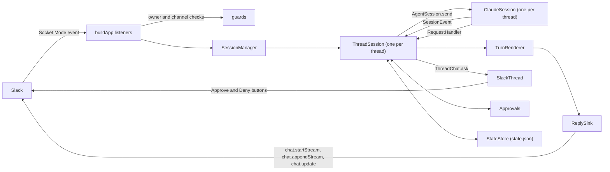

# Architecture

awaydesk is one Node process. It holds a Slack Socket Mode connection and one Claude Code process
per live thread session, across every bound channel, all on one event loop.

## Overview

One Slack thread is one Claude Code session, which is one `ClaudeSession` in the daemon: a single
`query()` of the Claude Agent SDK with streaming input. A message in a thread goes to that thread's
session, and what the session sends back is written into the same thread. Threads of different
channels run side by side on the one event loop, and each thread keeps the folder it was opened in.

The source is three layers, wired by `main`. `src/clock.ts` and `src/log.ts` sit above them and any
layer imports them. `test/imports.test.ts` reads the imports of every source file and fails on one
the table does not allow.

| Layer | Holds | Imports |
|---|---|---|
| `src/agent/` | the agent seam (`src/agent/seam.ts`) and the Claude back end (`src/agent/claude/`): the SDK's query with its options, hooks and permission callback, the translation of its records into events, folder trust, the session listing, the usage probe | the back end is the only code that imports `@anthropic-ai/claude-agent-sdk`; nothing of the core or of the chat layer |
| `src/core/` | the sessions, `state.json`, the model of a reply, the pending requests and holds, the daemon's words and texts, the configuration, the lock | the two seams; neither library, and nothing under `src/agent/claude/` or `src/chat/slack/` |
| `src/chat/` | the chat seam (`src/chat/seam.ts`) and the Slack provider (`src/chat/slack/`): the listeners and their guards, the reply sink, the root's reaction and the thread's status line, the Home tab, files | the provider is the only code that imports `@slack/bolt` and `@slack/web-api`; the core and the agent seam, never the back end |

The core talks to the two libraries through the seams alone. No type of the Agent SDK appears in
`src/agent/seam.ts` and no type of a Slack package in `src/chat/seam.ts`.

What crosses the agent seam:

| Crossing | Direction | What |
|---|---|---|
| commands | core to back end | on `AgentBackend`: `start`, `listSessions`, `datedSessions`, `aliveSessions`, `folderTrusted`, `trustedRepository`. On the `AgentSession` a start returns: `send`, `interrupt`, `stopTask`, `setPermissionMode`, `setModel`, `setEffort`, `contextUsage`, `info`, `close` |
| events | back end to core | `SessionEvent`, read in order from `AgentSession.events`: the session's id and version, a message's start and end, text as pieces or whole, a call's start and end, a task's life, a compaction, a change of permission mode, effort or folder, a prompt the agent took, usage limits gone stale, a turn's end, an error message of the agent's, a lost process. A turn has no start event, and `turn_ended` is an event like the others, never the answer to `send` |
| requests | back end to core, which answers | `RequestHandler.permission` and `RequestHandler.question`: each resolves once, for as long as the owner takes, with a `PermissionAnswer` or a `QuestionAnswer` |
| capabilities | read by the core | `AgentBackend.capabilities`: what the back end supports (`capabilities.CAPABILITIES` for Claude), such as `liveEffort` and the names of its permission modes |

What crosses the chat seam, which is the half a session uses:

| Crossing | What |
|---|---|
| a reply | `ReplySink`: `text`, `task`, `finish`, `closeOut`, `waitLanded`, `settle`. A session holds it as a `Reply`, which adds `setRunning`, `setLatest` and `footerShown`. A tool's line crosses as a `TaskUpdate` and the footer as `FooterFields`, which the provider formats |
| a thread | `ThreadChat`, one per thread from `ChatProvider.thread`: `openReply`, the root's status (`showStatus`, `clearStatus`, `settleStatus`), the activity line under the last message (`showActivity`, `activityRefused`, `written`), `notice`, a request put to the owner (`ask`, `withdraw`, `keepAnswers`) and `close` |
| a failure | `ChatError`, whose name is the provider's code for the failed call |

The inbound paths (a message, a click, a form), the session's setup, the same-folder hold, the Home
tab and file upload do not cross the chat seam: the Slack provider handles them and calls the core
directly (`SessionManager`, `Approvals`, `Holds`, `StateStore`). `ChatCapabilities` is declared in
the seam and nothing carries it.

| Part | Owns |
|---|---|
| `main` | the startup order, the Socket Mode connection, signals and the shutdown drain |
| `app.buildApp` | one listener per inbound path (message, button, modal, Home control); the listeners are the classes of `src/chat/slack/app/`: they acknowledge, check and route |
| `guards` | the owner, workspace and channel checks that each inbound path runs on its own |
| `commands` | the `!word` parser and the daemon's own words |
| `SessionManager` | the live `ThreadSession` objects, one per open thread, and what spans them: `!bind`, `!resume`, the drain |
| `ThreadSession` | one thread: its agent session, prompt queue, turns, requests, status and idle close |
| `ClaudeBackend`, `ClaudeSession` | the Claude Code process of a session and everything read from Claude Code's own records |
| `Translator` | turns the records of the SDK's stream into session events |
| `TurnRenderer` | turns the session events into a model of one reply |
| `ReplySink` (in `sinks`) | writes that model to Slack as a native stream, then by `chat.update`, and ends it with the footer |
| `SlackThread` | what a session does to its thread outside a reply: the root's reaction, the status line, a notice, a request's message |
| `Approvals`, `Holds`, `setup` | questions the daemon puts to the owner in Slack: tool permission, a same-folder hold, a session's setup |
| `StateStore` | `state.json`: the channels, their threads and what crash repair needs |
| `Home` | the app's Home tab, the session index; `ThreadDeleter` serves its edit mode |

One message's way from Slack to Claude Code and back:

1. Slack delivers the event over the Socket Mode connection, which Bolt's `SocketModeReceiver` holds
   (`app.socketReceiver`). `app.buildApp` registered the listener for it.
2. Bolt acknowledges an event before its listener runs. The listener then checks the owner and the
   workspace (`guards.isOwner`) and the channel (`ChannelGuard.refusal`), both through
   `Answers.admitted`. A message that starts with `!` is read by `commands.parseBang` as one of the
   daemon's words or as a passthrough to a Claude Code command.
3. A prompt reaches `Messages.submitToSession`. A top-level message opens a session
   (`SessionManager.open`); a reply in a thread gets that thread's session (`SessionManager.get`),
   rebuilt when a restart or an idle close dropped it. Before the prompt is sent, it can wait for
   the owner: a first prompt for the session's setup, and a prompt that would wake an idle session
   for the same-folder hold, when another session is working in that folder.
4. `ThreadSession.submit` queues the prompt. The session sends one at a time to its `AgentSession`
   (`ClaudeSession.send`), and one reader task follows `AgentSession.events`.
5. In the back end, `Translator.translate` makes session events of each record the SDK's stream
   yields. The reader gives each event to a `TurnRenderer`, which keeps the model of the reply. The
   `ReplySink` writes that model into the thread and ends the reply with the footer.
6. When Claude Code needs permission, the SDK calls `canUseTool`. The back end makes a request of it
   (`requests.toRequest`) and asks the session's `RequestHandler`; the session posts it through
   `ThreadChat.ask`, as a message with Approve and Deny buttons, and the click comes back through
   steps 1 and 2.

Terms used throughout:

| Term | Meaning |
|---|---|
| thread | A Slack thread. Its root is the owner's top-level message, or the owner's `!resume` message |
| session | A Claude Code conversation, named by a session id. `ThreadSession` is its live side in the daemon |
| turn | One prompt sent to Claude Code, and what it does until its result arrives |
| reply | What the daemon writes in the thread for a turn, ending with the footer |
| report turn | A turn Claude Code starts by itself to report a finished background task |
| bypass | Claude Code's `bypassPermissions` mode, kept per thread and set with `!bypass` |
| root reaction | The reaction on the thread's root message that shows the session's state: ⏳ working, ✋ waiting for the owner, ✅ ended, ❌ error |
| drain | The wait at shutdown for the turns already sent to finish |
| record | One object of the SDK's stream, as Claude Code wrote it |
| event | A `SessionEvent` of the agent seam, which the back end makes from records and hook inputs |

To learn what the daemon does and what it refuses, read this overview, then "Who may talk to it",
"Approvals", "Rendering" and the opening of "Sessions". The other sections are internals for someone
changing the code: "Startup", "State and the single-instance lock", "Writing to Slack", "Footer",
"Opening a file", the rest of "Sessions", "The session index" and "Slack handlers". The limits those
sections quote from Slack and the SDK are gathered, with their dates and versions, in "Measured
platform behaviour" at the end.

## Startup

`main.run` starts the daemon in this order. It is the one module that imports all three layers, and
every client, store and clock the layers use is built here and handed down.

1. It loads the configuration (`config.loadConfig`), so a bad `.env` fails before anything else.
2. It takes the single-instance lock (`lock.singleInstance`), so a second daemon fails before it
   opens a Socket Mode connection.
3. It reads `state.json` (`StateStore`) and prepares the attachments folder
   (`attachments.prepareUploads`, see "Attached files").
4. It builds the two Slack clients (`main.makeClients`: `clients.sharedClient` for every call but a
   reply's, `clients.repliesClient` for replies) and calls `auth.test` for the workspace id and the
   bot user id.
5. It builds the parts and wires them: the `ClaudeBackend`, the `UsageProbe` and its `UsageCache`,
   `Approvals` and `Holds`, the `SlackChat` with the shared `UpdateLimiter`, the `SessionManager`,
   the `ThreadDeleter` when the owner's user token is configured (`main.deleter`, which calls
   `auth.test` with that token), the `Home`, and the Bolt app (`app.buildApp`) with its
   `ChannelGuard`.
6. It installs the `SIGTERM` and `SIGINT` listeners (`main.StopSignals`), so a signal that arrives
   during a long repair is caught and not left to the default disposition, which would end the
   process at once.
7. With the shared client, Socket Mode not opened yet, it repairs what a crashed daemon left open
   (`repair.repairCrash`, see "State and the single-instance lock") and then cleans `state.json`
   (`cleanup.clean`, see "Cleaning `state.json`"). Cleaning runs only after repair, so a pruned
   thread's leftovers are still repaired first, and it runs again every
   `cleanup.CLEAN_EVERY_SECONDS` until a stop begins (`main.cleanEvery`).
8. It sets `StateStore.onSessionsChange` and asks for the first session index (`Home.request`, see
   "The session index").
9. It opens the Socket Mode connection and, once connected, posts the version 1 to version 2 upgrade
   notice to each channel that still owes one (`main.postUpgradeNotices`), as a message of its own,
   not a reply.

`main.main` is the entry point. A `ConfigError`, a `StateError` or `AlreadyRunning` is logged with
its message, any other failure of `main.run` by its name alone, and the process exits with 1. A
rejected promise or an exception nobody handled is logged by its name
(`main.installProcessHandlers`). After a rejected promise the daemon goes on, as the Python daemon
did after a task's exception. An uncaught exception stops it the way a `SIGINT` does, with the
shutdown below and no drain, and the process exits with 1, so that launchd, which keeps the
service alive, starts a clean daemon and the crash repair runs: Node documents the process as
unsafe to resume after one, and letting Node end it there would skip the shutdown and leave open
replies and a Claude Code process per session. One rejection leaves the daemon running and deaf.
`@slack/socket-mode` 3.1.0 reconnects from its `close` listener without awaiting the call
(`SocketModeClient.delayReconnectAttempt`), and when Slack refuses the app token for good
(`invalid_auth` and the four other codes the client calls unrecoverable) the request for a new
WebSocket URL is rejected there with no event for it. The log then holds
`unhandled rejection: invalid_auth`, and the daemon needs a working token and a restart.

When the network is gone the Socket Mode client asks Slack for a new WebSocket URL again and
again until it gets one. `app.socketReceiver` sets how: the waits start at one second, grow by
1.3 each time, stop growing at `app.RECONNECT_WAIT_SECONDS` (60), and the client never gives up,
so a try follows the one that failed by a minute at most. Left to itself `@slack/socket-mode`
3.1.0 lets the wait grow with no limit: with the network gone for two hours it tried 30 times,
the last wait 26 minutes (run on mocked timers, 2026-10-10). The log holds
`socket mode: reconnecting`, then one warning per failed try.

Logs are lines on standard error (`log.getLogger`), which the LaunchAgent writes to
`~/Library/Logs/awaydesk/awaydesk.log`. A line reads `<time> <LEVEL> <name>: <message>`, the time
local, the name that of the module (`awaydesk.core.state`); lines below `INFO` are not written
unless `log.setLevel` lowers the threshold. A line carries ids, counts and error names, never the
text of a prompt or of a reply. The Slack libraries are given loggers that never write their own
text (`quiet-logger`), since it can quote a message and, at the debug level, the Socket Mode ticket
in the WebSocket URL: the web clients write nothing, Bolt and the Socket Mode client one line per
warning or error that names the library, and the daemon logs the states of the connection itself.

### Shutdown

`SIGTERM`, which `launchctl kill TERM` and `launchctl bootout` send, starts a drain
(`SessionManager.drain`):

- It lets the turns already sent finish, each up to its reply's end (the stream's stop, footer
  included), and the background tasks with the turns that report them. A task whose end came without
  its notification is waited for `constants.INJECTED_TURN_WAIT`, since the CLI can suppress the
  notification. No other turn is sent.
- A new prompt gets `texts.RESTARTING` and, under it, the threads the stop still waits for
  (`Answers.refuseRestarting`, from `SessionManager.restartHolds`).
- A queued turn is dropped without a reply of its own (`ThreadSession.dropQueued`). One note
  (`turn.notSent`, `N messages were not sent because awaydesk restarted: send them again.`, with the
  start of each) is added to the end of the thread's running reply, or posted as a message of its
  own when nothing runs.
- Approvals and questions stay open: the Socket Mode connection closes only after the drain. A
  same-folder hold or a setup still open is cancelled, as `!stop` would.
- A thread left with only background tasks says `texts.RESTART_WAITS` in its status line
  (`ThreadSession.threadLine`, brought up to date by `ThreadSession.showRestartWait` at every poll
  of the drain), naming them by the footer's counts, since the daemon cannot tell whether a task (a
  dev server, a watcher) ever ends. A status line does not notify and goes with the restart, where a
  message would do both. Where Slack refuses the app a thread status (`ThreadChat.activityRefused`),
  one message says it (`texts.RESTART_WAITS_MESSAGE`). `!stop` ends such tasks with
  `AgentSession.stopTask`. Claude Code starts no turn to report a task stopped this way (measured:
  "Stopped task, no report turn"), so neither the drain nor the thread's next prompt waits
  `constants.INJECTED_TURN_WAIT` for one.
- The signal names no sender, and the session that sent it has a turn running when it arrives. Every
  session with a turn running then gets `ThreadSession.mayHaveOrderedRestart`. A background task it
  starts after the signal, most likely its own wait for the new process, which could only end once
  this one has exited, is left out of `ThreadSession.restartReady` (the idle test the drain uses)
  and of `texts.RESTART_WAITS`. The drain still waits for that session's turn and for every other
  task.

When no session is working, after `main.DRAIN_LIMIT_SECONDS`, or on a second signal, the daemon
stops the scheduled cleanup, closes the connection, tells the listeners it is stopping and gives up
the clips still waiting for a transcript (`BuiltApp.close`), closes every session
(`SessionManager.closeAll`), publishes the session index a last time (`Home.close`), closes the
usage probe and releases the lock. A step that fails is logged and the rest still runs.

A listener that was in flight when the stop ended goes on at its next step, since Node does not
cancel it with the loop. From `BuiltApp.close` it does nothing the owner can see: `Answers.admitted`
refuses, and nothing posts, reacts, opens a modal, submits a prompt or deletes a request. From the
first line of `SessionManager.closeAll` the manager hands out no session (`get` answers null),
and `open`, `resume` and `bind` throw `SessionClosed` before they read or write `state.json`;
`release` answers false. A session started then would never be closed, and with the real back end
its Claude Code process would keep Node alive after the lock was released. Once `main.run` has
returned, `main.main` ends the process with the code `run` gave. Node would otherwise stay alive
while anything holds its event loop, and the Socket Mode connection does after every stop:
`@slack/socket-mode` 3.1.0 closed its WebSocket 5.9 seconds after the stop in each of three runs
on 2026-10-10, with the lock already free. A stop that a failure asked for and that has not
returned after `main.FAILURE_STOP_SECONDS` ends the process with 1, on a timer that does not keep
it alive (`main.deferred`). After `bootout` launchd kills the daemon once the LaunchAgent's `ExitTimeOut`
passes (60 seconds at most), whatever the drain is doing. `SIGINT` skips the drain: from a terminal
it also reaches the Claude Code processes, which share the daemon's process group. A signal that
arrives before the daemon waits for one, during a repair for instance, is kept and starts the stop
as soon as the start is over.

## Configuration

`config.loadConfig` reads `~/.config/awaydesk/.env` without copying anything into the process
environment. It refuses a file that is not a regular file, belongs to another user, or grants any
permission to group or others, and it refuses tokens of the wrong kind. The ownership and the mode
are not checked on Windows. [setup.md](setup.md) lists the variables.

The file is parsed by Node's `util.parseEnv`, after a leading byte order mark is removed.
`config.expandEnv` then expands `${NAME}` and `${NAME:-default}` in every value, quoted or not. A
name resolves from the values the file defines above it, else from the process environment, where a
variable set to nothing counts as set, else to its default, else to nothing. An expanded value is
not expanded again, and `$NAME` without braces stays as written. A value is trimmed, and a variable
left empty counts as missing. `ALLOWED_ROOT` takes a leading `~` as the home directory and is stored
with its symlinks resolved; it must be a directory. The tokens are non-enumerable fields of the
`Config`, so a log line or a `JSON.stringify` of it never shows them.

## State and the single-instance lock

`StateStore` (in `state`) keeps, for each bound channel, its directory and, for each of its threads,
the folder it was opened in, its Claude Code session id, its bypass choice (on, off, or never
chosen), the effort level set with `/effort` and `ended`, the reaction name of its root once ✅ or ❌
is requested (cleared when the root turns ⏳ or ✋ again; read only by the session index), in
`~/.config/awaydesk/state.json` (version 2). `bypass` is `true` for on and `false` for not on; an
explicit off also writes `bypass_off: true`, and a thread with `bypass` false and no `bypass_off`
has never chosen. A reader that does not know `bypass_off` takes an off as not on. Every change is
written to a temporary file beside it, synced, and renamed over it, so a crash leaves either the old
file or the new one; the directory is synced after the rename. A file that cannot be read, or has an
unknown version, stops the daemon with a `StateError` instead of being replaced. A version 1 file
(one session id and bypass switch per channel, no threads) is converted on load and written back as
version 2: each channel keeps its directory and gets an empty thread map and a pending upgrade
notice; the session id and bypass switch, which belonged to the channel itself, are dropped.

Each thread also carries three fields for crash repair, ids only, never message content:

- `open_replies`: the ts of every message of a reply that a crash would leave unfinished. More than
  one can be open at once, since a background task's own reply can outlive the turn that started it.
  Each `ReplySink` owns the entries of its own messages (`ReplySink.retrack`): one is added the
  moment a message is written whose stream is open, whose card still runs, or that is the reply's
  last while its end has not landed, and removed once nothing of it is left for a repair to close.
  The sink reports each change through the callback `ThreadChat.openReply` was given, and the
  session writes it (`StateStore.replaceOpenReply`).
- `requests`: the ts of every approval, question, setup and same-folder hold message still carrying
  buttons (added on post, removed on delete or answer).
- `status`: the root's reaction name while it is ⏳ or ✋ (cleared once ✅ or ❌ is requested). The
  session asks the chat for a status by one of four words, and `constants.STORED_STATUS` gives the
  reaction name the file keeps for each.

All three are optional: a version 2 file without them reads as "nothing open", and a reader that
does not know them ignores them, so the version stays 2. A graceful close (`ThreadSession.close`)
clears all three for its thread once it is done, whatever the fields looked like partway through
(`StateStore.clearRepair`). The exception is a close that could not land a reply's end on Slack: the
open replies and the status stay, with `ended` set to ❌, so the next start's repair closes the reply
and says so. Otherwise only a crash leaves them set.

On start, before the Socket Mode connection opens, `repair.repairCrash` repairs every thread
`state.json` still shows as left open. For each open reply it stops the message's stream
(`chat.stopStream`; `message_not_in_streaming_state` means Slack closed it already, at 5 minutes,
and is fine), reads the message back by its own ts (`conversations.replies` with `ts` and `limit=1`)
and edits it with `chat.update`: its blocks as Slack keeps them, every card left `pending` or
`in_progress` closed as an error (a stopped stream stores it as one anyway), and
`texts.STOPPED_BEFORE_ANSWER` appended as a context block, or, at Slack's 50-block cap, added to the
last context block. The stream's own stop is the one notification the reply owes, and the edit never
notifies; nothing is posted. A message that cannot be read back, or is gone, is left as it is. It
deletes each stale request (`message_not_found` counts as done) and sets ❌ on a root left ⏳ or ✋,
through the same `StatusReaction` a live session uses. Each field is cleared once its own repair has
been attempted, successfully or not (a failed `state.json` write here is logged and swallowed, never
left to break startup), so a second start never retries what an earlier one gave up on; one thread's
failure is logged and does not stop the others.

`lock.singleInstance` takes the lock by the mechanism of the platform, and a second process fails to
start with `AlreadyRunning`. macOS is the only supported host.

| Platform | The lock | Its limits |
|---|---|---|
| macOS | the configuration directory itself, opened with `O_EXLOCK` and `O_NONBLOCK`: the exclusive lock `flock` takes, held by the open directory | none stated: it adds no file, the kernel releases it when the holder exits, a killed one included, and removing or renaming a file in the directory changes nothing |
| Linux | a listening Unix socket `lock.sock` in the directory (`lock.socketLock`), with a claim file beside it, the socket's name plus `.claim`, created exclusively around every start, so that two starters never both replace a socket a dead process left. A socket that refuses a connection is stale and is replaced; one that accepts is a live holder | removing `lock.sock` under a live holder lets a second start in, since the new socket is another file; a claim file left behind blocks a start for at most `lock.CLAIM_STALE_MS`; the socket's path must fit a Unix socket address (107 bytes) |
| Windows | a named pipe whose name is derived from the directory's real path; the system drops it with its process and refuses a second one of the same name | none stated; no claim file is involved |

Node's `fs.constants` does not export `O_EXLOCK`, so `lock` passes its number, `0x20`, as
`sys/fcntl.h` of the macOS SDK defines it. Measured on macOS on 2026-10-10, on Node 22 and 26: the
open conflicts in both directions with a `flock(LOCK_EX | LOCK_NB)` another process holds on the
same directory, and fails with `EAGAIN`.

### Cleaning `state.json`

`cleanup.clean` runs on start and then every `cleanup.CLEAN_EVERY_SECONDS` (`main.cleanEvery`), and
removes only what an answer makes certain:

- `cleanup.forgetGoneChannels` asks about each bound channel through the lookup it is given, which
  answers `gone`, `there` or `no answer` (`cleanup.ChannelAnswer`), and removes, with
  `StateStore.removeChannel`, each one that is `gone`, threads included. The lookup for Slack is
  `channels.channelLookup`: `gone` is `channel_not_found` from `conversations.info`, and any other
  failure is no answer and removes nothing. A private channel the bot was removed from gives the
  same answer as a deleted one, so it is forgotten too. When Slack finds none of the bound channels
  (a channel it gave no answer about is not one it found), nothing is removed and a warning says so:
  that is what the token of another workspace looks like.
- `StateStore.prune` then drops a thread whose session id is no longer among its folder's sessions
  (`AgentBackend.aliveSessions`, which for Claude is `listing.aliveSessions`: the sessions the SDK
  lists, with every transcript file in the folder's transcript directory) and a no-session thread
  whose root message is more than a day old. A folder the back end cannot tell about keeps its
  threads: one whose transcript directory is there and cannot be read, and one whose name passes
  `listing.LONG_PROJECT_KEY` characters and has no directory under the name the daemon derives (see
  "Slack handlers" for how that name is derived).

A pass leaves alone every thread and channel with a live session object
(`SessionManager.liveThreads`), whose session id may not be on disk yet; the next pass takes them
once the session has closed. `clean` never throws: a pass that fails is logged and the next one
tries again.

## Who may talk to it

Every inbound path that acts (a message, including a `!word`, and a button) runs two checks of its
own before anything reaches Claude Code, through `Answers.admitted`:

1. `guards.isOwner`: the Slack user is the configured owner AND the workspace is the one `auth.test`
   reported at startup. A click from a user whose home workspace differs is refused
   (`guards.interactionActor`).
2. `ChannelGuard.refusal`: the channel is private, not shared with another workspace, and its
   members are exactly the owner and the bot. It is read from Slack every time, so inviting a third
   person stops the bot in that channel at once. A channel that cannot be read is refused.

A payload is read field by field, and a field of the wrong type never passes a check. Messages with
a subtype (edits, deletions, joins) and messages from bots are ignored (`guards.isPromptMessage`),
except `file_share`, a message carrying files, and `thread_broadcast`, a thread reply sent with
**Also send to #channel**, which is handled as any reply in its thread. Neither event has a `team`
field (measured: "File share event has no team", "Thread broadcast event has no team"), so
`guards.messageActor` reads the workspace elsewhere. For a `file_share` it comes from the files'
`user_team`, which must be the same for every file, or the message is refused. For a
`thread_broadcast` it is the `team_id` of the envelope the event came in, and only when the
envelope's `is_ext_shared_channel` is `false`: that id names the workspace the event happened in,
not the writer's own, so in a channel shared outside the workspace the message is ignored. The
channel check refuses such a channel in any case. A `team` that is present and is no string names no
workspace: the message is refused, and neither the files nor the envelope are read in its place. A
`thread_broadcast` that carries files follows the files' rule; no such event has been recorded. The
hidden `message_changed` that Slack sends after a `thread_broadcast` is ignored like any edit. A
refusal reaches the owner as an ephemeral message; everyone else gets nothing.

A control of the session index (the Home tab) runs the first check alone. Its payload names no
channel, and all it does is choose what the owner's own page shows, or delete what the owner
confirmed there: nothing reaches Claude Code.

Where the daemon's own answers go is decided in `Messages.handleWord`. A word typed at the top
level, or in a thread that holds no session, acts as a top-level word: its answer is a normal post
in the channel (`Answers.inChannel`, or `Answers.say` with no thread), which is neither ephemeral
nor a thread reply, so it stays after a reload and never notifies. Three words are the exception in
a thread that holds no session, where a word reads as being about that thread: `!stop`, `!resume`
and `!bind` with a folder act on the whole channel, so there they change nothing and say where to
send them, for the owner alone (`texts.STOP_OUTSIDE_SESSION`, `texts.WORD_IN_THREAD`). A word typed
inside a session's thread is answered by `Answers.tellOwner` or an ephemeral `Answers.say` under the
owner's message (`chat.postEphemeral` with `thread_ts`), which Slack drops on reload; `!bypass` adds
`Answers.acknowledge`, a ✅ reaction on the word, which stays; `!stop` there is answered by a post in
the thread, which stays: `texts.STOPPED_THREAD` when it stopped something,
`texts.NOTHING_TO_STOP_THREAD` when nothing runs; `!open` posts its button in the thread.
`Messages.wordReport` chooses the same place for a word's failure, and `Answers.replyOnFailure` logs
a report that itself fails instead of letting it throw, since a throw would reach the message
listener's own failure path, which posts `texts.ERROR_REPLY` threaded under the word. The old-folder
notice (`texts.OLD_THREAD_FOLDER`, shown on a prompt sent in a thread whose folder differs from the
channel's current one) and `Not sent.` are ephemeral as well. A Resume button carries
`<session id>@<thread ts>`, the thread of the owner's `!resume` message (`resume.parseResumeValue`);
the click is checked like any other inbound path, and a value in any other shape answers
`texts.RESUME_STALE`.

## Attached files

`attachments` handles the files of a `file_share` message before anything reaches Claude Code. Every
file is checked first (`attachments.refusal`): its download URL must be
`https://files.slack.com/...`, the only host that receives the bot token, and an image must be JPEG,
PNG, GIF or WebP, at most 7.5 MB (10 MB once base64-encoded) and 8000x8000 px, the limits of
Claude's vision API; any other image type is refused. A file that is not an image must be a `text/*`
type (which covers source code) or one of `attachments.FILE_TYPES` (PDF, JSON, XML, YAML,
JavaScript, shell, SQL, TOML, Jupyter notebook), at most 100 MB; any other type is refused. One
message takes at most 5 images and 15 MB of images in all (`attachments.imagesRefusal`): images stay
in the conversation and are sent again at every turn, and a request is capped at 32 MB. Then the
files are downloaded together, with the bot token and no redirect followed, each within
`attachments.DOWNLOAD_TIMEOUT_MS`; `attachments.download` checks the host again before it sends the
token. Slack answers 302 when the app lacks `files:read` (measured: "Download without files:read").
An image becomes an image part, and the turn's prompt one user message of content parts
(`attachments.promptFor`), which the back end sends through the SDK's streaming input
(`prompt.userMessage`); any other file is saved to `$TMPDIR/awaydesk/` and its path is appended to
the prompt, but only once every file arrived, so a failed message leaves no copy. The folder must be
a directory of this user with mode 700, or nothing is written there; at each start the files older
than 3 days are removed (`attachments.prepareUploads`), so a conversation resumed after a restart
still finds its files. A refused file or a failed download sends nothing and tells the owner which
file and why. Prompts, messages with files and Claude Code commands enter the queue in the order
they were sent, although downloads take a while (`Messages.arrival`). A message that waited on its
files is submitted to the thread's session as it is then; if that session closed meanwhile (an idle
close, most likely), the submit is retried once against a freshly looked-up session for the same
thread.

## Rendering

`TurnRenderer` (in `renderer`) reads the session events of the agent seam only, never tool names, so
a tool Claude Code adds later shows in the reply with no code change. The table says "line" for what
the model holds per tool (the chat seam's `TaskUpdate`); the sink draws the lines on task cards, two
for a run of calls and one for a line with a view of its own (see below).

A wire record becomes events in the back end, in `Translator.translate`. A record is one object of
the SDK's stream, read as `unknown` and narrowed field by field; its kind is its `type`, with the
`subtype` of a `system` record and the event type of a `stream_event` (`translate.kindOf`). The
inputs of the two hooks the daemon registers become events in `hooks`. Every kind of record in the
recordings is either translated (`translate.TRANSLATED_KINDS`) or named as not read
(`translate.UNREAD_KINDS`), and a test fails on a recording that carries a kind in neither list; at
run time a kind in neither gives no event. The `Translator` keeps, for one session, what the core
must not need to know about the stream: which messages a `message_start` announced, since Claude
Code sends a streamed text again whole in the message's own record and a text reaches the core once;
the ids of the prompts the daemon sent, so only a prompt of its own is `prompt_taken`; and whether a
compaction is under way. A turn's `result` clears the first and the third, so a stream an interrupt
left unfinished does not hide the next turn's text.

| Event | Made from | What the owner sees |
|---|---|---|
| `text_delta` with no parent call | a `stream_event` of type `content_block_delta` carrying a `text_delta` | the text, as it is written |
| none | a top-level text block in an `assistant` record whose message id a `message_start` announced | nothing more: the same text already arrived as deltas |
| `text` | the same in an `assistant` record whose message id no `message_start` announced | the text, where it arrives, a paragraph apart from text before it (note 1) |
| `call_started` with no parent call | a `tool_use` or `server_tool_use` block | a new tool line, in progress, titled `Name: first string argument` |
| the same with `parentCallId` set, from the record's `parent_tool_use_id` (a subagent, or a skill run in a forked context) | the same blocks | the parent's line counts the subagent's calls and holds its latest ones (note 2) |
| `call_ended` for a line | a `tool_result` or `advisor_tool_result` block | the line completes, or shows an error with the output's first line when `isError`; a line whose task already ended as stopped keeps `Stopped` |
| `task_started` | a `system` record of subtype `task_started` | for a tool call, nothing yet; a task's line once the call's result arrives with the task still running (note 3) |
| `task_progress` | subtype `task_progress` | the line shows the task's description |
| `task_ended`, a terminal `task_updated` | subtype `task_notification`; subtype `task_updated` whose patch names the status `completed`, `failed`, `stopped` or `killed` | the line completes, shows an error when the task failed, or completes with `Stopped` |
| `agent_error` with `parentCallId` set | an `assistant` record that carries `error` | nothing in the reply's text; its words become a nested line of the call's card (note 4) |
| `agent_error` of kind `authentication` | the same, with `error` `authentication_failed` | a note asking to run `claude` and `/login` on the host. Claude Code sends this category for a 401 and for a 403 alike |
| any other `agent_error` | the same, with any other `error` | the text of the message, as a notice (note 5) |
| `compacted` | a `system` record of subtype `compact_boundary` | `Compacted the conversation: 15.0k → 2.0k tokens.`, from its `compact_metadata`, whether the owner asked (`!compact`) or Claude Code compacted on its own (note 6) |
| `turn_ended` | a `result` record | its text, when nothing else was written (note 7) |

Notes on the table:

1. Claude Code writes its own output for a command this way: `Goal set: <condition>` before the
   first inner turn of a `/goal`, the output of `/usage` and of a skill run in a forked context
   (recorded: `goal.jsonl`, `usage.jsonl`, `skill-fork-command.jsonl`). A message with no id is left
   to the row above, and so is every such message at the top level while a streamed one has had no
   `message_stop`, or once a `message_start` named no id. A subagent's reply arrives the same way,
   as one whole `assistant` record with `parent_tool_use_id` and no stream event (measured:
   "Subagent reply is one record"); the renderer shows no text of a subagent.
2. The count reads `Agent: review · 12 calls`. While the subagent runs, its line holds its latest
   calls (`renderer.CHILD_LINES`) as the card's `details`; a streamed card is sent each of them once
   and keeps them all, since a stream only adds to a card's text. The line becomes a task's line: it
   keeps a card of its own once it ends, in the foreground or in the background.
3. Claude Code starts a task for a long command in the foreground too, which ends before the call's
   result. When the call's result arrives with its task still running, the line becomes a task's
   line, notes "Running in background" on its nested line and stays in progress. A task started by a
   call inside another call (a long command a subagent runs) is held aside while that call is open:
   it gets no line and the session does not track it. If it ends before the call's result, it was
   the subagent's foreground work and stays off the reply; if it is still running at the call's
   result, it outlives the call and becomes a task with its own line, like a top-level one
   (`TurnRenderer.nests`, `TurnRenderer.takePromoted`). A task with no call in the reply gets a new
   line; one started by a call the reply never saw, while such a task (a command's) runs, is an
   agent inside that command and shows on the command's line, counted as a call with its
   description, as a subagent's calls show on its line.
4. A background subagent's own failed request stays out of the reply's text, as a subagent's other
   text does. The task's `task_ended` event, with status `failed`, then sets the card of the call
   that started the subagent to an error with the notification's summary as its output
   (`Agent terminated early due to an API error: ...`). For a subagent run in the foreground Claude
   Code forwards no such message: the card gets the error from the task's notification and the
   call's own result. The session logs `Claude Code reported a subagent's error` with the channel,
   the thread and the category.
5. The text is the one Claude Code wrote itself (for a 529, `API Error: 529 Overloaded.` and what to
   do next). With no text block the turn's result speaks, and `Claude Code reported an error` with
   the error code shows only when the result has no text either. The category is never matched
   against a list: any word but `authentication_failed`, such as `model_not_found`, shows its text
   the same way. The session logs a warning with the channel, the thread and the code.
6. It can be the first event of its turn that shows anything (`/compact`, a compaction as a turn
   begins): the turn then starts with it.
7. In the recordings a local command's text (`/usage`) arrives first in an `assistant` record no
   stream event announced, so the result is the fallback for a turn whose only text is its result.

A turn that ends with no text and no tool line says `Done. Claude Code returned no text.`, or
`Stopped the current turn.` when it was interrupted, so no reply is left empty. When the turn ends,
every line still in progress is closed first (with `Stopped` when the turn was interrupted), then
the reply ends. A task that started and has not ended is the exception: its line stays open with
"Running in background". `TurnRenderer.runningTasks` lists them. Only the task events decide this,
because a subagent can move to the background with no second `task_started`.

## Writing to Slack

`ReplySink` (in `sinks`) writes each reply as a native Slack stream inside the session's own thread,
below the message that asked for it (`chat.startStream` with chunks, addressed to the owner's user
and team). The stream starts with Claude's first content, its first text or the card of the first
tool when a turn opens with one, and never with a placeholder. It grows with `chat.appendStream` at
most once every `sinks.DEBOUNCE_SECONDS` per reply, and each append draws from one shared
`UpdateLimiter` (in `limiter`, an option of the Slack provider, `SlackChatOptions`), as does every
`chat.update`: a token bucket that paces writes evenly at 40 per 60 seconds plus a burst of 5, worst
case 45 in one window, under the documented floor of `chat.update` (Tier 3, 50 or more a minute, per
app), so several busy threads together stay under the app's own budget instead of racing through it
and then freezing until it resets.

The retries of a Slack call are the daemon's own policy, in `clients`. Both clients are built with
the library's retries switched off (`clients.SENT_ONCE`), and the policy is applied around the
client's `apiCall`:

| Failure | What is sent again |
|---|---|
| Slack rate limited the call (HTTP 429) | every method, after the `Retry-After` Slack gave, up to `clients.RATE_LIMIT_RETRIES` (3) times: a rate limited call never ran. A 429 with no valid `Retry-After` is not sent again |
| the connection failed before an answer (a reset, a refused or unreachable host) | once, after a backoff pause, while no retry of the call was made yet. `clients.sharedClient` does so for every method. `clients.repliesClient`, the one replies are written with, does so for every method but the four of `clients.CREATING_METHODS`, `chat.postMessage` and the three stream calls: they are not idempotent, and a reset can come after Slack applied the call |
| anything else | never: an error Slack answered with, an HTTP status other than 200 and 429, and the client's own timeout (`clients.REQUEST_TIMEOUT_MS`, 30 seconds), since a timed out call may have run |

For the four creating calls the sink reads the thread back and adopts what landed
(`ReplySink.adopt`). The library's `files.uploadV2` is passed through untouched: the two Slack
methods it calls come back through `apiCall` and are retried there, one by one.

A write to Slack that has begun always runs to its end. A pass of the sink (`ReplySink.flush`) takes
the reply's lock, brings every message to the model and ends the reply if it has ended; once asked
for it is never cancelled, and the next pass queues behind it. The Slack client cannot abort a call
in flight, and a call given up after Slack took it would lose a message's ts or post an ending
twice. What can be cancelled is a wait outside a pass: the debounce before a write, the pause before
the end's one retry, the stream's 280 seconds, and a caller's own wait for a pass. `finish`,
`closeOut`, `waitLanded` and `settle` take an `AbortSignal`: aborting it rejects that call and
leaves the pass running. `ReplySink.settle` then waits for what is in flight.

Within a reply, writes happen in the order things happen. Claude's text goes as `markdown_text`
chunks. Tools go as `task_update` chunks, each a card Slack updates in place by its id.

A run of calls, the calls between two pieces of text, shares two cards (`fold.Fold`, fed by
`ReplySink.task`). One call of the run is shown whole, titled with the tool's name and its first
argument: the last call started that still runs, else the last one shown, which joins the counts
when another call takes its place. Until there is a call to count, the first card shows that call,
and a run of one call stays one card. From then on the first card holds the counts of what ended, in
the terminal's words where the terminal has words (`previews.folded`:
`Ran 2 shell commands · Read 1 file`), the failed calls after `✗`, and the second card shows the
call. Calls that run at the same time show one at a time. A failed call says why in its title
(`Bash: pytest -q · Exit code 1`). Neither card carries `details` or `output`: Slack appends both to
what a card already holds (measured: "Card text is appended"), so a card that is reused keeps its
text in its title.

A call with a view of its own has a card of its own, keyed by its call id, and ends the run: a
subagent, whose title counts its calls and whose `details` say what it is doing now, a background
task, which keeps its card `in_progress` for as long as it runs, and a stopped call. A call that
turns into one of these while a card of a run shows it keeps that card. An `Edit` or a `Write` that
ended well also ends the run, and has no card: its preview is all that shows it.

Once the reply's body has ended, each run reads as one line of counts in a `context` block
(`✓ Ran 2 shell commands · Read 1 file · ✗ Ran 1 shell command`), as the terminal folds a run that
ended (`TaskUpdate.folded`, `ReplySink.cardBlocks`). A stream cannot replace what it showed, so the
line is written by the `chat.update` that follows the stream's stop (`ReplySink.end`), which never
notifies. The reply has ended with the stop: an update that fails is tried once more with the next
write, and the cards stay if that fails too.

The renderer keeps an `Edit` or a `Write` (`previews.PREVIEWED`) from the sink until its result
arrives, since a stream cannot take back the card a running call would get. While the call runs the
reply shows nothing for it; a call that waits for approval has the approval's message. One that
ended well is a `blocks` chunk with no card (`previews.preview`): a collapsible, full-width
`container` block (`blocks.previewContainers`), closed until the owner opens it, whose title is the
call's line (`Update(notes.txt)`), in code style through `rich_text_title` with the plain `title` as
the fallback, and whose subtitle is the sentence (`Added 1 line, removed 1 line`). Inside a diff's
container is the whole numbered diff in a rich text preformatted element with the language `diff`,
which Slack desktop colours; each changed line also carries a red or green square after its sign,
since Slack mobile colours nothing. A new file's container holds its first 10 lines and
`… +N lines`. A body longer than `blocks.MESSAGE_LIMIT` continues in a second container with the
same title; both sit in one message when it is written by update, and in the next message when it is
streamed or posted. One that failed joins its run as a call that ended, with the reason in its
title; one that was stopped has a card of its own; one whose preview has no lines (an empty new
file) has a card that says the sentence. A card the sink already drew for the call stays
(`Tool.cardless`), and the diff under it is then titled with the sentence alone. An answered
`AskUserQuestion` shows its answers the same way, as a `context` block of words (`Preview.plain`).
Its lines come from the questions and answers the daemon sent back, so they depend on no
undocumented field. The preview is built from the event's `FileChange`, which the back end reads
from the `tool_use_result` of the `user` record (`translate.fileChange`). The SDK types that field
as `unknown` and does not document it; any shape other than the one measured gives no `FileChange`
and the call shows its generic card, and the release probe's claim P13 checks the shape on each new
SDK.

The stream stays open until the reply ends, or until `sinks.STREAM_SECONDS` (280 seconds) after it
started, whichever comes first. Slack closes a stream 5 minutes after `chat.startStream` (measured:
"Stream lifetime"), and the daemon stops it a little earlier itself.

- **The reply ends first.** `ReplySink.closeOut` stops the stream with `chat.stopStream`, passing
  the footer, a divider and a context block, as `blocks` at the message's bottom (Slack renders them
  below the stream, buttons included). The stop is the one notification.
- **280 seconds pass first.** `ReplySink.expire` stops the stream (Slack pushes on the stop, the
  first notification) and the same message keeps growing with `chat.update`, which never notifies
  (measured: "Update after stop is silent"). Each update writes the whole message from the
  renderer's model as `markdown` blocks and `task_card` blocks (a run of calls keeps its two cards
  until the body ends), with a short `text`, since a `chat.update` whose `text` is long fails
  `msg_too_long`. The end posts the reply's ending as a new message, the second notification
  (`ReplySink.end`): the text Claude wrote after its last call, whole, with whatever follows it, and
  the footer under it. Its `text`, the banner, is the first paragraph of that text as plain text
  (`markdown.bannerText`), so the notification says how the work ended, the stream's own stop having
  said how it began. The ending is a whole part of the renderer's model, never a cut inside one
  (`ReplySink.endingCursor`), so no list or heading is split. It is posted first, then a silent
  update takes it out of the message it grew in: a failed post leaves the reply as it was, a failed
  update leaves the text twice, and in both cases the end has not landed and the one retry follows.
  When the message holds no such text, or nothing of the answer would stay before it (an answer that
  is text alone), nothing is moved and the new message is the footer alone
  (`ReplySink.writeClosing`), its banner the start of Claude's answer, never a line of the daemon's.
  A turn cut short gets no footer (the Claude Code process was lost, another error ended it, or the
  daemon restarted or closed the session), and `ThreadSession.abandon` writes a line on how the
  reply ended (`Claude Code reported an error: …`, `This reply ended before an answer: …`). When
  Claude wrote text after its last call, that line follows the text into the new message, whose
  banner is still the start of the text. When there is no such text to move, the line itself is the
  ending that moves, with whatever follows it, and is the banner. A process lost while no turn is
  active is told by what the session still owed: a reply that waited for a background task of its
  own gets the same line, then ends as above, and the root shows ❌; a session with nothing running
  and nothing waiting gets no line and keeps the reaction it had, since its last reply ended well
  and the next message connects a new process. The sink keeps it as a part of its own
  (`ReplySink.text` with `ending`, fed by `TurnRenderer.feedEnding`), so a notice written just
  before it stays in the reply, and a card that closes after it moves under it. No other line of the
  daemon's moves. A footer goes under the line: a report turn cut short renders into a reply that
  already has the footer of its first turn, and the running list (`⏳ 1 agent`) shows there until the
  session empties it. When a full message pushed the line, or the note under it, into a
  continuation, that message rang when it was posted and is the ending as it stands
  (`ReplySink.opensOnEnding`): no closing message follows. A line that does not fit the room left in
  a message is cut there, as any text is, and the continuation then rings with the rest of it. The
  new message shows empty in one known case: a turn that ended well with an answer of text alone,
  whose footer could not be built.

Slack holds a message to 12,000 characters and 50 blocks or task cards (measured: "Message limits");
the daemon stops at `blocks.MESSAGE_LIMIT` (11,000) and `blocks.BLOCKS_LIMIT` (45), which leave room
for a preview that arrives after its card and for the footer. Slack translates Claude's text into a
`header` per heading, a `table` per table, a `divider` per rule and `rich_text` for each run between
them, and holds a post and an update to 50 of those; a stream is not held to it, the update after
its stop is (measured: "Block cap after a stream stops"). `markdown.markdownStarts` counts a text
that way for a stream's plan, a post and an update alike, and `markdown.markdownCut` cuts it at a
block's start, before a heading that would end the message. While the reply is being written, a
write of its last message that Slack still refuses with `no more than 50 items allowed` halves the
message's room and is tried again (`ReplySink.tighten`), so the rest goes on in a new message; the
writes of the reply's end are not split. A reply past `blocks.MESSAGE_LIMIT` or
`blocks.BLOCKS_LIMIT` continues in a new message, a new stream while the first one still streams,
else a post. Every message a reply adds notifies once. A stream and a post count the text of a
collapsed container toward those 12,000 characters; `chat.update` does not (measured: "Container
text on update"). A message written by update therefore counts a container as one block and no
characters (`ReplySink.weight`), so a stopped message holds several large diffs where a stream would
have continued. A continuation is posted with the characters a post takes, then brought to what an
update takes by a `chat.update` of the same message (`ReplySink.postStep`). An update refused for
content that held a container is tried once more with the containers counted, as a post counts them
(`containersCounted`, kept for the message): what fits is written, and the rest goes on in a new
message, or is cut with the preview note when the span is fixed.

The reply ends once its turn has ended and none of its tasks still runs or still waits on a turn
Claude Code starts to report it (the held-open reply): a task the turn started keeps its card open
and updating in place, `ReplySink.finish` ends only the body, and `ThreadSession.stillOwed` decides
when `ReplySink.closeOut` runs (the CLI can suppress the report's notification, so past
`constants.INJECTED_TURN_WAIT` `ThreadSession.expireUnreported` gives up on it). A report turn can
name only the reply of the first task it covers when several end together;
`ThreadSession.sweepClosedOut`, run after every turn and after `ThreadSession.expireInjectedTurn`,
ends every other reply left eligible. A turn Claude Code starts on its own to report a background
task renders into the reply that started the task (`ThreadSession.openingTarget`); when that reply
has already ended, the report gets a reply of its own.

A prompt taken into a report turn: every prompt a session sends is one user message under a uuid of
the daemon's own (`Turn.uuid`, `prompt.userMessage`), and the back end starts Claude Code with
`--replay-user-messages`, so Claude Code re-emits it as a `user` record with that uuid, which the
back end turns into `prompt_taken` (`ThreadSession.acknowledge`; measured: "Prompt replay"). A
prompt that gets a turn of its own is replayed after that turn's `init` and before its first stream
event, so no turn runs when its replay arrives; one the CLI takes into a running turn is replayed
inside that turn, and that turn ends with one result, with the origin `task-notification`, for both.
The session never waits for a replay: the back end makes `prompt_taken` only of a record whose uuid
it sent, and the session ignores one that names no prompt it still holds as sent
(`ThreadSession.sent`, or the active turn's own). A replay that arrives with no turn running names
the prompt of the turn that starts next (`ThreadSession.whoseTurn`): that turn takes the prompt's
reply whatever the session was waiting for. When a task's notification is waiting to be reported, a
turn that opens with words and no replay is that report, so it does not take the reply of a prompt
of plain text that waits beside it (measured: "Prompt replay", "Prompt sent before a notification").
In every other case the session takes the turn for the first waiting prompt's unless it awaits a
report: no recording covers them. A turn that opens with a compaction starts before its replay, a
command is not replayed as a prompt is, and a prompt with an image or a turn that fails before its
first word (a logged-out CLI, a limit reached) was not recorded. A replay that arrives while a turn
runs lands on `ActiveTurn.taken`; when that turn's `turn_ended` says the agent started it,
`ThreadSession.finish` releases those prompts (`ThreadSession.settle`: out of `sent`, `Turn.done`
set) and adds the note `texts.TAKEN_INTO_REPLY_ONE` to the reply, through the same end notes as a
restart's `N messages were not sent`. A prompt whose replay did not come during the turn waits for
its own turn. The worker sends one prompt at a time, so a turn takes in at most one. An
`AgentSession.interrupt` with such a prompt queued ends the report turn with
`error_during_execution`, and the prompt then runs as a turn of its own. A prompt already taken in
when `!stop` ends the turn with a result the agent started is released with the note like any other
(not measured: what Claude Code does with it on an interrupt). If the session is abandoned first
(`ThreadSession.abandon`: a lost process, a close, a restart), the prompt is listed among the
messages not sent, whether or not Claude Code had taken it in; its replay is not kept.

`!stop`, a restart, an error that cuts a turn, an idle close and `SessionGone` end the reply through
the same path, at once: the stream stops with the footer and, for `!stop`, the stopped command's
card, and that stop is the notification (`ThreadSession.stopTaskReplies` for the tasks' replies). A
stream whose last append has an unknown outcome (a reset, a timeout) is told nothing more: it is
stopped and the message goes on by `chat.update` from the model. An append Slack refuses as too long
(`msg_too_long`) would be refused again, so `ReplySink.streamStep` stops the stream at once, without
the footer, and writes the message by `chat.update`; the end then posts the reply's ending, as for a
reply past `sinks.STREAM_SECONDS`. The text of a message's cards counts toward the cap of a streamed
message, by a formula Slack does not document (measured: "Card text cap"). Slack adds the `details`
and the `output` of every `task_update` to what the card holds, so a stream is sent only the lines a
card lacks (`blocks.cardAddition`), and `ReplySink.planCard` counts each card toward
`blocks.MESSAGE_LIMIT`: its title, the text it was sent, and a fixed cost per card, per text and per
line, set from that measurement. A new card that does not fit opens the next message; a card already
in a full message gains no more lines of `details`, and still gets its `output`. The count is an
estimate of what Slack stores, so a refusal remains possible; it is logged with the sizes the plan
knew and no content. When Slack refuses an update of any message for its content, the change is
dropped and the message shows less than the model: unless a later update of it passes, the reply's
end counts as not landed and the root shows ❌. The update that only folds the cards of a stream sent
all of its span is the exception, since nothing of the reply is missing. Every reply that has ended
keeps its footer, the record of how its last turn ended; only the thread's latest reply adds the
counts of what still runs to it (`Reply.setLatest`). A card left `in_progress` in a stopped message
is stored as an error until it is updated (measured: "Open card stored as error"), so every end
closes its cards first.

Slack's push behaviour is what makes this shape: a stream in a thread the owner started notifies
once, when it stops, with its first text as the banner, and never when it starts (measured: "Push on
stream stop"; Slack's reference says nothing on it). Every write while Claude works is silent. An
open stream cannot be deleted (measured: "Open stream cannot be deleted"), which is why a reply
never starts as a placeholder that a later write replaces.

`chat.startStream` works only inside a thread and answers `invalid_thread_ts` without `thread_ts`
(measured: "Stream needs a thread"), which the thread model satisfies. A write Slack refuses, or
cannot receive because the network is down, is sent again with the whole reply at the next write; it
never stops the Claude Code session. Every message the daemon posts turns link and media previews
off (`unfurl_links`, `unfurl_media`), so a link in Claude's text is never fetched by Slack on its
own. The end has no next write to fix it: when Slack refuses the content of a message of the end
that is not posted yet, a continuation or the reply's ending (`invalid_blocks`, `msg_too_long` and
the like, `errors.REFUSED_CONTENT`, not a rate limit), that message is posted once more as plain
text (`ReplySink.writePlain`), and the reply goes on to the next messages. A message that already
shows something is never replaced by a plainer one. An end that fails for any other reason (the
network, or a rate limit the client has already retried) is tried once more after
`sinks.FINAL_RETRY_SECONDS`; until it lands, `ThreadSession` shows no ✅
(`ThreadSession.trackLanding`), shows ❌ if the retry fails too, and keeps the persisted status so
the next start's repair still finds the reply.

## Approvals

When Claude Code asks for permission, the SDK calls the `canUseTool` callback the back end
registered. `requests.toRequest` makes a request of the seam of it, a `PermissionRequest` or, for a
call of `AskUserQuestion` whose input holds questions in the measured shape, a `QuestionRequest`,
and the session answers it (`ThreadSession.askOwner`). The session posts the request through
`ThreadChat.ask` as a message of its own, below the reply, with **Approve** and **Deny** buttons,
and waits, for as long as it takes. Any failure on the way to an answer is a deny with a message,
never a rejected callback: the SDK answers a callback that rejects with an error response, which is
not a deny, so `ClaudeSession` catches it, logs the error's name and tells Claude Code that the
request could not be shown. The request shows the tool's whole input, since Approve hands Claude
Code the whole input: it runs over as many code blocks as it needs, and past one message it keeps
the start and the end with a line saying how many characters are not shown
(`requests.approvalBlocks`). Everything the model wrote (the title, the description, the input, a
question's header) goes to Slack with `&`, `<` and `>` escaped and a zero-width space after each
backtick (`escape.shownAsWritten`), so no `<url|label>` can hide what it links and no text can close
its code block. A clarifying question (Claude Code's `AskUserQuestion` tool, 1 to 4 questions)
arrives the same way and is posted as one line naming the questions, with **Answer** and **Skip**.
Answer opens a modal (`requests.questionView`) that shows one question at a time, since Slack has no
tabs: radio buttons, or checkboxes when several may be picked, each option with its description, and
an **Other** field, as the terminal offers. Slack caps an option object's text and description at 75
characters each and gives it no place for the option's `preview`. When an option says more than
that, the page shows the question in bold, then every option whole in a `rich_text` block: its label
in bold, its full description, and its preview in a preformatted element, which keeps its line
breaks. Rich text shows its text as written, so nothing Claude wrote is read as markup. The choice
under them keeps the labels alone, titled with the question's header. The modal's own button reads
`Next (1/3)` and moves on (`response_action: update`) only once the question has an answer,
otherwise the question gets an error (`response_action: errors`); it reads `Submit` on the last.
What was filled travels in the view's `private_metadata` (`requests.Draft`, under Slack's 3,000
characters) from one question to the next. The picked labels, with the text typed under Other as the
answer itself, go back as the tool's answers, a multi-select's as a list (measured: "Multi-select
answer as a list"). The modal carries no channel or thread: each click in it is checked against the
owner, the workspace, and the channel and thread its request was posted in (`Draft.threadTs`,
alongside its `private_metadata`). Each request has a random id that only its buttons carry
(`Approvals.open`); a click resolves it once, only from the channel and thread it was posted in
(`Approvals.resolve`), and only after the identity and channel guards. Once decided, the request
message is deleted: the tool's line in the reply records the call. For an answered question that
line is the record of the answers, as the terminal keeps it: the call's card reads
`User answered Claude's questions:` and a `context` block under it holds `⎿ · question → answer` for
each question, cut at Slack's 3,000 characters (`previews.answered`, drawn by `sinks.pieceBlocks`).
It sits in the reply where the question was asked, so what Claude does next shows below it. The
session hands the answers to the reply itself (`ThreadSession.keepAnswers`,
`TurnRenderer.answered`), keyed by the call id the permission request carries, and then deletes the
request. When the reply has no line of its own for that call (a question asked inside a subagent
shows on the subagent's line), the request is rewritten instead, with no buttons, into the same
record (`ThreadChat.keepAnswers`, `requests.answeredBlocks`); if Slack refuses that rewrite, the
request is deleted, so no button is left that no longer works. `!stop` denies every request still
pending in the session's own thread and deletes its message, and a request still waiting when the
session closes is answered as refused (`Approvals.denyAll`): a denial for a permission, a skip for a
question. A request Slack does not accept is denied at once, with a message telling Claude Code that
it could not be shown (`texts.APPROVAL_UNPOSTED`), and the tool's line records the denial.

## Footer

Every reply ends with one context line. The session hands the reply the footer as fields
(`FooterFields`, from `ThreadSession.footerData`), and the Slack provider writes the line
(`footer.formatFooter`): `⚡ bypass` when bypass is on, the model from `AgentSession.contextUsage`
(the SDK's `getContextUsage()`), the effort level, the name of the folder this thread was opened in,
the git branch and the uncommitted changes of the folder the session works in, the session's tokens
from the turn's `turn_ended` event (the `modelUsage` of the `result` record, summed by
`footer.sessionTokens`), the context percentage from the same `contextUsage`, and the 5-hour and
weekly limits with the time to each reset. The folder the session works in is the `cwd` of the
latest hook input, which follows a `cd` and a worktree (`ThreadSession.workingDirectory`, set by the
event `folder_changed`): the back end registers a `Stop` hook, and a `PostToolUse` hook after every
tool, so a turn stopped or failed before its `Stop` still moves it. Until a hook reports it, and
again after the agent process restarts, it is the thread's own folder. The changes are the lines
inserted and deleted since the last commit, staged and unstaged, untracked files not counted, as
ccstatusline's git-changes counts them. They come from plumbing commands
(`git diff-files --shortstat` and `git diff-index --cached --shortstat HEAD`, the empty tree before
a first commit), which never write the index: `git diff` refreshes it under `index.lock`, and a diff
killed at `footer.GIT_TIMEOUT` would leave the lock behind and stop every commit. The branch and the
changes show only where that folder is in a repository the daemon's git may run in
(`AgentBackend.trustedRepository`, for Claude `trust.trustedRepository`: one the owner trusted in
Claude Code, or one inside the folder the session started in, `ThreadSession.directory`, when that
folder passes `trust.workspaceTrusted`); anywhere else no git runs and the footer leaves both out,
since a diff runs the `clean` filters a repository's config names. git is given the repository with
`--git-dir` and started at the repository's root (`footer.runGit`), so it searches for nothing from
the folder: a planted `.git` file, a bare layout or a `core.worktree` there is never read.
`core.fsmonitor` is off, and `--ignore-submodules=dirty` keeps git out of every nested repository
the index names, so a submodule counts by its checked-out commit alone, also one set to
`ignore = all`. Inside the repository's own `.git` directory the branch alone shows. All the git
calls of one footer share `footer.GIT_TIMEOUT` (`footer.gitState`), and a git process still running
when it passes is killed. The effort level is the one Claude Code reports in the input of the `Stop`
hook (`effort.level`, the event `effort_observed`); `/effort` and `/model` run no hook, so after one
of them the footer follows its output (`Set effort level to ...`, read by `footer.effortChange`).
Until Claude Code reports a level on the running process the footer leaves it out, unless the daemon
itself just set a stored level, which shows at once; when the model takes no effort parameter it
shows `default`. The limits come from Claude Code's `/usage`, sent on a long-lived session of its
own, started in the home directory with none of the owner's setting sources, without the permission
to bypass and without the Chrome flag (`UsageProbe`, over `ClaudeBackend.startBare`), and are
cached for five minutes (`footer.UsageCache`, `footer.USAGE_TTL`); the event `limits_changed`, which
the back end makes of the SDK's rate-limit record, invalidates the cache. A probe with no answer
within `usage.USAGE_TIMEOUT` gives up and closes its session. The limit fields exist only with a
claude.ai subscription. A field that cannot be read is left out.

`!status`, sent inside a session's thread, lists the same values one per line (`Model: ...`,
`Context: ...`), read by the same `ThreadSession.footerData` and written from the same list,
`footer.footerFields`, as the footer writes them (`footer.formatStatusFields`), then the running
tasks; bypass and the folder are left out, since its Mode and Directory lines show them. When the
session works in another folder than the one it was opened in, a `Working in:` line names it before
the values. Once the thread has a session id, a `Terminal:` line under `Session:` gives
`cd <folder> && claude --resume <id> --fork-session` (`directory.terminalLine`): a session created
through the SDK stays out of the terminal's picker, and a fork made in the terminal is listed
(`docs/setup.md`, "Continuing a session in the terminal"). The folder is the thread's own, quoted
for the shell, so the fork is listed where `!resume` in the channel looks; the id is stored from the
first turn's `session_started` event, so the line shows during that turn too. A command holding a
backtick is written as escaped text, since a code span cannot hold one, and the line is left out
when the folder cannot be used (`DirectoryUnavailable`). It starts the thread's agent process when
none is running, since the model and the context come from it (the context usage is answered before
a session's first turn and during a turn; measured: "Usage before first turn"). The session tokens
are those of the process's last result, left out until its first turn and after a result that
reports none (`/usage`, `/clear`). Claude Code's version comes with a turn's `init` record and not
with the start (measured: "Version on init"), so a process started by `!status` shows
`started, version shown after the first turn`. When the directory is missing, unreadable or not
trusted, the status ends with the message a prompt would get there; when the process fails to start
for another reason, it ends with the error line a prompt would get.

## Opening a file

`!open` shares a file of a session's folder into its thread, where Slack shows it in its own file
viewer. `src/chat/slack/openfile/` holds the logic (`listing`, `changed`, `modal`, `read`) and the
class `Open` the handlers (`Open.openWord`, `Open.openFile`, `Open.openModal`, `Open.updateModal`,
`Open.onOpenChoose`, `Open.onOpenQuery`, `Open.onOpenSubmit`). The file goes up with the Slack
client's `files.uploadV2` (`files:write`, in `read.uploadFile`): the file itself, its basename as
the name and its path from the folder as the title, and nothing posted on success.

The search reads the folder from disk, and the changed files come from git. Which repositories the
folder has is `listing.repositoriesOf`: the one holding the folder when `SessionManager.repository`
(the footer's own `trustedRepository` lookup, given the session's folder) finds it usable, otherwise
the usable ones found at most two levels below it, by `folders.foldersWithin`, the walk `!bind`
uses, which never enters a repository; the lookups of those candidates run together.
`Listings.repositories` keeps the answer for a folder for `listing.REPOSITORIES_TTL` seconds, so the
listing and the changed files of one modal ask once. Where git runs in several repositories (the
listing, `changed.changedIn`), at most `listing.GIT_CHAINS` run at once. Inside one the files come
from git, through the footer's `footer.runGit`: `ls-files --cached --others --exclude-standard`,
which leaves out what `.gitignore` excludes, as the terminal's `@` file picker does under
`respectGitignore`. Everywhere else `listing.walkFiles` reads the disk: regular files, no symlinked
folder entered, no `.git` entered, none of the usable repositories' roots (git lists those).
`Listings` joins the two for a folder, within `listing.LISTING_BUDGET` seconds (what is found by
then is the answer), and keeps the result for `listing.LISTING_TTL` seconds
(`listing.LISTING_PARTIAL_TTL` when it ran out of time or a repository's git list failed or timed
out, so an incomplete listing is not taken for a complete one) so the keystrokes of one search do
not walk the folder again; `!open <words>` reads the same listing. A request for a folder being
listed waits for that listing, and a request that gives up does not stop it; at most
`listing.LISTING_KEPT` folders are kept, the expired ones removed on the next request. Paths are
relative to the session's folder.

A kept listing is never the reason for "no match": `Listings.search` lists the folder again first
when a kept listing finds none, so a file made since is found. The listing it answers from says
whether it is complete (`Listing.complete`); a search over one that is not carries that into its
answer (`Found.complete`): `!open <words>` says `texts.OPEN_NO_MATCH_PARTIAL` instead of "no match",
posts the matches with `texts.OPEN_PARTIAL` instead of opening a single match on its own, and the
modal adds the same line under its rows. The files that match are checked on disk
(`read.regularFiles`) only until the rows are full when a modal asks (`limit` of `modal.ROW_LIMIT`),
so typing costs ten checks and not one for each match; past ten the count in the heading is the
matches by name, and below ten it is exact. `!open <words>` checks all of them.

The changed files are the union over the same repositories (`changed.changedIn`): `status` under
`--no-optional-locks` with `diff-tree` from the repository's start commit to `HEAD`. No command
writes the index, and `status` does not report a file that was only touched (the measurements are in
the header of `src/chat/slack/openfile/listing.ts` and repeated by
`test/chat/slack/openfile/changed.test.ts`). The start commit is `changed.startCommit`: where the
repository's `HEAD` was when the thread started, from HEAD's reflog at the thread's `thread_ts`
(`git rev-parse --verify --quiet HEAD@{<seconds> +0000}`, through `--git-dir`, so a linked worktree
reads its own log). It is computed when `!open` builds the list and kept nowhere: no handler touches
it when a prompt arrives, and a daemon restarted any number of times gives the same answer. A reflog
that does not go back that far gives its oldest entry (git's own answer), unless that entry's old
value is null, which means the repository was made or cloned since the thread began: then the start
is the empty tree and every file counts (`rev-list -g --until` says whether the log begins after the
thread, `rev-list -g --count` and `rev-parse HEAD@{<count>}` whether the oldest entry has an old
value, `hash-object -t tree /dev/null` is the empty tree of the repository's hash algorithm). With
no reflog, or no commit yet, there is no start and the list is the uncommitted and untracked files.

`!open` alone posts a message with one button (`modal.pickerBlocks`, action
`modal.OPEN_BUTTON_ACTION`); `!open <words>` with several matches posts the count and the same
button, carrying the words (at most `modal.QUERY_LIMIT` characters) as its value. The click is
handled by `Open.onOpenChoose`: it acknowledges, checks the owner, the workspace and the channel
(`Answers.admitted`), resolves the thread to the folder of its own entry in `state.json`
(`Open.threadFolder`), never the channel's, and opens the modal with `views.open`. The click's
`trigger_id` lives 3 seconds, which the channel check, the wait for the rows and `views.open` share:
the owner check and the thread's folder are local, so the listing starts before the channel check's
two calls to Slack, and the rows are waited for until `modal.OPEN_WAIT` seconds after the click came
in. When they are ready the modal opens with them, else it opens with a line that says the files are
being listed and an update fills it. The rows come from `Open.foundFiles`: the changed files, newest
first, while the search field is empty, and `Listings.search` over the folder's listing otherwise.

`modal.modalView` builds the view: an input block holding the search field (`dispatch_action` with
`trigger_actions_on: ["on_character_entered"]`, so each character is a `block_actions` event) and,
when there are rows, an input block holding a radio button group of at most `modal.ROW_LIMIT` (10)
options, whose label says what the rows are. An option's text is the file name as `plain_text` with
`emoji` false (shortened in its middle past 75 characters), so a name is never read as formatting;
its description is the folder (shortened from the left past 75, left out for a file at the root),
its value the path; a path over 150 characters gets no row. The search field keeps its `block_id`
and `action_id` in every view, which is what makes Slack keep the typed text through `views.update`
(the views.update reference, "Preserving input entry"). The same rule keeps the state of the rows'
radio group, a chosen row included, so its `block_id` is `open_choice_block:<mark>` with a mark of
the rows' values: other rows, another id, and the old choice is dropped. Only the view `views.open`
takes sets the field's initial value and focus. The thread travels in the view's `private_metadata`
(`modal.Target`) and comes back untrusted: each handler resolves it to the folder of that thread's
own session and refuses anything else.

Each typed character reaches `Open.onOpenQuery`, which checks the owner and the workspace alone (no
call to Slack for the channel: it runs once per character, and its rows reach only the owner's own
modal), reads the text from the action's `value` (else from `view.state.values`) and calls
`Open.updateModal`. Each character is handled on its own and their updates can finish in any order.
The daemon is the only writer of its modals, so an update carries no `hash` (optional in
`views.update`); `modal.ModalUpdates` orders them by the event's `action_ts` (the first fill of a
slow-opening modal has key 0): `ModalUpdates.claim` refuses an event not newer than one already
taken, one update of a view runs at a time (`ModalUpdates.lock`), and each checks that it is still
the newest when its turn comes and again before it writes (`ModalUpdates.current`), so an update
made stale while it waited is never sent. A rejection by Slack is logged by its error code and
dropped. At most `modal.MODALS_KEPT` views are tracked, and a view whose modal was submitted
(`ModalUpdates.forget`) is never tracked again.

The modal's **Open** button is a `view_submission` handled by `Open.onOpenSubmit`. The answer to
Slack is the first thing sent and makes no call to it: with no row chosen it is
`response_action: "errors"` on the radio block, or on the search field when the view has no radio
block (nothing to choose from); with a row, a plain acknowledgement, which closes the modal. A row
counts only when it is among the options of the submitted view's own radio block (`modal.chosenIn`),
so a choice Slack kept from other rows is none. The row's value is untrusted input, and
`read.readOpenable` resolves the links, refuses a path that leaves the folder or is no regular file,
then opens the resolved path once (`O_NOFOLLOW | O_NONBLOCK`), reads the size from that descriptor
and reads at most `read.SNIPPET_LIMIT` (1 MB) from it; an empty file is refused before any upload
(`texts.OPEN_EMPTY`). Slack gets those bytes, as a `Buffer` in the upload's `file` field: handing it
the path would let the library open the path again, following links and with no size limit.

## Sessions

`SessionManager` (in `manager`) keeps one `ThreadSession` per open Slack thread, across every bound
channel. A top-level message opens one in the channel's current folder (`SessionManager.open`); a
reply inside a thread hands back its existing one, rebuilding it first if a restart, an idle close
or a gone resume dropped it (`SessionManager.get`); a Resume click or `!resume <id or title>` opens
one already set to a chosen session id, in the thread of the owner's `!resume` message
(`SessionManager.resume`); `ResumeBind.resumeIntoThread` posts the confirmation, then deletes the
list the click came from (`ResumeBind.showResumed`); when the confirmation did not post, or the
delete fails, the list is edited into a line that says what was resumed, so buttons never outlive a
resume and a failure there never blocks the confirmation. Each thread keeps the folder it was opened
in for as long as it exists: `!bind` changes only where the *next* thread starts, and refuses while
any of the channel's threads is not idle (`SessionManager.bind`).

A `ThreadSession` knows neither library. It starts its agent through `AgentBackend.start`, reads
`SessionEvent`s, and writes its thread through `ThreadChat`. Its worker, its reader and its timers
are tasks with an `AbortSignal` each (`tasks.Task`); a cancel aborts the signal, and every wait a
cancel could interrupt takes it. A call that has begun is never cut: a write to the chat, the
agent's start, a git call. The signal releases whoever waited for it, and where the result of such a
call would be lost an explicit cleanup picks it up: an agent session whose start was given up is
closed when the start returns (`ThreadSession.connect`).

- The agent session is started on first use (`ThreadSession.ensureConnected`), and only in a folder
  the owner has trusted in Claude Code. An SDK session never shows Claude Code's trust dialog, and
  Claude Code uses a repository's own hooks, `env` block and helper commands there whether the
  folder was trusted or not. `trust.workspaceTrusted`, which the core asks through
  `AgentBackend.folderTrusted`, reads Claude Code's record
  (`projects["<path>"].hasTrustDialogAccepted` in `~/.claude.json`) by Claude Code's rules: in a git
  repository the repository root decides (the main checkout's root for a worktree) and a trusted
  parent does not cover it; outside git, a trusted folder covers its subdirectories. Claude Code
  holds the `permissions.allow` rules and `additionalDirectories` of a folder's
  `.claude/settings.json` to that folder's own record: where only a parent's trust covers the
  folder, the session starts and those rules are left out. Which repository a folder belongs to is
  read from the filesystem (`trust.locate`) and never asked of git there, since git would answer
  from the folder's own `.git` file, `commondir` and `core.worktree`, which whoever supplied the
  folder wrote. The first folder up the path that holds a `.git` entry is the repository's root and
  is keyed on itself, whatever that entry says. One case moves the key: the entry is a file naming
  `<main>/.git/worktrees/<id>`, and the `gitdir` file in that directory, which git writes on the
  main checkout's side, names this folder back; the key is then the main checkout. Paths are
  compared as directories on disk (device and inode), so a path in another case or Unicode form is
  the same folder and a name one space longer is another. A folder git would take for a bare
  repository outside the root's own `.git` has no key and counts as untrusted, with everything below
  it. That is told by the names of its entries alone (a `HEAD`, with `objects` and `refs` or a
  `commondir`), so a folder that only looks like a git dir counts too. The check runs no command, so
  nothing in a folder can hold it. The daemon's own git (footer, `!status`, `!open`) has a second
  way in beside a trusted key: a repository whose key, git dir and common dir all lie strictly
  inside the folder the session started in, when that folder passes `trust.workspaceTrusted`
  (`trust.trustedRepository`; the paths resolved, so a symlink that leads elsewhere and a worktree
  whose main checkout is elsewhere are not inside; a `.git` file or symlink naming a git dir
  elsewhere, a worktree moved in by hand and a `commondir` that leads out are not either, since git
  would read that repository's config). The small files read there (a `.git` file, a `commondir`, a
  worktree's `gitdir`) are cut at their line ends as git cuts them, and an empty `commondir`, which
  git refuses, covers nothing. The gate for a session's start and for `!bind` is
  `trust.workspaceTrusted` alone and does not take it. Trust is by path, as in Claude Code: a folder
  placed at a path the owner trusted, or at the path of a worktree deleted and not pruned, passes
  for it, and a repository placed at a trusted path covers the worktrees it registers. A path in the
  record that passes through a symlink trusts nothing. An untrusted folder starts nothing, and the
  reply says to open `claude` there in the terminal once and accept the dialog. A `!bind` runs the
  same checks (`directory.checkDirectory`: missing, unreadable, untrusted): the channel is bound,
  and the answer gives the reason instead of promising a session. Not verified: folder trust and the
  footer's git on Windows, where the tests that build a git layout are skipped.
- The session asks the back end for a start with the thread's own directory, the thread's stored
  session id to resume, its stored effort level and the owner's own settings sources (user, project
  and local): the `StartOptions` built in `ThreadSession.connect`. `ClaudeSession` makes the SDK's
  options of them: the directory as `cwd`, `resume`, `effort`, `settingSources`,
  `includePartialMessages`, the permission callback, the two hooks,
  `allowDangerouslySkipPermissions`, which makes `!bypass on` possible without turning it on, and
  the extra argument `replay-user-messages` (above, "A prompt taken into a report turn"). The SDK
  runs Claude Code in its non-interactive mode, which treats the two servers built into Claude Code
  differently from the terminal (measured: "Built-in servers"). Computer use is offered in an
  interactive session only and is never there. The Chrome integration is connected only when Claude
  Code is started with `--chrome`, so the session gets that flag when the owner chose "Enabled by
  default" in `/chrome` (`chrome.chromeEnabled` reads `claudeInChromeDefaultEnabled` in
  `~/.claude.json` at every start, inside `ClaudeBackend.start`). The daemon adds no rule of its own
  to the browser tools: a call Claude Code asks about goes through the permission callback like any
  other (measured: "Chrome in an SDK session"), and what a thread in bypass does with them is Claude
  Code's decision. The MCP servers the owner configured load as in the terminal.
- After the start, `AgentSession.info` gives the commands the session offers, with their aliases
  (for `!help` and `!`), its models, and the permission mode Claude Code started in
  (`ThreadSession.nativeMode`, kept as reported). All three are read from the SDK's initialization
  result, which carries the aliases and the mode (measured: "Initialization result"). `!bypass off`
  returns to that mode, or to `default` when the folder's own settings start it in
  `bypassPermissions`. `ThreadSession.bypass` is the one answer to "does this run in bypass": the
  owner's choice when there is one, else `ThreadSession.nativeMode`. The footer's `⚡ bypass`,
  `!status`, the channel list and the setup's checkbox all read it.
- The daemon never chooses the mode a thread runs in with bypass off: it is the one the owner's
  Claude Code settings give (`permissions.defaultMode`). `ThreadSession.mode` holds the mode the
  session runs in: what the start left, then each `mode_changed` event, which the back end makes of
  the `permissionMode` Claude Code reports in a `status` system record after every change of mode
  (measured: "Permission mode status"). The `Mode:` line of `!status` shows it; the footer and the
  channel list mark bypass alone. When Claude Code refuses the mode `!bypass off` returns to (auto
  mode on a model that has none), `ThreadSession.setBypass` sets `default`, since the refusal leaves
  bypass running.
- If the thread's stored session cannot be resumed (its transcript was deleted), the back end's
  start fails with `ResumeRefused`: Claude Code answers the start with an error result, and
  `ClaudeSession.ready` reads the stream to its end to tell that from a process that failed to start
  (measured: "Resume of an unknown session"). The thread's entry is dropped, the thread ends
  (`SessionGone`), and its reply, and every reply still waiting in it, says so
  (`texts.SESSION_GONE`); the next message in that thread finds no entry, starts nothing and gets
  `texts.NOT_A_SESSION`. Any other failure of a start leaves the thread as it is, and its next
  message tries again. If the thread's directory no longer exists, nothing starts and the reply says
  so (`texts.DIRECTORY_MISSING`). If macOS privacy protection denies the daemon the directory (a
  launchd service does not inherit Terminal's access to `~/Documents`), nothing starts and the reply
  says how to grant access.
- If the Claude Code process exits or its stream fails, the back end ends the session's events with
  `process_lost`, whose reason is its own words for a process that exited or the name of the
  failure, never its message. The open reply ends with an error line, every waiting message is told,
  and the next message starts a new process. A Slack failure while a reply is written never stops
  the session or the running turn.
- Messages are queued and run one at a time; each gets its own reply in the thread. `!stop`
  interrupts the running turn, denies its pending approvals and stops the thread's background tasks
  (`AgentSession.stopTask`), then shows `✅` on the root through `ThreadSession.react`, which clears
  `ThreadSession.errorStanding`: a stop the owner gave is not an error.
- The same-folder hold: before a message would wake an idle session (`Messages.submitToSession`), a
  live session of any other thread, of any channel, whose resolved folder is the same and is not
  idle (`SessionManager.workingIn`) makes the daemon ask first:
  `Another session is working in this folder: <link>. Send anyway?`, with the buttons `Send anyway`
  and `Don't send` (`Requests.holdBeforeSending`, kept in `hold.Holds`, memory only). The wait runs
  inside the thread's own arrival lock (`Messages.arrival`), so a later message of the same thread
  queues behind it and opens no second hold. `!stop` inside the held thread or a top-level `!stop`
  of its channel cancels the wait the same way `Don't send` does (`Holds.cancel`); so does
  `SessionManager.drain`, which also cancels every hold still open when a restart starts (a hold
  opened after that point checks `SessionManager.draining` itself, since the drain never revisits
  it). Either way the owner gets `Not sent.`; a hold a message could not post is cancelled and told
  `texts.HOLD_UNPOSTED`, failing closed: nothing is sent into a folder another session is using.
- Session setup: a session's first prompt is held before the same-folder hold and before anything is
  sent: a top-level message that opens a session (a prompt, files, or a `!name` passthrough), and a
  reply in a thread where nothing was ever sent (`ThreadSession.neverRan`: no turn queued and no
  stored session id), as after a cancelled setup or a same-folder hold's `Don't send`.
  `Requests.setupBeforeSending` starts the agent session, then posts one message in the thread
  (`setup.setupBlocks`): a header (`texts.SETUP_HEADER`) and one `actions` block (block_id `setup`,
  one row that Slack wraps on a narrow screen) holding the four controls. A Model select lists the
  CLI's own models (the models of `AgentSession.info`, kept as `ThreadSession.models` and stored
  with the pending setup, so a click reads its choice against the list the message was built from),
  each option showing the model's `displayName` and, under it, the CLI's own `description` (cut to
  Slack's 75 characters, left out when the entry has none); the select is left out when the CLI
  lists no model. An Effort select offers `Effort: default` (which passes nothing) and
  `Effort: <level>` for the chosen model's `supportedEffortLevels`. A Bypass checkbox is ticked when
  the folder's own Claude Code settings start the process in bypassPermissions, so unticking is an
  explicit off, with `!bypass off`'s semantics. Start carries the setup id. `state.values` is keyed
  by that block_id, then by each control's action_id (`setup.readChoice`). Changing the model
  rewrites the message (`chat.update`, which never notifies, and is skipped once the setup is
  decided) with the new model's levels. Start reads every control from the click's `state.values`
  (`setup.readChoice`), and `ThreadSession.applySetup` applies it, and Start is authoritative:
  effort and bypass are written from the choice whatever `state.json` held (a restart can have left
  either; `!bypass` in the thread is refused before Start, `ThreadSession.beforeStart` and
  `texts.BYPASS_BEFORE_START`, and one typed while Start is applied waits for it,
  `ThreadSession.switchBypass`), so what runs is what the summary says. An effort the live session
  does not run at is stored and set on the live session with `AgentSession.setEffort`: the Claude
  back end declares the capability `liveEffort`, and no session is reconnected for it (measured:
  "Effort set on a live session"). A back end without that capability would get a fresh session,
  which loses nothing since no prompt has been sent. A non-default model is `AgentSession.setModel`
  on the live session (not stored: it survives a resume and leaves the owner's default alone,
  measured: "Model survives resume"), and bypass goes through `ThreadSession.setBypass` when the
  choice differs from what the live session effectively runs (`ThreadSession.clientBypass`: the
  choice, or the folder's own bypass). The message then becomes one summary line, written inside the
  same wait (a cancel that already deleted the message skips the edit), and stays; the held message
  goes on unchanged. The wait shares `Requests.askOwner` and `hold.Holds` with the same-folder hold.
  The entry stays in `Holds` while the answer is applied, so `!stop`, a top-level `!stop` and a
  drain cancel it then too (`Pending.cancelled`): nothing is sent, the message is deleted, the owner
  gets `Not sent.` and `!stop` does not say nothing is running. An answer that arrives before
  `chat.postMessage` has returned is applied the same way. A failed apply removes the message and
  the error reaches the owner. Whatever an unsent Start applied (stored effort, bypass, the agent
  session with its effort and model) is undone by `ThreadSession.forgetSetup`, called when a setup
  is cancelled or fails, when the same-folder hold cancels after Start, and before each new setup,
  so the setup asked again shows the defaults. A setup shows ✋ and pauses the idle timer; crash
  repair deletes a setup message left standing.
- Each `ThreadSession` asks its `ThreadChat` for one of four statuses (`working`, `waiting`, `done`,
  `error`), and the Slack provider keeps one `StatusReaction` (in `status`) on the thread's own root
  message, which `thread_ts` always is: a top-level owner message, or the owner's own `!resume`
  message. `ThreadSession.react` asks for a status at once and does not await it, since a reaction
  must never delay a turn, and the chat makes the changes in the order asked; the one exception is
  `✅`, awaited right after the end of the reply it follows, so it never shows first. `⏳` working: a
  turn is submitted or sent, or a report turn starts. `✋` waiting: an approval or a question is
  open, back to `⏳` once it is answered and the turn continues. `✅` ended: the reply to the latest
  prompt ends with nothing else of the session running, queued or owed (`ThreadSession.idle`); a
  second prompt queued behind the first keeps it `⏳` until everything has ended. `❌` error: a turn
  fails, a restart's drain drops a queued or taken turn, `SessionGone`, or a shutdown's drain cuts
  short a busy session. A session whose only unfinished work at the shutdown is a task the drain
  left out (`ThreadSession.mayHaveOrderedRestart`) gets `✅` instead. A `❌` stands until new work
  starts (a submit or a report turn, both of which clear `ThreadSession.errorStanding`), never
  flipped back to `✅` by some unrelated task's own idle sweep in between
  (`ThreadSession.reactDoneIfIdle` reads that flag, not `StatusReaction.current`, which only updates
  once its own `reactions.add` call returns and can lag a quick turn). A change of the reaction is
  two calls, `reactions.add` then `reactions.remove`, and a session reads idle before the second has
  returned: a close of an idle session (the idle close, a restart's drain) aborts the reader's wait
  there, and the call in flight still runs to its end. A `StatusReaction` whose change was aborted
  reads as a fresh instance, so its next change strips every other name, and `ThreadSession.close`
  calls `ThreadChat.settleStatus` (`StatusReaction.settle`), which makes the change asked for last
  and makes no call when the root already shows it. A session rebuilt on the same root (a restart, a
  resumed thread) starts a fresh `StatusReaction`, whose first successful `show` strips every other
  reaction name already on the root, so an earlier session's leftover `✅` or `❌` never sits next to
  the new one. A `missing_scope` failure (the workspace has not reinstalled the app for
  `reactions:write`) is logged once for the whole process; every `StatusReaction` instance stops
  calling Slack for reactions for the rest of the run. A top-level word (`!status`, `!stop`,
  `!bind`) is not a session and gets no reaction of its own.
- Each `ThreadSession` also has the thread's activity line (`ThreadChat.showActivity`), which the
  Slack provider keeps as one `ThreadStatus` (in `status`): Slack's status line under the thread's
  last message (`assistant.threads.setStatus`), which says `ThreadSession.threadLine`. `Working…`
  while a prompt is queued, taken or sent or a turn is active (a report turn included), and
  `Compacting conversation…` from the event `compaction_started` to `compaction_ended`: Claude Code
  opens a compaction with a `status` system record that says `compacting`, repeats it while it
  lasts, and ends it with the `status` record that carries `compact_result`, and the back end says
  each once. The first event also starts the turn it belongs to, when one is due. Once no turn runs
  and the thread's latest reply is still open, what the session left running,
  `1 shell still running`, the words the terminal ends such a turn with: a count that changes is a
  state of the thread and stays out of a reply whose stream only grows. Once the latest reply has
  ended its footer says it, and the status line says nothing (`Reply.footerShown`: the reply's end
  has landed on Slack, so a footer that could not be written never silences the line). During a stop
  that only background tasks hold, the line says `texts.RESTART_WAITS` whatever the footer shows.
  Nothing while an approval, a question or a hold waits on the owner, while `!stop` winds a turn
  down, and once the session is closed. `ThreadSession.showThreadStatus` brings the status to that
  line after anything that can change it (every `ThreadSession.react`, the start and the end of a
  turn, a failed or dropped prompt, `ThreadSession.abandon`, every change of the running tasks
  through `ThreadSession.showRunning`). `ThreadStatus.show` never waits on Slack: one task per
  instance makes the calls in order, so two quick changes end on the last one and a turn that ends
  at once sets nothing. The line is sent as the one loading message, which is what a client shows,
  with a `status` that says the same after the app's name (`is working…`,
  `has 1 shell still running`) for a client that draws that instead (with `status` alone, iOS showed
  nothing: measured: "Thread status on iOS"). Slack removes a status two minutes after it was set
  and clears it when the app replies (documented: "Status removal after two minutes"), so it is set
  again every `status.THREAD_STATUS_REFRESH_SECONDS` and within
  `status.THREAD_STATUS_AFTER_WRITE_SECONDS` of a write (`ThreadStatus.wrote`, which `SlackThread`
  calls after every pass of a reply that made a Slack call and after every notice it posts), at most
  one call per that interval. An answer to a word typed in the thread (`!status`, `!bypass`) is
  posted outside the session: `Answers.deliver`, the one function those posts go through, tells
  `SessionManager.wrote`, which reaches the live session's status the same way
  (`ThreadChat.written`). `ThreadSession.close` clears the status after it has cancelled its tasks
  (`ThreadChat.close`). A clearing call that fails is tried once more, and again at the close. A
  refusal is logged once per error code in a row and swallowed; one that says the token cannot call
  the method (`status.THREAD_STATUS_REFUSED`) stops every `ThreadStatus` from calling Slack for the
  rest of the run. Nothing about it is stored, and a crash leaves at most a status Slack removes by
  itself.
- One reader task follows `AgentSession.events` for the life of the agent session
  (`ThreadSession.read`). A turn has no start event: it starts at the first event of
  `constants.TURN_EVENTS` that arrives with no turn running (a message's start, a text, a call, an
  error message, a turn's end), or earlier at a `task_started` with no call id that comes while a
  message is sent and no report turn is expected: a skill with `context: fork` typed as a command
  runs its agent before the turn's first message, and streams none of that agent's calls, so its
  line shows the command while it works. A task event that names a call held by a reply whose
  background subagent still works goes to that reply, as the subagent's calls do (their
  `parentCallId`). A subagent's own event that no reply holds, while no turn runs (an agent
  continued with `SendMessage` in a daemon that never saw the call that first started it: its events
  name that call), starts no turn. The session id is stored as soon as a `session_started` event
  reports it, and again on each `turn_ended` (so `/clear`, which starts a new session, is recorded);
  on `turn_ended` the footer is built and the reply closed. The turn stays active until the reply is
  closed.
- A background task that finishes between turns sends its notification while the session is idle,
  then Claude Code starts a turn of its own to report it. That turn renders into the reply that
  started the task (the held-open reply: `ThreadSession.openingTarget`, keyed by the task id through
  `ThreadSession.taskReplies`), appended after that reply's own body with one line per task it
  reports, as the terminal prints it (`ThreadSession.endedLine`): a command's notification
  `summary`, which already reads `Background command "..." completed (exit code 0)`, or
  `Agent "<description>" finished` built from the task's `task_started` event, since an agent's
  `summary` is its result; plus the duration when the notification's `usage` reports `duration_ms`
  (`constants.TASK_KINDS`, `constants.SUMMARY_IS_END_LINE`). No new message follows for it; only
  when the reply it would render into is no longer tracked (a restart or an idle close dropped it)
  does the report get a reply of its own. The next queued message waits for it to finish.
  `texts.BACKGROUND_NOTICE` opens it only when no task end was seen. When a message was already sent
  and waits for its turn, that turn comes first, so nothing waits; the turn that reports the task
  follows it on its own (measured: "Prompt sent before a notification"; an older observation,
  "Report inside a queued turn", saw none follow). If no turn follows within
  `constants.INJECTED_TURN_WAIT` (30 seconds), the queue moves on; a notification for a task no
  reply tracks is then posted on its own, and one for a task a reply still tracks ends that reply
  instead, since nothing more is coming for it either. When a queued message and a notification
  cross, the prompt's replay tells whose turn starts, before its first word
  (`ThreadSession.whoseTurn`). Where no replay settles it, `turn_ended` tells who started the turn,
  and the queue is put back in order (`ThreadSession.settle`, which logs it); that one reply can
  then carry the other's label.
- A task that outlives its turn keeps its line in the reply that started it: the session maps the
  task id to that reply, and every later task event for it updates that line only, never another
  reply. A background subagent's own calls (a `parentCallId` pointing at a line of an ended turn) go
  under its line the same way and never open a reply. A notification for such a task still makes the
  next queued message wait for the turn Claude Code starts to report it.
- What is still running is counted by each task's type as Claude Code names it
  (`constants.TASK_KINDS`; a type not listed counts as a task) and said once, on the last line of
  the thread. When the thread's latest reply has ended, the counts close its footer
  (`⏳ 1 shell · 1 agent`); a new reply takes them over and the previous one drops them, keeping its
  footer. When the latest reply is still open for its own task, and so has no footer yet, the
  thread's status line says them (`1 shell · 1 agent still running`). The two never show together,
  and both disappear when nothing runs.
- When the Claude Code process goes away (shutdown, an idle close, a process that exits), its tasks
  go with it: their lines close with `Stopped` and the list empties. The map lives in memory only.
- A thread's process closes on its own (the idle close) after `constants.IDLE_CLOSE_SECONDS` (an
  hour) with nothing running, sent, taken or queued, and no approval, question or background task
  pending (`ThreadSession.idle`); the next message rebuilds the `ThreadSession` and starts it again
  with the stored session id to resume, silently, as any other start does. The timer
  (`ThreadSession.idleTimerCheck`) is armed or cancelled wherever that state could change, and
  always re-armed synchronously before a lookup is handed to a caller (`SessionManager.get` calls
  `ThreadSession.touch`), so it cannot fire in the gap between a lookup and the caller's own next
  `await` (a download, a slow Slack call).
- A level set with `/effort` does not survive Claude Code's own `--resume` by itself, unlike the
  model (`/model`), so the daemon stores it per thread and passes it back as the effort of
  `StartOptions` at every start (`ThreadSession.connect`). It is read from `state.json` before each
  start and shown at once as the session's effort, until Claude Code's own report, which every turn
  ends with, corrects it; with no stored level the effort is unknown until Claude Code reports one.
  A stored level that is not among the back end's `effortLevels` is never sent, with a line in the
  log. `ThreadSession.finish` parses the level from a `!effort` turn's own output
  (`footer.effortChange`) and stores it; `"auto"`, the CLI's word for the default, is stored as
  unset.
- Shutting down, once the drain has ended, closes every session (`SessionManager.closeAll`). A
  thread's own session also closes on its own: from the idle close, or at once when its stored
  session id can no longer be resumed (`SessionGone`). Either way, every reply still waiting in it
  (running, sent or queued) ends with `This reply ended before an answer:` and the reason. A closing
  session waits for an agent session that a daemon word (`!help`, `!bypass`, `!status`) is still
  starting, then closes it, and starts no other: the word gets `SessionClosed`, which tells the
  owner to send it again, and `!bypass` stores nothing. A session rebuilt to replace one still
  closing (an idle close, or a fresh lookup after a gone resume) waits for the old one to finish
  tearing down before its own first start (`ThreadSession.doneClosing`): `AgentSession.close`
  resolves once the process's stream has ended, and resuming the same session id any sooner would
  race the old process (measured: "Close, then resume").
- Logs carry channel and thread ids and error names, never prompt or reply text.

Bypass is a thread's own `ThreadState.bypass` in `state.json` (on, off or never chosen), which
`ThreadSession.bypassChoice` reads: an idle close and a restart of the daemon, whatever its cause,
keep it, and the next Claude Code process in that thread gets it back from
`ThreadSession.ensureConnected`, through `AgentSession.setPermissionMode`: on sets
`bypassPermissions`; an explicit off in a folder whose own settings start in bypass sets `default`,
so the folder's bypass does not return silently; never chosen leaves Claude Code's own mode. This is
needed since Claude Code's own `--resume` never restores `bypassPermissions` (documented: "Resume
and bypass"). A restart says nothing about bypass in a thread: it outlives one. A session `!resume`
opens starts in its new thread with bypass never chosen (it follows the folder's own mode) and no
`/effort` level set, whatever the session had before: both belong to the thread, not to the Claude
Code session id, and `!resume` never touches or waits on any other thread.

## The session index

`Home` (in `home`) publishes the owner's Home tab with `views.publish`, which takes no scope and
needs no event from the owner. It always publishes to the configured owner's user id.

`Home.publish` reads the bound channels (`StateStore.channels`) and asks Slack for each one's name
once per run (`conversations.info`); a channel Slack no longer has is left out with its threads. It
then builds one row per thread of those channels that holds a session id (`StateStore.threads`). The
title comes from Claude Code: the listing `Home` is given (its `sessionsOf` option, the back end's
`AgentBackend.listSessions`) lists each folder once, and a session it does not list yet shows
`Session` and the start of its id. The rest comes from Slack: `conversations.replies` with the
root's `ts` and `limit=1` returns the root alone, and `home.threadFacts` reads its `reply_count`,
its `latest_reply` and, among its `reactions`, the status one. A row is dated by the last reply, or
by the root while it has none, and the rows are ordered by that date. The status is the root's
reaction name: `ThreadState.ended` when it is set, `ThreadState.status` otherwise, and the reaction
read from the root for a thread that has neither (one that ended before the daemon kept it). `ended`
and `status` are both set only for an answer that never reached Slack, where the root shows ❌ and
`status` stays for crash repair. A root is read again only for a thread a state write touched since
the last read, which every turn does at its start and at its end (`StateStore.onSessionsChange`
names the threads it changed). Each row also needs a permalink (`chat.getPermalink`) for its
**Open** link: the one of the thread's last reply, whose `ts` is the root's `latest_reply`, or the
root's own while the thread has no reply. Slack opens a thread on the reply its permalink names
(measured: "Permalink opens on the reply"; the method's reference gives the link's form and says
nothing of the scroll). The last reply is the last message of the thread, the owner's included. The
link is kept per thread with that `ts` and asked again only when the `ts` changed, so a reply costs
one call. It carries a query (`?thread_ts=…&cid=…`), written into the page with `&` escaped as
mrkdwn takes it. `home.THREADS_AT_ONCE` threads are asked about at a time.

Only three answers are final, the ones in `home.GONE`: `channel_not_found`, `message_not_found` and
`thread_not_found`. The channel or the thread is then left out, a thread until a state write touches
it again and a channel for the rest of the run. Any other failure (a rate limit, a server error, the
network, a root in a shape that cannot be read) is no answer: nothing is kept from it, what was read
before stands, and the page is tried again after `home.RETRY_SECONDS`. When Slack answered about no
channel at all, nothing is published, so the page that is there stays.

`home.homeView` lays the rows out. Under the controls, each channel is a group: a header with the
channel and a **New thread** link button (the `slack://channel` deep link), then two blocks per
session: a section with the title, and a context line with the status word, the number of replies,
the time of the last reply as Slack's own `{ago}` date token, which the client renders, so the age
stays right between two publishes, and an **Open** link to the thread. A context line holding
`home.SPACER` leaves a blank row between two sessions of a channel. With no filter chosen every
bound channel is a group, the ones with sessions first by their newest, each cut to
`home.PER_CHANNEL` cards with a **Show all** button; with a channel, a status or a search chosen
(`home.narrowed`), only the channels with a match, uncut. The period applies either way and leaves
that shape alone: a channel whose sessions are all older keeps its header and says
`texts.HOME_NO_MATCH`. A Home view holds 100 blocks and a session takes up to `home.CARD_BLOCKS` of
them: the page stops before the cap, and ends with `texts.HOME_MORE` when that leaves a session out.
The channel menu holds `home.CHANNEL_OPTIONS` channels, Slack's limit for a select menu.

The filters are a `home.HomeFilter` kept in memory: channel, status, period and a search on the
title. The period starts on the last 48 hours; the others start unset. The two blocks that hold the
controls take an id that follows the chosen filter: Slack keeps what a control shows for as long as
its block keeps its id, so a page built with another choice (after a restart, after **Show all**)
must change it for the controls to show that choice. Every use of a control reaches a listener of
`HomeControls` as a `block_actions` payload, checked on its own for the owner and the workspace (a
Home tab payload names no channel). A filter's payload carries the state of all four controls in
`view.state.values`, which `home.readFilter` reads by action id and turns into the filter; a status
or a date the page never offered keeps the current one. **Show all** carries its channel, and
`Home.publish` drops a chosen channel that is not bound or that Slack no longer has. `Home.choose`
then publishes at once. The **New thread** link button is followed by Slack itself and still sends
its click, which is acknowledged and not read; a session's **Open** is a link in text and sends
nothing.

`StateStore.onSessionsChange` calls `Home.request` after a write that changed what the page shows,
with the threads the write touched: a channel bound for the first time, a thread added or removed, a
session id, a root's reaction. A write that changes anything else (a reply's bookkeeping, a request,
bypass, effort, a rebind) does not. `Home.request` returns at once and publishes after
`home.DEBOUNCE_SECONDS`, so the burst of reaction changes one turn makes costs one publish; a change
that lands during a publish is followed by another. Publishes run one at a time, each built after
the one before it landed, so a filter just chosen is never replaced by an older page. On a stop,
`Home.close` runs after every session has closed and publishes what was still owed, giving up after
`home.CLOSE_SECONDS`.

### Edit mode and Delete

With the owner's user token configured (`Config.userToken`, `SLACK_USER_TOKEN`), `main.deleter`
builds a `ThreadDeleter` (in `delete`) after checking with `auth.test` that the token is the owner's
own in the bot's workspace, and `main.run` hands its `delete` and `clean` to `Home`. Any other token
stops the start with a `ConfigError`. The header line is then a section with an **Edit** button
(`home.EDIT_ACTION`), since a context block holds no button; without the token it stays the context
line and the page has no such control. `Home.edit` keeps the mode in memory and publishes. It keeps
the filters the page had on entering and puts them back on leaving, so one chosen inside edit mode
(**Show all** on the channel being cleaned) does not outlast it. In edit mode a channel's header has
no **New thread**, and the title row of each session whose status is not `working` or
`waiting for you` carries a `danger` button (`home.DELETE_ACTION`) with a `confirm` dialog that
names the thread, cut to the dialog's 300 characters. Slack sends the click only after the owner
confirmed. The listener checks the owner and the workspace, like every Home control, and
`Home.delete` acts only in edit mode. It publishes at once with the thread marked
(`HomeRow.deleting`): the row reads `texts.HOME_DELETING` in place of its status and has no button,
a section under the header counts the threads on their way (`texts.HOME_DELETING_ONE` or
`texts.HOME_DELETING_MANY`), and the channel's header counts its own
(`texts.HOME_CHANNEL_DELETING_ONE` or `texts.HOME_CHANNEL_DELETING_MANY`), since such a row can be
one a channel does not show. A second click on a thread already being deleted does nothing, and the
page is published again when the delete ended. What a delete or a clean-up that did not end has to
say is kept per thread or channel (`Home.notices`), so one's result does not erase another's: each
is a context line under the header that names its thread or channel, the latest `home.NOTICES_SHOWN`
of them, until the same one is tried again or edit mode is entered or left.

`ThreadDeleter.delete` acts only on a thread `state.json` holds. It asks `SessionManager.release`,
which answers false for a thread whose session is working or waits for the owner. Otherwise it holds
the thread, closes its live session (the test the idle close makes, as silent) and waits for the
teardown. While a thread is held `SessionManager.get` answers null for it, so a message sent in a
thread that is being deleted builds no session from the entry `state.json` still has and is answered
`texts.NOT_A_SESSION`; `!resume` refuses it too (`SessionManager.held`). `SessionManager.free` ends
the hold when the delete ended, either way.

The deleter then reads the thread page by page (`conversations.replies`, cursor pagination) and
deletes its replies with `chat.delete`: the bot's own with the bot token, every other with the
owner's. It reads the thread again after each pass and deletes the root only once a read shows no
reply left, so a message that arrived meanwhile goes too and no reply is left under a deleted root.
`message_not_found` counts as deleted. `cant_delete_message` (a message that is neither the owner's
nor the bot's, or a workspace that does not let the owner delete) is counted and the delete goes on:
with any such message the root stays, the thread stays in `state.json`, and the page says
`texts.HOME_DELETE_REFUSED` with the count. `chat.delete` is Tier 3 and both clients send a rate
limited call again, which is where a delete's time goes; threads are deleted one at a time, so two
deletes never spend each other's retries. Only a thread emptied to its root and past it is dropped
from `state.json` (`StateStore.removeThread`). Any other failure stops the delete and leaves the
thread where it is, with `texts.HOME_DELETE_FAILED` (or `texts.HOME_DELETE_BUSY` for a thread in
use); the same click later continues with what is left. The Claude Code session and its transcript
are not touched.

### Clean up

In edit mode a channel's header carries a button (`home.CLEAN_ACTION`) with a `confirm` dialog that
says what it deletes; `Home.clean` acts only in edit mode and on a bound channel, marks the channel
(its header reads `texts.HOME_CHANNEL_CLEANING`, a section under the page's header
`texts.HOME_CLEANING_ONE`), and publishes before and after. `ThreadDeleter.clean` reads the channel
page by page (`conversations.history`, cursor pagination) and takes the owner's and the bot's
messages that carry no `subtype`, are no reply of a thread, and that `state.json` does not hold as a
thread. One that carries `thread_ts` is taken only when `conversations.replies` on it, with
`limit=1`, returns its root with no `reply_count`: a thread taken for a leftover would lose its
root, so no answer, or one with no root, keeps the message. Each is deleted with its author's token,
as a thread's messages are. It shares the deleter's lock, so one clean-up or delete runs at a time.
A message Slack refuses to delete (`cant_delete_message`) is counted and the rest still goes
(`texts.HOME_CLEAN_REFUSED`); any other failure stops the clean-up with `texts.HOME_CLEAN_FAILED`,
and the same click later deletes what is left.

`Home.publish` never throws. `not_enabled` (the Home tab is off in the Slack app's settings) is
logged once and ends the publishing for that run; any other failure is logged by its error code and
tried again after `home.RETRY_SECONDS`.

## Slack handlers

`app.buildApp` builds the Bolt app and registers one listener per inbound path: `message` events,
the `file_change` event (below, "An audio clip"), the Approve, Deny, Answer and Skip buttons, the
question form's Next and Submit, the same-folder hold's two buttons, the setup's Model select and
Start (its Effort select and Bypass checkbox are only acknowledged, since Start reads every
control), the Bind and Resume buttons of the two lists, `!open`'s Choose a file button with its
modal's search field and Open, and the session index's controls (its filters, Show all, Edit, Delete
and Clean up, and its New thread link button, which is only acknowledged). The listeners are methods
of the classes of `src/chat/slack/app/` (`Messages`, `Requests`, `Open`, `ResumeBind`, `Clips`,
`HomeControls`), which share `Answers`: the checks, where an answer goes, and how a failure is told.
The app registers no slash command. Bolt acknowledges an event before its listener runs, and a
click's listener acknowledges first; each then checks the owner, the workspace and the channel
itself; a control of the session index, and a character typed in `!open`'s modal, come with no
channel and check the owner and the workspace. The question form's Next and Submit answer Slack
after checks that make no network call, since a missing answer can only be shown in that answer. A
failure after the checks reaches the owner as a line of its own (`Answers.replyOnFailure`): a post
in the thread for a prompt, where a word's failure goes for a word. A listener that throws past that
is logged by the error's name. A link Slack made from a typed address (`<url|label>`, `<url>`)
reaches Claude Code as typed; a link the owner named reaches it as `label (url)`, so the address is
not lost; a mention stays in Slack's form (`<@U…>`), since naming the user would need a scope the
app does not have (`messages.slackUnescape`).

An audio clip: a message whose one file Slack shows as audio (`media_display_type`) is held instead
of being sent (`voice.clip`, `Clips.takeClip`), since Claude Code takes no audio and the daemon
transcribes nothing. Slack writes a clip's transcript when asked for it and sends `file_change`
while it does (measured: "Clip transcript"). That event names a file and no user or channel, so its
listener (`Clips.onFileChange`) acts only on a file id the owner's own message left waiting, reads
the file with `files.info`, and checks the owner, the workspace and the channel again on what Slack
returns before anything is sent. When `transcription.status` is `complete`, the text (the preview,
or the file's `vtt` when Slack cut the preview, `voice.vttText`) goes through the same path as a
typed message, so the setup, the holds and the notices apply as they do to text, with one
difference: a transcript is never read as a word of the daemon or as a command, so what Slack heard
cannot change the permission mode. A clip that a typed message could not follow (a thread with no
session, an unbound channel, a file somebody else uploaded) is refused when it comes, before any
wait. A clip waits `voice.WAIT_SECONDS`, in memory only.

A `message` event is routed by whether it is a reply in an existing thread: `Messages.handleMessage`
reads `SessionManager.get` for a reply (null for a thread that holds no session), and always null
for a top-level one (`thread_ts == ts`), even in a channel that is bound. `commands.parseBang` reads
a message starting with `!` (none for one carrying files, which is always a prompt).
`Messages.handleMessage` gives it the event's `text` first, then what `commands.unformatted` makes
of it. Slack puts the formatting marks in `text` (a backtick before the `!` of a message in inline
code) and sends the same message in the `rich_text` block of its composer, as `text` elements whose
`style` says how they look. `commands.unformatted` reads one thing in that block, the run the
message opens with, in a `rich_text_section` or a `rich_text_preformatted` part. When the run starts
with `!` and the text reads as marks, that run, then the same marks closing the run or the message,
it returns the text without those marks: the arguments stay as the owner sent them, with their own
formatting and links. Anything else returns nothing and the message stays a prompt: a quote, a list,
a message that opens with another element, and a message with no composer block, where nothing tells
a mark from a character the owner typed. The word ends at any whitespace, so a line break after it
separates the arguments as a space does. The words: `help`, `guide`, `bind`, `bypass`, `status`,
`stop` and `resume` and `open` are the daemon's own words (`commands.Word`), dispatched in
`Messages.handleWord` by whether the lookup above found a session: `!bind` and `!resume` work only
at the top level, refused inside a thread (`texts.WORD_IN_THREAD`); `!bypass` only inside a thread,
refused at the top level (`texts.BYPASS_TOP_LEVEL`), and so is `!open` (`texts.OPEN_TOP_LEVEL`);
`!guide` answers the same either way; `!help`, `!status` and `!stop` answer both, but with different
content: `!help` lists only the daemon's words at the top level and a session's own commands too
inside its thread, except `clear`, which a thread refuses (`commands.refusedInThread`); `!status`
lists the channel's live sessions at the top level and one session's own values inside its thread;
`!stop` stops every session of the channel at the top level and one session inside its thread.
`!clear` is not a word of its own: it is an ordinary `Passthrough` that `messages.isClear` catches
only inside a thread, refused there (`texts.CLEAR_IN_THREAD`, one thread is one session), under each
of its names: `clear`, `reset` and `new` (`commands.NEW_SESSION_NAMES`, known before a rebuilt
session has started), and any other alias the session's own command list gives `clear` (the
initialization result carries each command's aliases; measured: "Initialization result"). At the top
level it opens a new session like any other message, and reaches Claude Code as `/clear` if the
freshly started session offers that command. `!login` and `!logout` are `Passthrough`s the daemon
never sends (`commands.hostOnly`): they act on the host's own login, which the daemon and every
session run on, so `Messages.handleMessage` answers with `texts.LOGIN_ON_HOST` or
`texts.LOGOUT_ON_HOST` before any session is opened, in the channel or, inside a session's thread,
for the owner alone. Any other `!name args` is a `Passthrough` too: sent as `/name args` when the
session (freshly opened, at the top level) offers `name`, as the text itself otherwise. A top-level
message with no existing thread opens a new session (`SessionManager.open`); a message in a thread
that holds no session and is not a daemon word gets `texts.NOT_A_SESSION`, with nowhere to send it.

`!resume` stands in for Claude Code's interactive `/resume`, which an SDK session does not offer:
`resume` lists the directory's sessions from the back end's listing (`AgentBackend.listSessions`,
the SDK's `listSessions`) with the columns of the terminal's picker (name or title, time since the
last activity, git branch, size), the first 8 characters of the session id and a Resume button each,
or matches `!resume <id or name>`. The terminal's picker shows no id; the list shows its start
because `!resume` takes a full id or any start of one at least 8 characters long
(`resume.ID_SHOWN`). A session a thread already holds takes no row, and a line under the rows counts
them. The list is posted in the channel, and each button carries the session id and the ts of the
`!resume` message (`resume.parseResumeValue`). A Resume click or a typed `!resume <id or name>`
(`ResumeBind.resumeIntoThread`) opens the chosen session in the thread of that message
(`SessionManager.resume`), with a fresh thread entry: bypass never chosen (the folder's own mode)
and no `/effort` level, whatever the session had before. It is refused, with no `await` between the
checks and the `resume` call they guard so nothing can change in between, when that thread already
holds a session (`texts.RESUME_HELD`: a resume is never a swap), when another thread already holds
the chosen session (`texts.RESUME_ELSEWHERE`, with a link to it: one session lives in one thread),
or when the channel was bound to another folder while the chosen session was read from the old one
(`texts.RESUME_GONE`); it never waits on, or touches, any other thread of the channel.

The daemon's notices (the answer to `!bind`, `!bypass` and `!stop`, a word used in the wrong place,
a resume that did not happen or is refused, a refused attachment, a restart, and the ephemeral
errors) are a context block, small and grey as the footer, so they read apart from Claude's replies:
`Answers.notice`, `Answers.tellOwner`, and `ThreadChat.notice` for the session's own. The same holds
for the lines of the `!bind` and `!resume` lists; their rows keep a section, since a context block
holds no button. Their text is mrkdwn, and what comes from outside (a folder, a file name, a typed
target) is escaped with `escape.mrkdwnEscape`. `!help`, `!guide`, `!status` and the answer to a
resume stay a markdown block at full size (`Answers.say`): the first three are read, and a resumed
session's title keeps every character inside its bold only there, since mrkdwn has no escape for
`*`. A shorter target is read only as a title. The list holds the directory's own sessions, not
other worktrees', as the terminal's picker starts. A Resume click is checked like any other button,
and the session must still be one of the directory's. `!bind` alone lists, through
`folders.bindableFolders`, the folders where a session can start: `ALLOWED_ROOT`, then its folders,
then theirs (`folders.foldersWithin`), skipping hidden folders and symlinks and never descending
into a git repository (a `.git` directory or file). A folder is kept when the back end says the
owner trusted it (`AgentBackend.folderTrusted`). The checks run eight at a time
(`folders.TRUST_BATCH`) and stop once one more than the 20 rows shown (`folders.FOLDER_ROWS`) is
found, so the higher levels fill the rows, which are then shown in path order. The trust record is
parsed again only when its mtime or size changes. A Bind click is checked like any other button, its
folder goes through the same `directory.resolveDirectory` check as a typed `!bind <folder>`, a click
on the channel's own folder changes nothing, and a click while any of the channel's threads is not
idle is refused, as a typed `!bind` is. The `!resume` list reads the last message of a session's
transcript only while that session can still be among the 20 shown: a file's mtime bounds its last
message from above (`listing.byLastActivity`). The SDK dates a listed session by its transcript
file's mtime and names no path for a transcript, so the back end finds the folder's transcript
directory itself (`listing.projectFolder`): under `~/.claude/projects/`, or under
`CLAUDE_CONFIG_DIR` when that is set, in a directory named after the folder's real path (composed to
NFC on macOS) with every character that is not an ASCII letter or digit turned into `-`; past
`listing.LONG_PROJECT_KEY` (200) characters, the first 200, a `-` and a hash, and since that hash is
Claude Code's to compute, the first directory that starts with the same 200 characters and `-`
stands in for it. The rule is the one the SDK itself applies (measured: "Transcript folder name").
With no such directory the sessions keep their files' times, and a warning says so. Top-level
`!status` (`Messages.channelStatus`) lists the channel's directory, then one line per live session
of the channel, each a link to its thread labelled with the session's title (`Answers.threadLink`),
busy, waiting for the owner or idle, with the time since its last message when idle, its running
tasks, its bypass and its folder when it differs from the channel's; while a stop waits, a notice
under it names the threads the stop waits for. Inside a thread `!status` is that session's own
(`ThreadSession.status`, see Footer above). Top-level `!stop` (`SessionManager.stopChannel`) and
`!bind`'s busy check (`SessionManager.sessionsOf`) both read the channel's live sessions the same
way. `commands.helpText` lists the daemon's own words, then, only when it is called with a session's
commands (never at the top level, where a word never has one), those the session's start reported
(`AgentSession.info`), keeping only the lines that contain the text after `!help` when there is one,
so a command a new Claude Code release adds needs no change here. Bolt's per-request authorization
returns the identity `auth.test` gave at startup and no token, so no request costs an extra API call
and Bolt builds no client of its own; its `ignoreSelf` filter and its conversation store are
switched off, and what Bolt logs goes to the daemon's log.

## Measured platform behaviour

What the sections above state about Slack, the SDK and Claude Code that no reference documents or
that a reference leaves open, with how and when each was observed. The prose points to a row as
`measured: "Name"`. "Not recorded" marks a date, version or method that was not written down when
the observation was made. A row names the client and the package it was observed through
(`ClaudeSDKClient`, `claude-agent-sdk`, `slack-sdk`, `@anthropic-ai/claude-agent-sdk`); the
behaviour is Claude Code's or Slack's own. The last two rows are documentation reads, not
observations. Where `!open` relies on git's behaviour, its measurements are in the header of
`src/chat/slack/openfile/listing.ts` and repeated by `test/chat/slack/openfile/changed.test.ts`.

| Name | Observed | Method | Date | Version |
|---|---|---|---|---|
| Stopped task, no report turn | Claude Code starts no turn to report a task stopped with `ClaudeSDKClient.stop_task` | not recorded | not recorded | Claude Code 2.1.283 |
| File share event has no team | A `file_share` message event carries no `team` field | not recorded | 2026-09-25 | not recorded |
| Thread broadcast event has no team | A reply sent with **Also send to #channel** arrives as a `message` event of subtype `thread_broadcast` with `thread_ts`, a `root` copy of the thread's first message and no `team` or `parent_user_id`; its envelope has `team_id` and `is_ext_shared_channel`; a hidden `message_changed` wrapping the same reply follows | A reply recorded in Socket Mode, daemon stopped | 2026-10-09 | slack-bolt 1.30.0 |
| Download without files:read | Slack answers 302 to a file download when the app lacks `files:read` | not recorded | 2026-09-25 | not recorded |
| Card text is appended | Slack appends the `details` and the `output` of a `task_update` to what the card already holds | not recorded | 2026-10-01 | slack-sdk 3.44.1 |
| Stream lifetime | `chat.appendStream` is refused 300.3 seconds after `chat.startStream` | not recorded | 2026-09-28 | not recorded |
| Update after stop is silent | A stream stopped at 4 minutes 51 seconds, then ten `chat.update` calls on its message: no notification | not recorded | 2026-09-29 | not recorded |
| Message limits | A message holds 12,000 characters and 50 blocks or task cards | not recorded | 2026-09-28 | not recorded |
| Block cap after a stream stops | A post and an update are held to 50 items; a stream is not, but the update after its stop is | not recorded | 2026-10-08 | not recorded |
| Container text on update | A stream and a post count the text of a collapsed container toward the 12,000 characters; `chat.update` does not (50 containers of 10,000 characters accepted, nothing refused) | not recorded | 2026-10-06 | slack-sdk 3.44.1 |
| Prompt replay | With `--replay-user-messages`, Claude Code re-emits each prompt as a `user` frame with the daemon's uuid: after the turn's `init` and before its first stream event for a prompt that gets its own turn, inside the running turn for one the CLI takes in, which then ends with one result of origin `task-notification` | Haiku, one run per scene | 2026-10-06 | claude-agent-sdk 0.2.163, bundled CLI 2.1.286 |
| Card text cap | The text of a message's cards counts toward the cap of a streamed message by a formula Slack does not document | private test channel | 2026-10-01 | slack-sdk 3.44.1 |
| Open card stored as error | A card left `in_progress` in a stopped message is stored as an error until it is updated | not recorded | 2026-09-28 | not recorded |
| Push on stream stop | A stream in a thread the owner started notifies once, when it stops, with its first text as the banner, and never when it starts | iPhone locked, Slack open in a browser, channel on Just mentions | 2026-09-29 | not recorded |
| Open stream cannot be deleted | A stream cannot be deleted while it is open | not recorded | 2026-09-28 | not recorded |
| Stream needs a thread | `chat.startStream` answers `invalid_thread_ts` without `thread_ts` | not recorded | 2026-09-23 | not recorded |
| Usage before first turn | `get_context_usage()` answers before a session's first turn and during a turn | not recorded | 2026-09-25 | claude-agent-sdk 0.2.158, bundled CLI 2.1.280 |
| Version on init | Claude Code's version comes with a turn's `init` message and not with the connect | not recorded | 2026-09-26 | claude-agent-sdk 0.2.158, bundled CLI 2.1.280 |
| Permission mode status | A `status` system message carries `permissionMode` after each `set_permission_mode` | not recorded | 2026-10-08 | claude-agent-sdk 0.2.164 |
| Model survives resume | `set_model()` on a live client survives a resume and leaves the owner's default alone | not recorded | 2026-09-30 | Claude Code 2.1.285 |
| Prompt sent before a notification | A prompt sent with no turn running, a moment before a background command's notification, gets its turn first: `init`, the notification, the prompt's replay, then its words and a result of its own. The turn that reports the command follows with a result of origin `task-notification` and no replay before its words. The same holds in every turn of the fixtures `prompt-replay-*`, `compact` and `auto-compact*`: a prompt of plain text is replayed before its turn's first words, and no replay precedes a report turn | Haiku, the prompt sent 19.5 s and 19.9 s after the call of a 20 s command, one run each | 2026-10-09 | claude-agent-sdk 0.2.164, bundled CLI 2.1.292 |
| Report inside a queued turn | When a message was already sent and waits for its turn, that turn comes first and Claude Code reports the task inside it, with no turn of its own | not recorded | not recorded | Claude Code 2.1.280 |
| Thread status on iOS | A thread status sent as `status` alone showed nothing on iOS; the loading message shows | Slack iOS and desktop, free plan, an app holding `assistant:write` | 2026-10-02 | slack-sdk 3.44.1 |
| Permalink opens on the reply | Slack opens a thread on the reply that a permalink names | Mac app and iOS | 2026-10-05 | not recorded |
| Built-in servers | In a non-interactive run the `init` message lists the user, plugin and claude.ai MCP servers. `computer-use` is absent though switched on for the folder through `/mcp`; `claude-in-chrome` is absent with `/chrome` set to "Enabled by default" and listed, connected, with `--chrome` | The SDK's bundled CLI run with `-p --output-format stream-json`, with and without `--chrome`, reading `mcp_servers` and `tools` | 2026-10-09 | Claude Code 2.1.292 |
| Chrome in an SDK session | A client started with `extra_args` `chrome` opened a page in the owner's Chrome, read it, took a screenshot (an `image` block in the tool result) and closed the tab. The permission callback was asked for `tabs_context_mcp`, `navigate`, `read_page` and `computer`, and not for `tabs_close_mcp` | `ClaudeSDKClient` with the daemon's options in `default` mode, Haiku, one run | 2026-10-09 | SDK 0.2.164, Claude Code 2.1.292 |
| Clip transcript | A clip is a message with no text and one file of subtype `slack_audio` (`audio/mp4`, `media_display_type` `audio`); the same recording uploaded as a file has no subtype and gets a transcript too. No event follows its posting. After **Generate transcript**, `file_change` arrived four times in 15 seconds and `files.info` then gave `transcription` with `status` `complete`, a `locale` and `preview` (`content`, `has_more` false up to 67 characters); `vtt` on `files.slack.com` returned the transcript as WebVTT to the bot token. Slack chose the locale: `it-IT` once and `en-GB` twice for clips spoken in Italian, the two with wrong words. Not seen: a status other than `complete`, `has_more` true, the body of the `file_change` event (the log names it only) | Three clips from the iOS app, Slack free plan, a workspace set to English | 2026-10-09 | slack-sdk 3.45.0 |
| Claude Code and audio | The Read tool refuses an `.m4a` file as binary, and `/voice` is not among the commands an SDK session is offered | The SDK's bundled CLI with `-p`, one run; `get_server_info()` of a client with the daemon's options | 2026-10-09 | Claude Code 2.1.292 |
| Commands an SDK session is not offered | Of the 119 built-in commands in Claude Code's commands reference, `get_server_info()` lists 50. Each of 22 others sent as a prompt (`/rewind`, `/plan`, `/branch`, `/fork`, `/subtask`, `/btw`, `/background`, `/add-dir`, `/cd`, `/diff`, `/export`, `/copy`, `/permissions`, `/memory`, `/hooks`, `/skills`, `/tasks`, `/sandbox`, `/voice`, `/chrome`, `/status`, `/help`) got `/<name> isn't available in this environment.` as the turn's whole answer, with no output tokens | `ClaudeSDKClient`, Haiku, one session, each command once | 2026-10-09 | SDK 0.2.164, Claude Code 2.1.292 |
| Initialization result | `initializationResult()` carries each command's `aliases` (9 of 55 commands had some) and `current_permission_mode`; `supportedCommands()` carries the same aliases | `node probe/live-agent.ts`, Haiku, the owner's login | 2026-10-10 | @anthropic-ai/claude-agent-sdk 0.3.296, Claude Code 2.1.296 |
| Subagent reply is one record | A subagent's reply arrives as one whole `assistant` record with `parent_tool_use_id`, never as stream events; its `task_started` names the `Agent` call. No `task_progress` came in one run | `node probe/live-agent.ts`, Haiku, the owner's login | 2026-10-10 | @anthropic-ai/claude-agent-sdk 0.3.296, Claude Code 2.1.296 |
| Multi-select answer as a list | A multi-select `AskUserQuestion` answer sent back as a list is accepted, though the SDK's tool type says a comma-separated string | `node probe/live-agent.ts`, Haiku, the owner's login | 2026-10-10 | @anthropic-ai/claude-agent-sdk 0.3.296, Claude Code 2.1.296 |
| Resume of an unknown session | A start that resumes an unknown session id is answered with an error result (`error_during_execution`); `initializationResult()` and the stream both reject, after 1.2 to 4.8 seconds | `node probe/live-agent.ts`, Haiku, the owner's login | 2026-10-10 | @anthropic-ai/claude-agent-sdk 0.3.296, Claude Code 2.1.296 |
| Effort set on a live session | `applyFlagSettings({ effortLevel })` changed the effort of a running session with no restart, and the next `Stop` hook reported the level | `node probe/live-agent.ts`, Haiku, the owner's login | 2026-10-10 | @anthropic-ai/claude-agent-sdk 0.3.296, Claude Code 2.1.296 |
| Close, then resume | `close()` resolved in 282 ms, and a resume of the same session id right after it remembered the first prompt. Read in `sdk.mjs`: `close()` ends the input, then after 2 seconds sends SIGTERM and 5 seconds later SIGKILL | `node probe/live-agent.ts`, Haiku, the owner's login | 2026-10-10 | @anthropic-ai/claude-agent-sdk 0.3.296, Claude Code 2.1.296 |
| Transcript folder name | The transcript folder of a directory is not public API. `sdk.mjs` takes the real path (NFC on macOS), replaces every non-alphanumeric character with `-`, and past 200 characters keeps the first 200 plus `-` plus the base-36 absolute 32-bit string hash. The SDK's own `listSessions` finds a transcript written where that rule puts it | `sdk.mjs` read; `test/agent/claude/listing.test.ts` repeats it on every run | 2026-10-10 | @anthropic-ai/claude-agent-sdk 0.3.296, Claude Code 2.1.296 |
| Status removal after two minutes | Slack removes a thread status two minutes after it was set and clears it when the app replies | `assistant.threads.setStatus` reference, read | 2026-10-02 | not recorded |
| Resume and bypass | Claude Code's own `--resume` never restores `bypassPermissions` | sessions reference, read | 2026-09-26 | not recorded |
